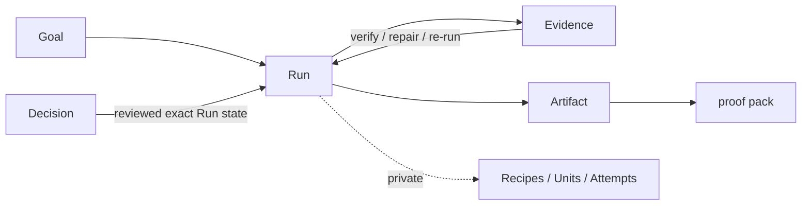

# Research Harness

[](https://github.com/WILLOSCAR/research-units-pipeline-skills/actions/workflows/verify.yml)

**A research loop that engineers its own evidence.**

A polished report can hide how it was produced: Which step produced this
section? Can you reproduce it? What checks did it survive, and what happened
after the last repair? Research Harness does not claim a result is
scientifically true — it proves the result was produced correctly, reproducibly,
and without letting the model grade itself.

The unit of trust is the Loop, not the answer:

```text
Goal -> Run -> Evidence -> Artifact,  closed by a verify/repair/re-run Loop
```

A **Run** pursues a Goal as a graph of steps with content-addressed inputs and
outputs. **Evidence** is the intermediate each step leaves for the next; an
**Artifact** is the reader-facing deliverable plus its proof pack. The
**harness** is the external referee: it recomputes scorecards instead of
trusting a self-reported PASS, admits a step out of the Loop only when its
evidence, scorecard, and Artifacts agree, and marks a human **Decision** stale
when the inputs it reviewed change.

The current release is an honest migration step. The source-checkout Python
module exposes this transition Interface over the durable local engine, while
`.harness-v3/state.json` remains the sole mutable authority. A normalized
cross-Run evidence store is a target, not an implemented claim. The stable `rh`
executable still owns legacy mutation and will not cut over until behavioral and
quality gates pass.

## See A Run In Five Minutes

Research Harness currently runs from a source checkout with Python 3.10+ and
[uv](https://docs.astral.sh/uv/):

```bash
git clone https://github.com/WILLOSCAR/research-units-pipeline-skills.git
cd research-units-pipeline-skills
uv sync --locked

uv run python -m research_harness loop work \
  --workspace workspaces/robot-adaptation \
  --goal "What should I read first about test-time adaptation for robotics?" \
  --kind brief \
  --repository .

uv run python -m research_harness loop show \
  --workspace workspaces/robot-adaptation --details
```

`loop work` advances to a completed Artifact, a blocked condition, or a human
Decision. To continue the same Run, omit `--goal` and `--kind`:

```bash
uv run python -m research_harness loop work \
  --workspace workspaces/robot-adaptation \
  --repository .
```

When a Decision is pending, review the named files, mark the current basis in
`DECISIONS.md`, then let the harness process that one Decision:

```bash
uv run python -m research_harness loop decide \
  --workspace workspaces/robot-adaptation \
  --repository .
```

`loop show` is read-only and does not require the source repository. Add
`--json` for a machine-readable projection.

Embedding callers use the same small Interface:

```python
from pathlib import Path
from research_harness import Loop, LoopKind, Continue, Start

run = Loop.open(Path("workspaces/robot-adaptation"), repository=Path("."))
run.advance(Start(goal="What should I read first?", kind=LoopKind.BRIEF))
run.advance(Continue())
inspection = run.inspect()
```

## The Loop, The Graph, The Skills

Three pillars carry the product, and all three are real code:

- **Loop** — trust is a converged fixed point, not a switch. A step is not
  trusted until the Loop stops finding new faults; repair is bounded and local.
  The `*-selfloop` Skill family (writer, evidence, deliverable, tutorial,
  argument) scores an intermediate, emits a deterministic scorecard, and
  produces a bounded repair plan the harness re-runs.
- **Graph** — every Run is a DAG with content-addressed nodes, which is what
  makes reproduction and local repair affordable: a failed check points at the
  smallest sub-graph, not the whole Run. Graph is the engine, not the pitch.
- **Skills** — producer Skills make content, prover Skills check it. The product
  is the combination: producers alone are "an agent did some work"; add provers
  and the harness and you get a run that verifies itself.

Bounded stopping is deliberate: repair while the marginal gain is positive, then
stop. Ungrounded self-refinement does not converge — verification must come from
outside the model's own text — and trusting a noisy verifier can raise a pass
rate while lowering true validity, so the Loop stops on marginal gain, not on a
fixed pass target.

## Choose A Loop Kind

Users choose the outcome. Current Workflow and Pipeline names are private
migration Recipes rather than product concepts.

| You want to… | `--kind` | Current Recipe implementation | Main Artifact |
|---|---|---|---|
| Understand a topic and choose a reading path | `brief` | `research-brief` | Brief |
| Review one supplied manuscript | `review` | `paper-review` | Review |
| Synthesize studies under an approved protocol | `evidence-synthesis` | `evidence-review` | Synthesis |
| Write a literature survey or bounded report | `survey` | `arxiv-survey` | Survey |
| Develop literature-grounded directions | `ideas` | `idea-brainstorm` | Idea memo |
| Teach from a fixed source set | `tutorial` | `source-tutorial` | Tutorial |

For a Survey PDF, add `--format pdf`. During migration, that format still uses
the executable `arxiv-survey-latex` variant; its target is an Export Adapter,
not a seventh product kind. Other kinds reject this format option; Tutorial's
current Recipe already owns its declared PDF delivery.

Input limits remain deliberate. Review does not invent a manuscript, Tutorial
does not invent a source pack, and Evidence synthesis stops for a Decision on
the protocol before retrieval. See the [usage guide](readme/README.en.md) for
the current Workspace preparation paths.

## What The Harness Verifies


```mermaid
flowchart LR
    G["Goal"] --> R["Run"]
    R --> E["Evidence"]
    E -->|"verify / repair / re-run"| R
    R --> A["Artifact"]
    A --> PP["proof pack"]
    D["Decision"] -->|"reviewed exact Run state"| R
    R -. "private" .-> X["Recipes / Units / Attempts"]
```

The current engine provides recoverable execution, pinned contracts, Artifact
hashes, Decision review bases, contract-scoped acceptance checks, recomputed
scorecards, and read-only legacy inspection. It does not persist a
research-quality Evaluation, and it does not fabricate a normalized cross-Run
evidence graph from files that have different semantics.

An Artifact may be a Brief, Review, Synthesis, Survey, PDF, Idea memo, Tutorial,
or inspection detail. It is always a projection over the Run. Changing an
Artifact cannot create a second state authority, and changing reviewed inputs
makes the earlier Decision stale.

## Quality Without Overclaiming

Research Harness keeps three claims separate:

| Layer | What a qualified PASS establishes | What it does not establish |
|---|---|---|
| Execution integrity | state, Attempts, Manifests, hashes, and recovery agree | that the research is good |
| Contract acceptance | required Artifacts satisfy observable Recipe checks | scientific truth, novelty, or exhaustive retrieval |
| Research quality | usefulness and correctness on evaluated realistic inputs | validity beyond those inputs |

The first two layers have current implementation evidence. Research quality
needs repeated Runs, held-out evaluation, and expert judgment. A green scorecard
is a contract signal, never a truth claim.

## Current Evidence And Limits

The repository publishes curated compatibility evidence rather than private
Workspaces:

| Snapshot | Demonstrates | Open boundary |
|---|---|---|
| [`course-paper-residue-pass`](examples/course-paper-residue-pass/README.md) | current v2 contract acceptance, 0/226 template matches, 10-page PDF | retained Artifacts, manual replay, dirty revision, one topic |
| [`course-paper-pilot`](examples/course-paper-pilot/README.md) | completed delivery and reproducible 96/140 residue failure | historical contract; fails the current writing gate |
| [`research-brief-real-source-proof`](examples/research-brief-real-source-proof/README.md) | one live-arXiv Brief delivery | historical v1 protocol, one topic |
| [`research-brief-harness-proof`](examples/research-brief-harness-proof/README.md) | deterministic recovery and Audit evidence | synthetic sources, historical v1 protocol |

Fixtures exercise `paper-review`, `idea-brainstorm`, `evidence-review`, and
`source-tutorial`. Cross-topic stability, expert comparison, a normalized
evidence store, and automatic Harness-candidate promotion remain open.

## Runtime Requirements

- Python 3.10+ and `uv`;
- `pdftotext` for Tutorial PDF ingestion;
- `latexmk`, XeLaTeX, BibTeX, and `pdfinfo` for LaTeX/PDF delivery.

The Python package declares `PyYAML` and `pypdf`; maintainer dependencies are in
the `test` extra.

## Maintainer Verification

Run the repository gates:

```bash
uv run --locked python scripts/validate_repo.py --strict
uv run --locked python scripts/readiness_audit.py --strict
uv run --locked python scripts/audit_skills.py --fail-on WARN
uv run --locked python scripts/audit_workflow_context.py
uv run --locked --extra test ruff check .
uv run --locked --extra test python -m pytest -q
```

Do not raise a Recipe proof state without completed execution evidence or a
failure-repair regression, and do not describe contract acceptance as research
quality.

## Documentation

- [Canonical domain language](CONTEXT.md)
- [Research Loop Architecture](docs/AUTO_RESEARCH_DESIGN_SYSTEM.md)
- [Product-object decision](docs/adr/0025-make-the-self-correcting-run-the-product-object.md)
- [Whole-project refactoring audit](docs/REFACTORING_AUDIT.md)
- [Recipe catalog and proof states](docs/PIPELINE_TAXONOMY.md)
- [Implementation language mapping](docs/PROJECT_LANGUAGE.md)
- [Roadmap](docs/HARNESS_ROADMAP.md)
- [Current readiness](docs/HARNESS_READINESS.md)
- [Schemas and projections](docs/SCHEMAS.md)
- [Architecture decisions](docs/adr/)
- [Detailed usage guides](readme/README.en.md)

[中文 README](README.zh-CN.md)

## Star History

<a href="https://www.star-history.com/?repos=WILLOSCAR%2Fresearch-units-pipeline-skills&type=date&legend=top-left">
  <picture>
    <source media="(prefers-color-scheme: dark)" srcset="assets/star-history/star-history-dark.svg">
    
  </picture>
</a>
