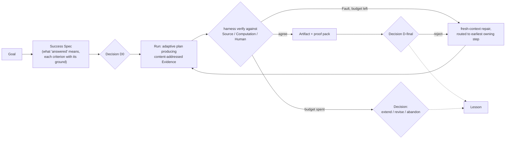

# Research Harness

[](https://github.com/WILLOSCAR/research-units-pipeline-skills/actions/workflows/verify.yml)

**Research should leave a trail, not just an answer.**

A long research task can produce a polished PDF and still leave basic questions
unanswered: Which sources support this paragraph? What changed after the last
failure? Can the work resume tomorrow without reconstructing a chat? What did
`PASS` actually verify — and was it verified against what I asked?

Research Harness turns a research **Goal** into a self-correcting **Run** whose
every step leaves checkable **Evidence** and whose result is an **Artifact**: a
reader-facing deliverable together with the proof pack that shows how it was
produced. Trust comes from the **Loop** — `verify → Fault → repair → re-run` —
performed by the **harness** as an external referee against a ground the model
cannot smooth away, with the human's **Decision** as a turn inside it. What a
Run learns by failing settles into **Lessons**, the only ground on which the
harness itself is allowed to **evolve**.

```text
inner, one Run:      Goal -> criteria -> Run -> Evidence -> verify -> Fault -> repair -> re-run ... -> Artifact -> Decision
outer, the project:  Run -> Faults + Decisions -> Lesson -> evolve(harness, SOP) -> next Run
```

It is not an autonomous scientist. It is what an autonomous scientist needs in
order to be believed: a **harness for long-horizon research agents** — the
state, Evidence, verify, Decisions, budget, and Lessons around an external
model — that makes agent-assisted research inspectable, resumable, and honest
about what has and has not been proven. Auto-research systems can run their
literature, ideation, writing, and review stages inside it as Loop kinds; an
`experiment` kind is the natural next one. It is neither recursive
self-improvement nor a self-evolving agent: the harness changes only by
Lessons, replay, and a human Decision.

> **Where the project stands (2026-09-12).** The story above was re-examined
> and accepted as sound. The previous code was measured against it and found to
> deviate structurally — most importantly, the Goal never reached the verify
> side, so a Run converged toward its workflow template rather than toward the
> Goal. That implementation is preserved at git tag
> `snapshot/pre-refactor-2026-09-12` and is being rebuilt from scratch against
> [`docs/PRODUCT_DESIGN.md`](docs/PRODUCT_DESIGN.md) (see [Status](#status)).
> Every document in this repository declares whether it describes the
> **product** (target) or the **implementation snapshot** (frozen); this README
> describes the product. See
> [ADR 0026](docs/adr/0026-redesign-the-product-from-the-story-and-freeze-the-implementation.md).

## The Product

### What you do

State a Goal and the outcome you want. Make two Decisions — one on what
"answered" will mean, one on the finished Artifact. Receive the Artifact with
its proof pack.

| You want to… | Loop kind | You provide | You receive |
|---|---|---|---|
| Understand a topic and decide what to read | `brief` | topic | one-page brief |
| Review a manuscript | `review` | the manuscript | referee-style review |
| Synthesize research under an approved protocol | `evidence-synthesis` | a review question | protocol + bounded synthesis |
| Write a literature survey or bounded report | `survey` | topic + delivery constraints | survey draft (`--format pdf` for LaTeX/PDF) |
| Develop literature-grounded research directions | `ideas` | topic + scope | direction memo |
| Turn a fixed source pack into a tutorial | `tutorial` | source pack + audience | tutorial (+ PDF, slides) |

One surface, four verbs, four outcomes (plus `lessons()` for maintainers):

```text
start(goal, kind, format?)  continue()  decide(decision)  inspect()
NEEDS_DECISION | BLOCKED | PROGRESSED | COMPLETED
```

### What a Run does


```mermaid
flowchart LR
    G["Goal"] --> SS["Success Spec<br/>(what 'answered' means,<br/>each criterion with its ground)"]
    SS --> D0{"Decision D0"}
    D0 --> R["Run: adaptive plan producing<br/>content-addressed Evidence"]
    R --> V{"harness verify against<br/>Source / Computation / Human"}
    V -->|"Fault, budget left"| RP["fresh-context repair,<br/>routed to earliest owning step"]
    RP --> R
    V -->|"agree"| A["Artifact + proof pack"]
    A --> DF{"Decision D-final"}
    DF -->|"reject"| RP
    V -->|"budget spent"| B{"Decision:<br/>extend / revise / abandon"}
    DF -.-> L["Lesson"]
    B -.-> L
```

1. **The Goal enters verify.** At start, the Run derives a Success Spec from
   your Goal — the questions to answer, the scope boundary, what counts as
   drift, the budget — and names, for each criterion, the ground it can be
   checked on: a **Source**, a **Computation**, or **you**. You confirm it
   (D0). Every downstream gate reads it. A criterion nothing can check is
   listed as yours to judge, never passed by a gate.
2. **verify is two things.** *Integrity verify* is deterministic and the model
   cannot influence it: hashes, manifests, state agreement, Decision freshness.
   *Quality gates* are declared proxies; each carries a kind (`structural`,
   `grounded`, `calibrated`), its ground, and says how much it means. No gate
   ever reads a verdict the producer wrote.
3. **The Run adapts its plan, never its criteria.** It may add, skip, or
   reorder steps; every step still enters verify. If it finds a criterion it
   cannot meet, it asks you — it does not rewrite the criterion.
4. **Repair is Fault-directed, fresh-context, bounded, and routed upstream.**
   A failing gate produces a Fault naming the earliest step whose Evidence
   conflicts with the Success Spec. The repairer receives the Fault and the
   Evidence — not the failed draft. The harness stops repair as converged,
   exhausted, or escalated, and records why. An exhausted Loop ends in your
   Decision, never in silence.
5. **You get the last word.** Every Loop kind ends with your Decision on the
   Artifact, with the proof pack in front of you — every statement pointing to
   the Evidence that supports it. Decisions bind the hashes of everything you
   reviewed; if any of it changes, the Decision goes stale. A rejection
   re-enters the Loop as a Fault.
6. **Failures become Lessons; Lessons are how the harness evolves.** When a Run
   ends, its Faults and Decisions are distilled into a project-level Lesson.
   A change to a gate, a budget, or a Loop kind's SOP must cite Lessons, must
   catch the Faults they record on replay, and is adopted only by a human
   Decision. The harness never certifies its own change.

### What a PASS means

| Layer | PASS proves | Does not prove |
|---|---|---|
| Execution integrity | the Run's record is consistent | the answer is good |
| Contract acceptance | the Artifact passed its declared gates, each labeled by kind and calibration | scientific truth or exhaustive retrieval |
| Research quality | — your D-final, held-out evaluation, expert review | general validity |

The product claims the first two layers. The third is yours; the product's job
is to put you in a position to make it.

Full design: [`docs/PRODUCT_DESIGN.md`](docs/PRODUCT_DESIGN.md). Canonical
language: [`CONTEXT.md`](CONTEXT.md).

## Using It

Python 3.10+ and [uv](https://docs.astral.sh/uv/):

```bash
git clone https://github.com/WILLOSCAR/research-units-pipeline-skills.git
cd research-units-pipeline-skills
uv sync --extra test

uv run rh start --goal goal.md --kind brief          # opens the Run; the first packet derives the Success Spec
uv run rh continue                                   # hands out the next packet, or verifies the pass you just finished (D0 follows the spec)
uv run rh decide D0 --accept                         # or --reject --reason "..."
uv run rh inspect                                    # state, open Faults, pending Decision, re-verified integrity
uv run rh lessons list                               # the outer loop
```

`--kind` selects one of six Loop kinds: `brief`, `review`, `evidence-synthesis`,
`survey`, `ideas`, `tutorial` (`experiment` is deferred). `--format` selects an
export of the same Artifact; Horizon 0 ships `md`, and the `pdf` / `slides`
adapters arrive with Horizon 1. `rh` is the only entry point; `python -m rh` is
its alias. The workspace defaults to `workspaces/current` (`-w DIR` or
`$RH_WORKSPACE` to change it).

### How an agent works a Run

The harness never calls a model; an agent drives it. `rh continue` writes a
packet under `<workspace>/steps/<step>/pass-<n>/packet.md` naming the Skill to
follow, the input Evidence by hash, the outputs expected, and the criteria the
step serves. The agent (Codex, Claude Code, Cursor) reads that Skill under
`.codex/skills/`, writes the outputs under the pass's `outputs/`, and runs
`rh continue` again. The harness hashes the outputs into Evidence, runs the
kernel gates, schedules prover Skills for the gates that need a reader, and
either admits the step or routes each Fault to a repair pass on the earliest
step it implicates — with the Fault and the Evidence, never the failed draft.
Humans answer D0 (the Success Spec) and D-final (the Artifact); an agent that
cannot meet a criterion calls `rh escalate --reason` instead of rewriting it.

### Maintainer verification

```bash
uv run --extra test ruff check .
uv run python scripts/check_docs.py
uv run --extra test python -m pytest -q
```

## Status

The Horizon 0 rebuild ([`docs/HARNESS_ROADMAP.md`](docs/HARNESS_ROADMAP.md),
[`docs/REBUILD_DESIGN.md`](docs/REBUILD_DESIGN.md)) is in progress on this
branch: the kernel under `src/rh/`, the CLI above, the six Loop kind
declarations under `src/rh/kinds/`, and the conformance tests under
`tests/conformance/` (all 21 rows of the checklist, driven by a scripted agent)
are in place; the Skills the kinds name are being aligned to the new contract,
and the first Runs on real sources (`brief`, then `review`) are next. The
previous implementation, its usage guides, and its published examples live at
git tag `snapshot/pre-refactor-2026-09-12` (read any file with
`git show snapshot/pre-refactor-2026-09-12:<path>`); how far that code got, and
where it deviated from the design, is measured in
[`docs/IMPLEMENTATION_SNAPSHOT_2026-09-12.md`](docs/IMPLEMENTATION_SNAPSHOT_2026-09-12.md).
Examples are regenerated by the new kernel in Horizon 1; the snapshot's
examples are not replayed by it.

## Documentation

- [Canonical language](CONTEXT.md) — the eleven terms, the two loops, and what they imply
- [Product design](docs/PRODUCT_DESIGN.md) — commitments, product form, conformance checklist
- [Rebuild design](docs/REBUILD_DESIGN.md) — kernel, referee protocol, storage, Loop kind format, build order
- [Roadmap](docs/HARNESS_ROADMAP.md) — Horizon 0 is the rebuild
- [Implementation snapshot](docs/IMPLEMENTATION_SNAPSHOT_2026-09-12.md) — the frozen code measured against the design
- [Architecture decisions](docs/adr/) — classified as story, behavior, or snapshot
- [Contributing](CONTRIBUTING.md) — local gates and where code goes

[中文 README](README.zh-CN.md)

## Star History

<a href="https://www.star-history.com/?repos=WILLOSCAR%2Fresearch-units-pipeline-skills&type=date&legend=top-left">
  <picture>
    <source media="(prefers-color-scheme: dark)" srcset="assets/star-history/star-history-dark.svg">
    
  </picture>
</a>
