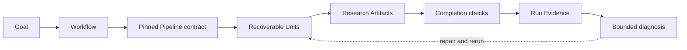
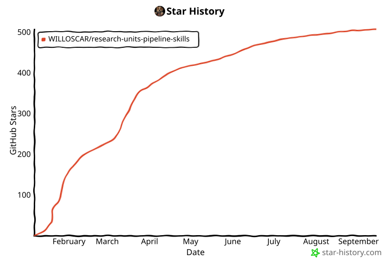

# Research Harness

[](https://github.com/WILLOSCAR/research-units-pipeline-skills/actions/workflows/verify.yml)

**Research should leave a trail, not just an answer.**

A long research task can produce a polished PDF and still leave basic questions
unanswered: Which sources support this paragraph? What changed after the last
failure? Can the work resume tomorrow without reconstructing a chat? What did
`PASS` actually verify?

Research Harness turns a research goal into a file-first, recoverable Run. It
organizes focused Skills into explicit Workflows, preserves intermediate
Artifacts and decisions, checks observable contracts, and points failures back
to the smallest repair surface.

```text
Goal -> Run -> Evidence -> Improve
```

It is not an autonomous-scientist claim. It is infrastructure for making
agent-assisted research inspectable, resumable, and honest about what has—and
has not—been proven.

## See A Run In Five Minutes

Research Harness currently runs from a source checkout with Python 3.10+ and
[uv](https://docs.astral.sh/uv/):

```bash
git clone https://github.com/WILLOSCAR/research-units-pipeline-skills.git
cd research-units-pipeline-skills
uv sync --locked

uv run rh goal create \
  --goal "Understand test-time adaptation for robotics and decide what to read" \
  --workflow research-brief \
  --workspace workspaces/robot-adaptation

uv run rh run start --workspace workspaces/robot-adaptation
```

The Run advances until it finishes or reaches an unmet prerequisite. For
`research-brief`, inspect the paper set, taxonomy, outline, and C2 review block,
then continue:

```bash
uv run rh run status --workspace workspaces/robot-adaptation
uv run rh run approve --workspace workspaces/robot-adaptation --checkpoint C2
uv run rh run resume --workspace workspaces/robot-adaptation
uv run rh evidence inspect --workspace workspaces/robot-adaptation --excerpt
```

The Workspace now contains the readable deliverable and its evidence trail:

```text
GOAL.md                  requested outcome and constraints
UNITS.csv                explicit plan and current Unit state
DECISIONS.md             human checkpoints and choices
papers/ + outline/       research evidence and intermediate structure
output/                  deliverable, scorecards, audits, repair reports
.harness/                Run identity, Attempts, Events, hashes, provenance
```

If a contract fails, ask the Harness where repair belongs:

```bash
uv run rh improve diagnose --workspace workspaces/robot-adaptation
```

## Choose The Deliverable

Users choose a Workflow by outcome; Skills and Units stay implementation
details until inspection or repair is necessary.

| You want to… | Workflow | Required starting point | Main deliverable |
|---|---|---|---|
| Understand a topic and decide what to read | `research-brief` | topic | `output/SNAPSHOT.md` |
| Review one paper or manuscript | `paper-review` | manuscript | `output/REVIEW.md` |
| Synthesize studies under an approved protocol | `evidence-review` | review question | `output/SYNTHESIS.md` |
| Write a literature survey or bounded report | `arxiv-survey` | topic and delivery constraints | `output/DRAFT.md` |
| Deliver that Survey as LaTeX and PDF | `arxiv-survey-latex` | topic and delivery constraints | `latex/main.pdf` |
| Develop literature-grounded research directions | `idea-brainstorm` | topic and scope | `output/REPORT.md` |
| Turn a fixed source set into a tutorial | `source-tutorial` | source pack and audience | tutorial, article PDF, slides |

In Codex or Claude Code, the activation surface is deliberately one sentence:

```text
Use research-brief to map test-time adaptation for robotics and tell me what to read first.
Use paper-review to review the attached manuscript and trace every major concern to the paper.
Use arxiv-survey-latex to write an 8-10 page course paper on RAG evaluation and produce a PDF.
Use source-tutorial to turn sources/manifest.yml into a tutorial for senior software engineers.
```

`graduate-paper` remains a research-stage Chinese thesis path, not one of the
seven executable Pipeline contracts.

Input boundaries are intentional. `paper-review` will not invent a manuscript;
`source-tutorial` will not invent a source pack; `evidence-review` writes a
protocol and pauses for approval before retrieval. See the
[usage guides](readme/README.en.md) for those setup paths.

## What Changes When Research Becomes A Run

Without a Harness, a research agent usually leaves a final answer and a long
conversation. With Research Harness, each transition has an inspectable owner:


```mermaid
flowchart LR
    G["Goal"] --> W["Workflow"]
    W --> P["Pinned Pipeline contract"]
    P --> U["Recoverable Units"]
    U --> A["Research Artifacts"]
    A --> C["Completion checks"]
    C --> E["Run Evidence"]
    E --> D["Bounded diagnosis"]
    D -. "repair and rerun" .-> U
```

Three mechanisms make that trail useful:

1. **The contract is pinned.** `harness-lock.v2` snapshots the selected Pipeline
   and hashes its inheritance bundle, Skill implementations, and Harness Kernel.
   An active Run fails closed if the Pipeline or Kernel drifts; it cannot silently
   continue under different rules.
2. **Completion is evidence-backed.** A `DONE` cell alone is not success. The
   Attempt, required outputs, Artifact hashes, Workflow checks, Manifest, and
   Completion Event must agree.
3. **Failure has an address.** Doctor, Audit, scorecards, and the Failure ledger
   distinguish an observable defect from its owning repair surface. Improvement
   diagnoses; it does not rewrite the Harness in place.

Human checkpoints use the same discipline. Approval is bound to the reviewed
Artifact hashes, so changing an approved outline, scope, or protocol revokes the
stale authorization.

## What A PASS Means

Research Harness separates three claims that are easy to blur:

| Layer | A PASS establishes | It does not establish |
|---|---|---|
| Execution integrity | Attempts, state, Manifests, hashes, and provenance agree | that the answer is good |
| Contract acceptance | required Artifacts satisfy observable Workflow checks | scientific truth or exhaustive retrieval |
| Research quality | usefulness and correctness on realistic inputs | validity beyond the evaluated cases |

The repository implements the first two layers. The third needs repeated Runs,
held-out evaluation, and expert judgment. Reports use qualified evidence rather
than turning every green check into a research-quality claim.

## The Survey Failure That Shaped The Gate

The Survey writer can bootstrap provisional prose from structured evidence packs
and versioned templates. Early versions completed the delivery path but left too
much of that scaffold in the paper: the historical course-paper sample matches
template fragments in **96/140 sentences (68.6%)**.

That failure is now a contract, not a warning:

- `front-matter-writer` checks the abstract, introduction, related work,
  discussion, and conclusion before merge;
- `subsection-writer` and `writer-selfloop` check H3 prose;
- `pipeline-auditor` checks the whole merged draft, selected asset hashes, and
  the three template-owning Skill implementations;
- pipeline voice such as “this run” is blocking reader-facing residue;
- the whole-draft limit is <=10%.

The current published replay completes all 49 Units under the current contract:

| Evidence | Result |
|---|---:|
| Required Workflow checks | 31/31 PASS |
| Target Artifacts | 75/75 present |
| Harness Kernel lock | 35/35 matched |
| Ledger integrity issues | 0 |
| Template residue | 0/226 sentences (0.0%) |
| PDF delivery | 10 pages |

This proves attainability for one retained Artifact set. It does not prove
authorship, semantic originality, autonomous generation, cross-topic
calibration, or expert paper quality. The Run used manual Artifact revalidation
and a dirty worktree; a clean, from-scratch reproduction remains open. Inspect
the [current-contract evidence](examples/course-paper-residue-pass/README.md)
and the [historical failure baseline](examples/course-paper-pilot/README.md).

## Published Evidence

The repository publishes curated evidence rather than private Workspaces:

| Snapshot | What it demonstrates | Boundary |
|---|---|---|
| [`course-paper-residue-pass`](examples/course-paper-residue-pass/README.md) | current v2 contract acceptance, 0/226 residue, 10-page PDF | manual replay, dirty revision, one topic |
| [`course-paper-pilot`](examples/course-paper-pilot/README.md) | completed delivery and a reproducible 68.6% failure baseline | historical contract; fails the current writing gate |
| [`research-brief-real-source-proof`](examples/research-brief-real-source-proof/README.md) | one live-arXiv briefing delivery | historical v1 protocol, one topic |
| [`research-brief-harness-proof`](examples/research-brief-harness-proof/README.md) | deterministic recovery and Audit evidence | synthetic sources, historical v1 protocol |

Scorecard fixtures and failure-repair regressions cover `paper-review`,
`idea-brainstorm`, `evidence-review`, and `source-tutorial`. Cross-topic
stability, measured model-token benchmarks, expert comparison, and automatic
Harness-candidate promotion remain open.

## Runtime Requirements

- Python 3.10+ and `uv` for the CLI;
- `pdftotext` for Source Tutorial PDF ingestion;
- `latexmk`, XeLaTeX, BibTeX, and `pdfinfo` for LaTeX/PDF delivery.

The Python package declares `PyYAML` and `pypdf`; maintainer dependencies are in
the `test` extra. GitHub Actions installs the same TeX/Poppler boundary used by
the PDF tests.

## Maintainer Verification

Run the same checks as `.github/workflows/verify.yml`:

```bash
uv run --locked python scripts/validate_repo.py --strict
uv run --locked python scripts/readiness_audit.py --strict
uv run --locked python scripts/audit_skills.py --fail-on WARN
uv run --locked python scripts/audit_workflow_context.py
uv run --locked --extra test ruff check .
uv run --locked --extra test python -m pytest -q
```

When extending a Workflow, keep its Pipeline contract, Unit template, owned
Skills, tests, and evidence claim aligned. Do not raise a proof state without a
completed Run or a failure-repair regression that supports it.

## Documentation

- [Architecture](docs/AUTO_RESEARCH_DESIGN_SYSTEM.md)
- [Workflow catalog and proof states](docs/PIPELINE_TAXONOMY.md)
- [Canonical project language](docs/PROJECT_LANGUAGE.md)
- [Loop glossary](CONTEXT.md)
- [Roadmap](docs/HARNESS_ROADMAP.md)
- [Current readiness](docs/HARNESS_READINESS.md)
- [Schemas](docs/SCHEMAS.md)
- [Architecture decisions](docs/adr/)
- [Detailed usage guides](readme/README.en.md)

[中文 README](README.zh-CN.md)

## Star History

<a href="https://www.star-history.com/?repos=WILLOSCAR%2Fresearch-units-pipeline-skills&type=date&legend=top-left">
  <picture>
    <source media="(prefers-color-scheme: dark)" srcset="assets/star-history/star-history-dark.svg">
    
  </picture>
</a>
