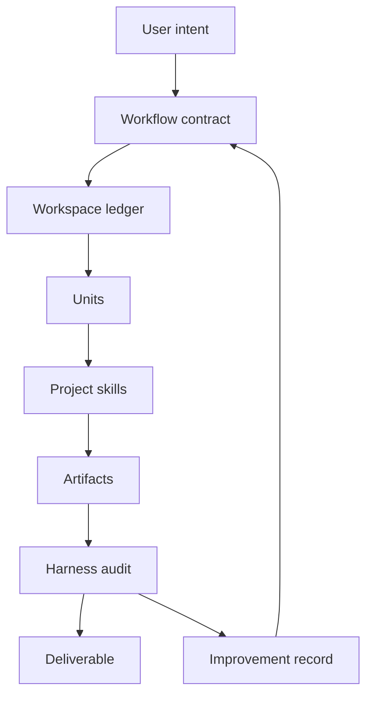

# research-units-pipeline-skills

> Languages: **English** | [简体中文](README.zh-CN.md)

An Auto Research Design System for agent-assisted research work.

This repository combines **semantic research skills** with a **file-first
harness**. It is meant for people using coding agents such as Codex to run
research workflows without losing the intermediate evidence. A run becomes a
durable workspace: planned units, intermediate artifacts, checkpoints, audits,
and improvement records.

The short version:

```text
intent -> workflow -> workspace -> unit -> skill -> artifact -> audit -> improvement
```

It is not a generic workflow engine, a prompt collection, or a claim that
research can be fully automated. The repo is narrower and more practical: it
keeps research work inspectable, resumable, and improvable while the model
handles the semantic reading and writing.

## What It Produces

Use this repo when the output matters enough that you want files, checkpoints,
and reviewable evidence rather than a one-off chat answer.

| Goal | Workflow | Main deliverable |
|---|---|---|
| Evidence-first literature survey | `arxiv-survey` | `output/DRAFT.md` |
| Survey with LaTeX/PDF delivery | `arxiv-survey-latex` | `output/DRAFT.md`, `latex/main.pdf` |
| Course paper or end-of-term report from a topic | `arxiv-survey` or `arxiv-survey-latex` | report draft, optional PDF |
| Fast topic briefing and reading path | `research-brief` | `output/SNAPSHOT.md` |
| Single-paper critique or referee-style review | `paper-review` | `output/REVIEW.md` |
| Protocol-driven evidence synthesis | `evidence-review` | `output/SYNTHESIS.md` |
| Literature-grounded research ideas | `idea-brainstorm` | `output/REPORT.md`, `output/REPORT.json` |
| Tutorial from webpages, PDFs, notes, or repo docs | `source-tutorial` | `output/TUTORIAL.md`, PDF, slides |
| Guided Chinese thesis organization | `graduate-paper` | thesis project artifacts |

Most users choose a workflow and inspect the workspace outputs. Maintainers
work on the pipeline contracts, project skills, harness scripts, and validation
rules behind those workflows.

## How A Run Works


```mermaid
flowchart TD
    A["User intent"] --> B["Workflow contract"]
    B --> C["Workspace ledger"]
    C --> D["Units"]
    D --> E["Project skills"]
    E --> F["Artifacts"]
    F --> G["Harness audit"]
    G --> H["Deliverable"]
    G --> I["Improvement record"]
    I --> B
```

- A `workflow` is the user-facing product path, such as `paper-review`.
- A `workspace` is one run directory under `workspaces/<name>/`.
- A `unit` is a small, checkable step in `UNITS.csv`.
- A `skill` is a reusable research or writing capability under `.codex/skills/`.
- An `artifact` is an intermediate or final file, usually Markdown, CSV, YAML,
  JSON, TeX, or PDF.
- An `audit` is a bounded check of workspace state, run state, or output
  quality.
- An `improvement` record maps weak output back to a concrete repair surface:
  a skill, pipeline, artifact, validator, or decision.

The design choice is artifact-first execution. The model should not rely on
conversation memory to carry a complex research workflow. It should write
state, evidence, and decisions to files that can be inspected by humans and
reused by later units.

## Quick Start

Start an agent session in this repository and ask for a concrete outcome:

```text
Use paper-review to critique this manuscript and give me a lab-style review.
```

```text
Use research-brief to explain test-time adaptation for robotics and produce a reading path.
```

```text
Use source-tutorial to turn these webpages and repo docs into a tutorial with PDF and slides.
```

```text
Write an arxiv-survey-latex survey about embodied agents and show me the outline first.
```

```text
Use arxiv-survey-latex to write a compact course paper on robot learning. Keep the outline reviewable before drafting and target a final PDF.
```

For tighter control, name the pipeline contract directly:

- [pipelines/arxiv-survey.pipeline.md](pipelines/arxiv-survey.pipeline.md)
- [pipelines/arxiv-survey-latex.pipeline.md](pipelines/arxiv-survey-latex.pipeline.md)
- [pipelines/research-brief.pipeline.md](pipelines/research-brief.pipeline.md)
- [pipelines/paper-review.pipeline.md](pipelines/paper-review.pipeline.md)
- [pipelines/evidence-review.pipeline.md](pipelines/evidence-review.pipeline.md)
- [pipelines/idea-brainstorm.pipeline.md](pipelines/idea-brainstorm.pipeline.md)
- [pipelines/source-tutorial.pipeline.md](pipelines/source-tutorial.pipeline.md)
- [pipelines/graduate-paper-pipeline.md](pipelines/graduate-paper-pipeline.md)

Feature guides:

| Workflow | English | 中文 |
|---|---|---|
| `arxiv-survey` / `arxiv-survey-latex` | [Guide](readme/arxiv-survey.md) | [说明](readme/arxiv-survey.zh-CN.md) |
| `research-brief` | [Guide](readme/research-brief.md) | [说明](readme/research-brief.zh-CN.md) |
| `paper-review` | [Guide](readme/paper-review.md) | [说明](readme/paper-review.zh-CN.md) |
| `evidence-review` | [Guide](readme/evidence-review.md) | [说明](readme/evidence-review.zh-CN.md) |
| `idea-brainstorm` | [Guide](readme/idea-brainstorm.md) | [说明](readme/idea-brainstorm.zh-CN.md) |
| `source-tutorial` | [Guide](readme/source-tutorial.md) | [说明](readme/source-tutorial.zh-CN.md) |
| `graduate-paper` | [Guide](readme/graduate-paper.md) | [说明](readme/graduate-paper.zh-CN.md) |

## Architecture

The repo has two cooperating layers.

**Skills** hold semantic research behavior:

- what sources or inputs to read;
- what artifact to write;
- what acceptance criteria apply;
- what guardrails the model must respect.

**Harness** holds deterministic execution support:

- workspace initialization and recovery;
- pipeline contract validation;
- unit execution;
- doctor, audit, improve, and pack commands;
- output manifests and report schemas;
- repo-level tests and readiness checks.

Keep this split when extending the project. Put research judgment in skills.
Put repeatable checks and recovery logic in the harness.

For the full architecture map and current function map, see
[docs/AUTO_RESEARCH_DESIGN_SYSTEM.md](docs/AUTO_RESEARCH_DESIGN_SYSTEM.md).

## Current Status

The active workflow families are:

- **Survey**: `arxiv-survey`, `arxiv-survey-latex`
- **Review**: `research-brief`, `paper-review`, `evidence-review`
- **Ideation**: `idea-brainstorm`
- **Tutorial**: `source-tutorial`
- **Thesis**: `graduate-paper`

Seven workflows currently have pipeline contracts, unit templates, and harness
validation. `graduate-paper` is a guided thesis workflow with thesis-oriented
skills and design material; it is not yet a strict executable pipeline.

Course papers and end-of-term reports are treated as a survey use case, not a
separate workflow family. Use `arxiv-survey` when Markdown is enough and
`arxiv-survey-latex` when the class deliverable needs a PDF.

The maintainer roadmap is focused on `paper-review`: a completed Auto Review
workspace, semantic rubric, scorecard, final review, audit, improvement report,
and artifact pack. Here, an artifact pack means a manifest of the files that
make a run inspectable and portable. Do not add a new workflow family before
that proof exists.

For the current catalog and maturity map, see
[docs/PIPELINE_TAXONOMY.md](docs/PIPELINE_TAXONOMY.md).

## Developer Surface

This section is for maintainers. Use these checks when changing pipeline
contracts, skill IO, workspace artifacts, schemas, or validation rules.

```bash
python -m pytest -q
python scripts/validate_repo.py --no-check-quality --strict
python scripts/audit_skills.py --fail-on WARN
python scripts/audit_skills.py --review-category template_placeholder --limit 20
python scripts/audit_skills.py --summary-only
python scripts/generate_skill_graph.py
python scripts/readiness_audit.py --progress workspaces/harness-upgrade/GOAL_STATUS.md --strict
```

Workspace diagnostics:

```bash
python scripts/pipeline.py doctor --workspace workspaces/<name> --write
python scripts/pipeline.py audit --workspace workspaces/<name> --write
python scripts/pipeline.py improve --workspace workspaces/<name> --write
python scripts/pipeline.py pack --workspace workspaces/<name> --write
```

`doctor` diagnoses workspace state. `audit` summarizes the run. `improve`
maps defects to repair surfaces. `pack` creates a deliverable manifest.

## Reading Map

- [docs/AUTO_RESEARCH_DESIGN_SYSTEM.md](docs/AUTO_RESEARCH_DESIGN_SYSTEM.md):
  system model and architecture diagram.
- [docs/PIPELINE_TAXONOMY.md](docs/PIPELINE_TAXONOMY.md): workflow catalog,
  maturity, and next proof.
- [docs/PROJECT_LANGUAGE.md](docs/PROJECT_LANGUAGE.md): canonical language for
  workflow, workspace, unit, artifact, audit, and improvement.
- [docs/HARNESS_ROADMAP.md](docs/HARNESS_ROADMAP.md): current product and
  engineering direction.
- [docs/HARNESS_READINESS.md](docs/HARNESS_READINESS.md): local checks and
  readiness criteria.
- [docs/SCHEMAS.md](docs/SCHEMAS.md): generated report schema names.
- [docs/adr/](docs/adr/): architecture decisions.
- [SKILL_INDEX.md](SKILL_INDEX.md): skill index.
- [SKILLS_STANDARD.md](SKILLS_STANDARD.md): skill authoring standard.

Multi-language feature documentation hubs live under `readme/README.*.md`.

## Star History

[](https://star-history.com/#WILLOSCAR/research-units-pipeline-skills&Date)
