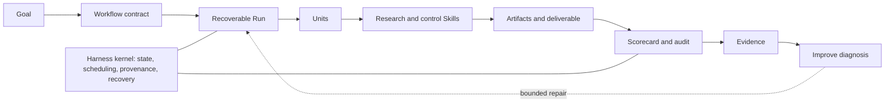

# Research Harness

Turn a research goal into a reviewable deliverable without losing the sources,
decisions, and intermediate evidence behind it.

Research Harness combines reusable research Skills with a file-first execution
Harness. It can produce a brief, paper review, evidence synthesis, literature
survey, course paper, or source-grounded tutorial, while keeping every long Run
recoverable and auditable.

```text
Goal -> Run -> Evidence -> Improve
```

This is an end-to-end **Auto Research Design System**, not a fully autonomous
scientist. Skills perform research transformations; Workflow contracts organize
them into a delivery path; the Harness records state, checks artifacts, and
locates failures so a person or agent can make the next bounded repair.

## Try A Small Run

The simplest topic-seeded demo is `research-brief`:

```bash
uv run rh goal create \
  --topic "test-time adaptation for robotics" \
  --workflow research-brief \
  --workspace workspaces/robot-adaptation

uv run rh run start --workspace workspaces/robot-adaptation
uv run rh run status --workspace workspaces/robot-adaptation
uv run rh evidence inspect --workspace workspaces/robot-adaptation --excerpt
```

The result includes a readable brief (`output/SNAPSHOT.md`), a structured
scorecard (`output/BRIEF_SCORECARD.json`), and an artifact index with hashes and
provenance. If a quality gate fails, diagnose the Run with:

```bash
uv run rh improve diagnose --workspace workspaces/robot-adaptation
```

`improve diagnose` identifies the failed contract and its repair surface. It
does not silently edit the Workspace or promote changes to the Harness.

The `rh goal create` shortcut is most useful for topic-seeded Workflows. Paths
that require an existing manuscript, source set, protocol, or human checkpoint
will stop and name the missing input. They can also be invoked naturally from
Codex:

```text
Use paper-review to review this manuscript. Keep every major concern traceable to the paper.
```

```text
Use arxiv-survey-latex to write an 8-10 page course paper on RAG evaluation and produce a PDF.
```

## Choose A Workflow

| Outcome | Workflow | Main deliverable |
|---|---|---|
| Understand a topic and decide what to read | `research-brief` | `output/SNAPSHOT.md` |
| Review one paper or manuscript | `paper-review` | `output/REVIEW.md` |
| Synthesize studies under an explicit protocol | `evidence-review` | `output/SYNTHESIS.md` |
| Build an evidence-first literature survey | `arxiv-survey` | `output/DRAFT.md` |
| Deliver a survey, course paper, or report as PDF | `arxiv-survey-latex` | `latex/main.pdf` |
| Develop literature-grounded research directions | `idea-brainstorm` | `output/REPORT.md` |
| Turn an existing source set into a tutorial | `source-tutorial` | tutorial, article PDF, slides |

`graduate-paper` remains a research-stage Chinese thesis path. It contains
useful Skills and design material, but does not yet have the strict executable
contract used by the seven Workflows above.

Course papers are a bounded use-case profile of the survey family, not another
Workflow. An explicit course-paper request selects smaller retrieval, evidence,
outline, paragraph, and citation budgets while retaining the same traceability
and quality gates. The current
[course-paper evidence snapshot](examples/course-paper-pilot/README.md) records
a completed 49-Unit Run, a passing Artifact audit, and a 10-page PDF for an
8-10 page Goal. This is one end-to-end delivery proof, not a claim of quality
across every topic.

## One Product Loop

| Stage | User question | Durable record |
|---|---|---|
| **Goal** | What outcome and constraints matter? | request, Workflow, required artifacts, success criteria |
| **Run** | What ran, what is next, and can it resume? | Units, Attempts, Events, Decisions, Checkpoints |
| **Evidence** | What supports the result? | sources, intermediate Artifacts, hashes, scorecards, audits |
| **Improve** | Where did this Run fail, and what owns the repair? | Failure ledger, diagnosis, explicit repair surface |


```mermaid
flowchart LR
    G["Goal"] --> W["Workflow contract"]
    W --> R["Recoverable Run"]
    R --> U["Units"]
    U --> S["Research and control Skills"]
    S --> A["Artifacts and deliverable"]
    A --> Q["Scorecard and audit"]
    Q --> E["Evidence"]
    E --> I["Improve diagnosis"]
    I -. "bounded repair" .-> R

    H["Harness kernel: state, scheduling, provenance, recovery"] --- R
    H --- Q
```

The important separation is responsibility, not a rigid binary:

- **Research Skills** retrieve, extract, compare, synthesize, review, and write.
- **Control Skills** materialize reports, checkpoints, manifests, and local gates.
- **Workflow contracts** define ordered Units, inputs, outputs, and acceptance.
- **Harness kernel** owns Run identity, scheduling, Attempts, recovery,
  provenance, implementation fingerprints, diagnosis, and audit.

Every Workspace keeps a readable project surface plus a machine-readable Run
ledger:

```text
workspaces/<run>/
├── GOAL.md
├── UNITS.csv
├── STATUS.md
├── DECISIONS.md
├── output/
└── .harness/
    ├── goal.json
    ├── run.json
    ├── harness.lock.json
    ├── events.jsonl
    ├── attempts.jsonl
    ├── artifacts.jsonl
    ├── failures/ledger.jsonl
    └── evaluations/ledger.jsonl
```

New Runs pin the initial Pipeline, Unit, Skill, and kernel revisions. Each
successful Unit also records the implementation fingerprint it actually used;
`doctor` reports a completed Unit as stale when its Skill implementation later
changes.

## Current Evidence

Seven Workflows have executable contracts and Unit templates. Structural
operability is broader than semantic proof:

- `paper-review`, `research-brief`, `idea-brainstorm`, and `evidence-review`
  have Workflow-local scorecards plus failure -> repair -> rerun tests.
- `source-tutorial` has a strict local-source delivery test through article and
  Beamer PDF compilation.
- the survey family has one completed compact course-paper/PDF Run and extensive
  contract tests; diverse-topic quality and measured token comparisons remain
  open.
- external held-out evaluation, candidate worktrees, automatic promotion, and
  a hosted Run store are not implemented.

Scorecards validate observable contracts and traceability. They do not reproduce
experiments, establish scientific truth, or replace expert judgment.

## Maintainer Interface

Use the lower-level adapter when developing or auditing the system:

```bash
uv run python scripts/pipeline.py doctor --workspace workspaces/<name> --write
uv run python scripts/pipeline.py audit --workspace workspaces/<name> --write
uv run python scripts/pipeline.py improve --workspace workspaces/<name> --write
uv run python scripts/pipeline.py pack --workspace workspaces/<name> --write
```

Validate the repository with:

```bash
uv run python scripts/validate_repo.py --no-check-quality --strict
uv run python scripts/readiness_audit.py --strict
uv run python scripts/audit_skills.py --fail-on WARN
uv run --extra test python -m pytest -q
```

When extending a Workflow, change its contract under `pipelines/`, align the
matching `templates/UNITS.*.csv`, implement the owned capability under
`.codex/skills/`, and add a completed Run or failure/repair regression before
raising its maturity claim.

## Documentation

- Start with the [Workflow catalog](docs/PIPELINE_TAXONOMY.md) and
  [usage guides](readme/README.en.md).
- Understand the [Auto Research architecture](docs/AUTO_RESEARCH_DESIGN_SYSTEM.md),
  [project language](docs/PROJECT_LANGUAGE.md), and
  [operability audit](docs/PIPELINE_OPERABILITY_AUDIT.md).
- Review [schemas](docs/SCHEMAS.md), the [roadmap](docs/HARNESS_ROADMAP.md),
  [readiness gates](docs/HARNESS_READINESS.md), and [ADRs](docs/adr/).

[中文说明](README.zh-CN.md)

[](https://star-history.com/#WILLOSCAR/research-units-pipeline-skills&Date)
