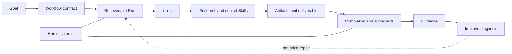

# Research Harness

Turn a research goal into a reviewable deliverable while preserving the
sources, decisions, intermediate artifacts, and execution evidence behind it.

Research Harness is an end-to-end **Auto Research Design System** built from
two complementary parts:

- **Skills** perform bounded research transformations such as retrieval,
  extraction, comparison, synthesis, review, and writing.
- **Harness** organizes those Skills into recoverable Workflows, checks their
  artifacts, records what happened, and locates the next repair when a Run
  fails.

```text
Goal -> Run -> Evidence -> Improve
```

The project does not claim to be an autonomous scientist. It makes long-form
research work observable and correctable so a user or agent can deliver, audit,
resume, and improve it without reconstructing the whole process from chat
history.

## Choose The Outcome

Users choose a Workflow by the result they need. The internal Skills and Units
remain implementation details until inspection or repair is necessary.

| Desired result | Workflow | Starting point | Main deliverable |
|---|---|---|---|
| Understand a topic and decide what to read | `research-brief` | topic | `output/SNAPSHOT.md` |
| Review one paper or manuscript | `paper-review` | manuscript | `output/REVIEW.md` |
| Synthesize studies under an explicit protocol | `evidence-review` | question and protocol | `output/SYNTHESIS.md` |
| Write a literature survey or bounded research report | `arxiv-survey` | topic and delivery constraints | `output/DRAFT.md` |
| Deliver the same Survey path as LaTeX and PDF | `arxiv-survey-latex` | topic and delivery constraints | `latex/main.pdf` |
| Develop literature-grounded research directions | `idea-brainstorm` | topic and scope | `output/REPORT.md` |
| Turn an existing source set into a tutorial | `source-tutorial` | source pack and audience | tutorial, article PDF, slides |

`graduate-paper` remains a research-stage Chinese thesis path. It contains
useful Skills but is not part of the seven executable Workflow contracts.

## Start A Run

The CLI currently runs from a source checkout and uses
[uv](https://docs.astral.sh/uv/). Topic-seeded Workflows can start immediately:

```bash
uv run rh goal create \
  --topic "test-time adaptation for robotics" \
  --workflow research-brief \
  --workspace workspaces/robot-adaptation

uv run rh run start --workspace workspaces/robot-adaptation
uv run rh run status --workspace workspaces/robot-adaptation
uv run rh evidence inspect --workspace workspaces/robot-adaptation --excerpt
```

The Run produces a readable brief, a structured scorecard, and an Artifact
index with hashes and provenance. A failed contract can be diagnosed with:

```bash
uv run rh improve diagnose --workspace workspaces/robot-adaptation
```

Workflows that require an existing manuscript, source pack, protocol, or human
decision will stop at that prerequisite and name it. They can also be invoked
naturally from Codex:

```text
Use paper-review to review this manuscript. Keep every major concern traceable to the paper.
```

```text
Use arxiv-survey-latex to write an 8-10 page course paper on RAG evaluation and produce a PDF.
```

## One End-To-End System


```mermaid
flowchart LR
    G["Goal"] --> W["Workflow contract"]
    W --> R["Recoverable Run"]
    R --> U["Units"]
    U --> S["Research and control Skills"]
    S --> A["Artifacts and deliverable"]
    A --> C["Completion and scorecards"]
    C --> E["Evidence"]
    E --> I["Improve diagnosis"]
    I -. "bounded repair" .-> R

    H["Harness kernel"] --- R
    H --- C
```

The layers have distinct responsibilities:

- **Workflow contract:** defines the stages, required Skills, target Artifacts,
  checkpoints, and mandatory acceptance checks for one user outcome.
- **Workspace:** stores one Run as human-readable files plus a machine ledger.
- **Unit:** declares one step, its dependencies, inputs, outputs, owner, and
  acceptance rule.
- **Skill:** performs one bounded research or control capability.
- **Artifact:** preserves a research input, intermediate result, scorecard,
  report, or final deliverable.
- **Harness kernel:** owns Run identity, scheduling, Attempts, Completion,
  recovery, provenance, reconciliation, Audit, and failure attribution.

Every scripted Unit, manual semantic Unit, and approved checkpoint passes
through the same Completion Protocol before it becomes `DONE`. Normal execution
enforces the Workflow's mandatory checks. `--strict` adds diagnostics that the
Workflow has not made mandatory; it is not the only checked mode.

## Evidence And Quality

The system keeps two evidence scopes:

- **Research Evidence** supports or qualifies the content of the deliverable.
- **Run Evidence** explains what executed, which Artifacts changed, and which
  checks passed.

It also separates three quality claims:

| Layer | What a PASS means |
|---|---|
| Execution integrity | Attempts, state, Manifests, hashes, and provenance agree |
| Contract acceptance | Required Artifacts satisfy observable Workflow checks |
| Research quality | The result is useful, correct, and sufficiently complete on realistic inputs under expert or held-out evaluation |

The Harness implements the first two layers. The third requires repeated Runs
and external judgment. A scorecard does not prove scientific truth, novelty, or
exhaustive retrieval.

## Survey As A Report Engine

The Survey family supports full literature surveys and bounded, literature-
grounded deliverables such as course papers, course reports, seminar reports,
short literature reviews, and focused technical landscape reports. Users state
the intended outcome, length, evidence depth, and format in the Goal. The
Workflow selects the internal delivery profile; users do not need to edit
profile keys.

Use `research-brief` for orientation, `paper-review` for one manuscript,
`evidence-review` for protocol-driven synthesis, and `source-tutorial` for a
fixed source pack. Use the Survey family when the deliverable requires finding,
comparing, synthesizing, and citing multiple papers. See the
[Survey guide](readme/arxiv-survey.md) for concrete Goals and evidence modes.

## Current Proof Boundary

- `paper-review`, `research-brief`, `idea-brainstorm`, and `evidence-review`
  have Workflow-local scorecards and failure, repair, and rerun tests.
- `research-brief` has a completed real-source arXiv pilot in addition to a
  deterministic Harness proof.
- `source-tutorial` has a strict local-source delivery test through article and
  slide PDF compilation.
- the Survey family has one completed bounded-report pilot with an audited
  10-page PDF.
- cross-topic stability, expert comparison, measured model-token benchmarks,
  and automatic Harness candidate promotion remain open.

Published snapshots are deliberately narrow:

- [`research-brief` Harness proof](examples/research-brief-harness-proof/README.md)
- [Real-source `research-brief` proof](examples/research-brief-real-source-proof/README.md)
- [Course-paper delivery proof](examples/course-paper-pilot/README.md)

## Maintainer Path

Validate the repository before changing maturity claims:

```bash
uv run python scripts/validate_repo.py --strict
uv run python scripts/readiness_audit.py --strict
uv run python scripts/audit_skills.py --fail-on WARN
uv run --extra test python -m pytest -q
```

When extending a Workflow, update its contract under `pipelines/`, align the
matching `templates/UNITS.*.csv`, implement the owned capability under
`.codex/skills/`, and add a completed Run or failure-repair regression before
raising its proof state.

## Documentation

- [Auto Research architecture](docs/AUTO_RESEARCH_DESIGN_SYSTEM.md)
- [Workflow catalog and maturity](docs/PIPELINE_TAXONOMY.md)
- [Canonical project language](docs/PROJECT_LANGUAGE.md)
- [Roadmap](docs/HARNESS_ROADMAP.md)
- [Current readiness](docs/HARNESS_READINESS.md)
- [Schemas](docs/SCHEMAS.md)
- [Architecture decisions](docs/adr/)
- [Detailed usage guides](readme/README.en.md)

[Chinese README](README.zh-CN.md)

[](https://star-history.com/#WILLOSCAR/research-units-pipeline-skills&Date)
