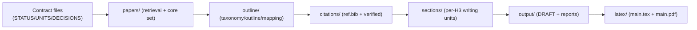

# research-units-pipeline-skills

> **一句话**：让 Pipeline 会"带人 / 带模型"做研究——不是给一堆脚本，而是给一套**语义化的 skills**，每个 skill 知道"该做什么、怎么做、做到什么程度、不能做什么"。

---

## 核心设计：Skills-First + 拆解链路 + 证据先行

**传统问题**：研究流水线要么是黑盒脚本（不知道怎么改），要么是松散文档（执行时靠人肉判断）。

**本设计的解法**：

1. **Skills 语义化**：每个 skill 不是函数，而是**带引导的执行单元**——
   - `inputs / outputs`：明确依赖和产物
   - `acceptance`：验收标准（如"每小节映射 >=8 篇论文"）
   - `notes`：怎么做、边界条件、常见错误
   - `guardrail`：不能做什么（如 C2-C4 阶段 **NO PROSE**）

2. **拆解链路**：6 个 checkpoint（C0→C5），36 个原子 units，依赖关系显式写在 `UNITS.csv`
3. **证据先行**：C2-C4 强制先建证据底座（taxonomy → mapping → evidence packs），C5 才写作

**设计目标**：
- **可复用**：同一个 skill（如 `subsection-writer`）可被多个 pipeline 复用，换个 pipeline 不用重写逻辑
- **可引导**：新手/模型按 skill 的 `acceptance` + `notes` 执行，不需要"猜"该做到什么程度
- **可约束**：`guardrail` 防止执行者（尤其是模型）越界（如在 C3 阶段偷偷写正文）
- **可定位**：失败时报告指向具体 skill + 中间产物，修复后从失败点继续

---

**为什么这样设计？**

| 特性 | 传统做法 | 本设计 |
|------|----------|--------|
| **可见** | 黑盒脚本 | 每个 unit 产出中间文件（`papers/`、`outline/`、`citations/`、`sections/`） |
| **可审计** | 日志散落 | `UNITS.csv` 记录执行历史与验收标准，`DECISIONS.md` 记录人类检查点 |
| **可自循环** | 失败全部重跑 | 质量门 FAIL → 报告告诉你改哪个中间产物 → 修复后从失败 unit 继续 |
| **可复用** | 每个项目重写 | skills 模块化，跨 pipeline 复用（如 `taxonomy-builder`、`evidence-binder`） |
| **可引导** | 靠人肉判断 | 每个 skill 带 `acceptance` + `notes`，执行者知道"做到什么程度" |


English version: [`README.en.md`](README.en.md).


## codex 参考配置

```toml

[sandbox_workspace_write]
network_access = true

[features]
unified_exec = true
shell_snapshot = true
steer = true
```


## 一句话启用（推荐：对话里跑 Pipeline）
启动 codex
> codex --sandbox workspace-write --ask-for-approval never 

把下面这句话丢给 Codex（或 Claude Code）即可：

> 给我写一个 agent 的 latex-survey

这句话会触发 repo 内的 skills 自动路由并执行 pipeline（按 `UNITS.csv` 合同落盘中间产物）。

（可选：指定 pipeline 文件：`pipelines/arxiv-survey-latex.pipeline.md`（或 `research-units-pipeline-skills/pipelines/arxiv-survey-latex.pipeline.md`）；不想自动同意 C2：把“C2 自动同意”删掉即可。）

你也可以更明确一点（避免 router 选错）：

> 用 `pipelines/arxiv-survey-latex.pipeline.md` 给我写一个 agent 的 latex-survey（启用 strict 质量门；C2 自动同意）

## 你会得到什么（分层产物 + 自循环入口）

**执行层**：
- `UNITS.csv`：36 个原子 unit 的执行合约（依赖 → 输入 → 输出 → 验收标准）
- `DECISIONS.md`：人类检查点（**C2 必须审批大纲**后才进入写作）

**中间产物层**（按 checkpoint 分层）：
```
C1: papers/papers_raw.jsonl → papers/core_set.csv           # 检索 + 去重
C2: outline/taxonomy.yml → outline/outline.yml → outline/mapping.tsv  # 结构（NO PROSE）
C3: papers/paper_notes.jsonl → outline/subsection_briefs.jsonl        # 证据底座（NO PROSE）
C4: citations/ref.bib → outline/evidence_drafts.jsonl                 # 引用 + 证据包（NO PROSE）
C5: sections/*.md → output/DRAFT.md → latex/main.pdf                  # 写作 + 编译
```

**质量门 + 自循环入口**：
- 质量门 FAIL → `output/QUALITY_GATE.md` 告诉你改哪个中间产物
- 写作层自循环（只修复失败小节）：
  - `output/SECTION_LOGIC_REPORT.md`（thesis + 连接词密度）
  - `output/CITATION_BUDGET_REPORT.md`（引用增密建议）

## 简单的对话式执行（从 0 到 PDF）

```
你：给我写一个 agent 的 latex-survey

↓ [C0-C1] 检索 800+ 篇论文 → 去重到 150+ 核心集 arxiv 会补全 meta 信息
↓ [C2] 构建 taxonomy + outline + mapping（NO PROSE）→ 停在 C2 等审批

你：C2 同意，继续

↓ [C3-C4] 构建证据底座（paper notes + evidence packs + citations）（NO PROSE）
↓ [C5] 基于 evidence 开始写作 → 质量门检查

【如果 PASS】→ output/DRAFT.md + latex/main.pdf ✓
【如果 FAIL】→ output/QUALITY_GATE.md 告诉你改哪个中间产物

你（如果 FAIL）：按报告修复对应文件（如 outline/evidence_drafts.jsonl），然后说"继续"
→ 从失败 unit 恢复执行，不需要全部重跑
```

**关键原则**：C2-C4 强制 NO PROSE，先建证据底座；C5 才写作，失败时可定点修复中间产物。

## 示例产物（v0.1，包含完整中间产物）
该版本由 codex 中的 gpt-5.2-xhigh 运行约 2 小时 生成，过程中仅进行过 一次 human-in-the-loop（C2 阶段） 介入。
路径：`example/e2e-agent-survey-latex-verify-****时间戳/`（pipeline：`pipelines/arxiv-survey-latex.pipeline.md`）。
配置摘要：`draft_profile: lite` / `evidence_mode: abstract` / `core_size: 220`（详见 `queries.md`）。

目录速览（每个文件夹干嘛用）：

```text
example/e2e-agent-survey-latex-verify-20260118-182656/
  STATUS.md            # 进度与执行日志（当前 checkpoint）
  UNITS.csv            # 执行合约：一行一个 unit（依赖/验收/产物）
  DECISIONS.md         # 人类检查点（Approve C*）
  CHECKPOINTS.md       # checkpoint 规则
  PIPELINE.lock.md     # 选中的 pipeline（单一真相源）
  GOAL.md              # 目标/范围 seed
  queries.md            # 检索与写作档位配置（draft_profile/evidence_mode/core_size...）
  papers/              # C1/C3：检索结果与论文“底座”
  outline/             # C2/C3/C4：taxonomy/outline/mapping + briefs + evidence packs + tables/figures 规格
  citations/           # C4：BibTeX 与 verification 记录
  sections/            # C5：按 H2/H3 拆分的可 QA 小文件（含 chapter lead）
  output/              # C5：合并后的 DRAFT + 报告（audit/merge/citation budget...）
  latex/               # C5：LaTeX scaffold + 编译产物（main.pdf）
```

文件夹之间的“流水线关系”：



只看最终交付：
- Markdown 草稿：`example/e2e-agent-survey-latex-verify-20260118-182656/output/DRAFT.md`
- PDF：`example/e2e-agent-survey-latex-verify-20260118-182656/latex/main.pdf`
- QA 报告：`example/e2e-agent-survey-latex-verify-20260118-182656/output/AUDIT_REPORT.md`


## 欢迎提出各类 issue，一起改进写作流程

## Star History

[](https://star-history.com/#WILLOSCAR/research-units-pipeline-skills&Date)
