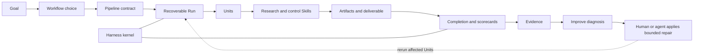

# Research Harness

把一个研究目标转成可复核的交付物，同时保留背后的来源、决策、中间产物与执行证据。

Research Harness 是一套端到端的 **Auto Research Design System**，由两部分组成：

- **Skills** 完成有边界的研究转换，例如检索、提取、比较、综合、评审与写作。
- **Harness** 把 Skills 组织成可恢复的 Workflows，检查产物、记录执行过程，
  并在 Run 失败时定位下一个修复位置。

```text
Goal -> Run -> Evidence -> Improve
```

这个项目不宣称自己是“全自主科学家”。它要解决的是：让长链条研究任务可观察、
可恢复、可审计、可修复，而不需要每次都从聊天记录里重建整个过程。

## 先选交付结果

用户根据想得到的结果选 Workflow。除非需要检查或修复，内部 Skills 与 Units 不必
成为用户的心智负担。

| 想得到的结果 | Workflow | 起点 | 主要交付物 |
|---|---|---|---|
| 快速理解一个主题并决定先读什么 | `research-brief` | topic | `output/SNAPSHOT.md` |
| 评审一篇论文或 manuscript | `paper-review` | manuscript | `output/REVIEW.md` |
| 在明确 protocol 下综合多项研究 | `evidence-review` | Review 问题，再人工批准 Protocol | `output/SYNTHESIS.md` |
| 写文献 Survey 或有边界的研究报告 | `arxiv-survey` | topic 与交付约束 | `output/DRAFT.md` |
| 把同一条 Survey 路径交付为 LaTeX 与 PDF | `arxiv-survey-latex` | topic 与交付约束 | `latex/main.pdf` |
| 形成有文献依据的研究方向 | `idea-brainstorm` | topic 与 scope | `output/REPORT.md` |
| 把已有资料转成教程 | `source-tutorial` | source pack 与受众 | 教程、Article PDF、Slides |

`graduate-paper` 仍是中文毕业论文的 research-stage 路径。它有可用 Skills，但不属于
当前 7 条可执行 Workflow Contract。

不同 Workflow 的输入边界不能互换。`research-brief`、Survey 家族与
`idea-brainstorm` 可以从 topic 开始；`paper-review` 必须有 manuscript；
`source-tutorial` 必须有本地 source pack 与受众信息；`evidence-review` 会先把 Review
问题写成 Protocol，并在检索前停下来等待批准。缺少前置材料时，Harness 会明确指出，
而不是用臆造上下文替代。

## 启动一次 Run

当前 CLI 从源码 checkout 中运行，需要 Python 3.10+，并使用
[uv](https://docs.astral.sh/uv/)。`uv run` 会安装已声明的 Python 依赖，包括论文 PDF
解析；Source Tutorial 摄取 PDF 还需要 `pdftotext`，LaTeX/PDF 交付则需要对应 Workflow
编译检查所列的 TeX 工具，以及用于页数验收的 Poppler `pdfinfo` 或可选 `PyMuPDF`
包。准备好这些依赖后，可以直接从 Goal 启动：

```bash
uv run rh goal create \
  --goal "理解机器人中的测试时自适应，并决定优先阅读什么" \
  --workflow research-brief \
  --workspace workspaces/robot-adaptation

uv run rh run start --workspace workspaces/robot-adaptation
uv run rh run status --workspace workspaces/robot-adaptation
uv run rh run approve --workspace workspaces/robot-adaptation --checkpoint C2
uv run rh run resume --workspace workspaces/robot-adaptation
uv run rh evidence inspect --workspace workspaces/robot-adaptation --excerpt
```

`run start` 会推进到下一个尚未满足的前置条件。对于 `research-brief`，先检查 core
paper set、taxonomy、outline 与 C2 review block，再批准 C2；只有当前活跃的 Checkpoint
可以被批准。批准会绑定所审阅 Artifact 的 Hash，材料变化后旧批准自动失效。
`run resume` 会从持久化的 Unit ledger 继续执行。完成后的 Run 包含人类可读的 Brief
与机器可读的 Scorecard；`evidence inspect` 会同时写出 Run Audit 与 Artifact Pack，
并可生成便携 excerpt。如果 Contract 失败，可以运行：

```bash
uv run rh improve diagnose --workspace workspaces/robot-adaptation
```

对于由用户提供输入的 Workflow，先把材料放进 Workspace，再继续：

```bash
# 单篇 Manuscript 评审
uv run rh goal create --goal "评审这篇论文" --workflow paper-review --workspace workspaces/review
mkdir -p workspaces/review/inputs
cp /path/to/manuscript.pdf workspaces/review/inputs/manuscript.pdf
uv run rh run start --workspace workspaces/review

# 固定资料包教程：第一次 start 会生成 sources/manifest.yml 并阻塞
uv run rh goal create --goal "把这组资料教给新成员" --workflow source-tutorial --workspace workspaces/tutorial
uv run rh run start --workspace workspaces/tutorial
# 将示例项替换为真实网页、PDF、Markdown、Repo、Docs Site 或 Transcript Locator。
uv run rh run resume --workspace workspaces/tutorial

# Evidence Review：Workflow 先生成 Protocol，再停在 C1 等待批准
uv run rh goal create --goal "判断哪些干预能提升检索忠实度" --workflow evidence-review --workspace workspaces/evidence-review
uv run rh run start --workspace workspaces/evidence-review
uv run rh run approve --workspace workspaces/evidence-review --checkpoint C1
uv run rh run resume --workspace workspaces/evidence-review
```

需要已有 Manuscript、Source Pack 或人工决策的 Workflow 会在对应前置条件处停下并说明
缺什么。`evidence-review` 会自行生成 Protocol，并在检索前暂停，让用户批准或修改，
而不是要求用户预先提供 Protocol。也可以在 Codex 中用自然语言调用：

```text
使用 paper-review 评审这篇论文，确保每条主要意见都能追溯到原文。
```

```text
使用 arxiv-survey-latex 写一篇 8-10 页的 RAG 评测课程论文，并生成 PDF。
```

## 一套端到端系统



每一层的职责不同：

- **Workflow**：用户为目标选择的研究路径。
- **Pipeline Contract**：用阶段、必需 Skills、目标 Artifacts、Checkpoints 与强制验收
  实现该 Workflow。
- **Workspace**：保存一次 Run 的人类可读文件与机器 Ledger。
- **Unit**：定义一个步骤的依赖、输入、输出、Owner 与 Acceptance。
- **Skill**：执行一个有边界的研究或控制能力。
- **Artifact**：保存研究输入、中间结果、Scorecard、Report 或最终交付物。
- **Harness Kernel**：管理 Run 身份、调度、Attempts、Completion、恢复、provenance、
  reconciliation、Audit 与失败定位。

新 Run 启动时，`harness-lock.v2` 会把选中的 Pipeline Contract 及其本地 Variant
依赖复制到 Workspace 并记录 Hash。仓库之后的改动不会静默重定义旧 Run；合同快照
缺失或被修改时，执行与 Audit 会显式阻断。

脚本 Unit、人工语义 Unit 与已批准 Checkpoint 都要通过同一套 Completion Protocol，
才能成为 `DONE`。普通执行会强制运行 Workflow 声明的最低验收；`--strict` 只追加
尚未被 Workflow 提升为强制项的诊断，它不是“是否检查”的总开关。
每项强制验收结果都会随 Completion 证据持久化，因此 Run Audit 可以直接展示已验证、
待执行、阻塞、跳过与旧版未验证的覆盖状态，不需要从 prose log 反推整次运行。

## 证据与质量

系统保留两种证据：

- **Research Evidence** 支撑或限定交付物中的研究内容。
- **Run Evidence** 说明执行了什么、哪些 Artifacts 发生了变化、哪些检查通过。

同时，质量判断被分成三层：

| 层级 | PASS 的含义 |
|---|---|
| 执行完整性 | Attempts、State、Manifests、Hashes 与 provenance 一致 |
| 契约验收 | 必需 Artifacts 满足可观测的 Workflow 检查 |
| 研究质量 | 结果在真实输入上的有用性、正确性与充分性，并经专家或 held-out 评估 |

Harness 当前实现前两层。第三层需要重复 Runs 与外部判断。Scorecard 不能证明科学
真理、研究新颖性或穷尽性检索。

## 把 Survey 当成研究报告引擎

Survey 家族既能交付完整文献综述，也能交付有边界、以文献为主要证据的课程论文、
课程报告、研讨课报告、短文献评述与技术现状报告。用户只需在 Goal 中说明用途、篇幅、
证据深度与格式；Workflow 自行选择内部 delivery profile。

快速理解 topic 用 `research-brief`，单篇评审用 `paper-review`，按 Protocol 综合用
`evidence-review`，固定资料包转教程用 `source-tutorial`。当交付物需要检索、比较、
综合并引用多篇论文时，选 Survey 家族。详见 [Survey 使用说明](readme/arxiv-survey.zh-CN.md)。

## 当前证据边界

- `paper-review`、`research-brief`、`idea-brainstorm` 与 `evidence-review` 已有 Workflow-local
  Scorecard 与 Failure -> Repair -> Rerun 测试；关键 Join 会拒绝过浅的 Novelty Surface、
  未落到核心论文的 Brief Scope、缺少有效论文指针或两篇论文覆盖的主题条目、断裂的
  Ideation Trace/Shortlist、一致性不足的 Protocol 与
  Extraction、缺失的 Bias 记录，以及词法上过度确定的结论；明确否定这些强结论的学术表达不会被误杀。
- Survey 家族已有强制的写作前 Evidence Loop：Subsection Brief、Evidence Binding 与
  Evidence Draft 必须覆盖完全相同的 Subsection ID；Gap 字段格式错误或仍有阻塞证据时，
  不允许进入写作。
- `research-brief` 除可重复的 Harness 证明外，还有一条完成的真实 arXiv 来源 pilot。
- `source-tutorial` 已通过从本地 Source 到 Article PDF 与 Slides PDF 的严格交付测试；
  Context Pack 必须保留已批准的 Module-Source Coverage，并重新连接成功 Ingest、
  Provenance、Snippet 与正文可见的 Source Notes。
- Survey 家族已有一条完成的有界报告 pilot，包含已审计的 10 页 PDF。
- 跨 topic 稳定性、专家对比、真实 model-token benchmark 与 Harness candidate 自动晋升尚未完成。

已公开的 `research-brief` 快照运行于 `recoverable-provenance.v1`；课程论文快照没有包含
当前 `.harness` ledgers 或 `run-audit.v2` bundle。它们仍是有效的交付物与历史 Run 证据，
但不冒充当前 v2 的跨 ledger acceptance 证明；重新发布公开 v2 Run 已进入 Roadmap。

公开证据快照保持有边界：

- [`research-brief` Harness 证明](examples/research-brief-harness-proof/README.md)
- [真实来源 `research-brief` 证明](examples/research-brief-real-source-proof/README.md)
- [课程论文交付证明](examples/course-paper-pilot/README.md)

## 维护者路径

提高成熟度声明前，先运行：

```bash
uv run python scripts/validate_repo.py --strict
uv run python scripts/readiness_audit.py --strict
uv run python scripts/audit_skills.py --fail-on WARN
uv run python scripts/audit_workflow_context.py
uv run --extra test python -m pytest -q
```

扩展 Workflow 时，先修改 `pipelines/` 中的 Contract，对齐 `templates/UNITS.*.csv`，
再在 `.codex/skills/` 实现对应能力。只有在补充 Completed Run 或 Failure-Repair 回归证据后，
才提高 Proof State。

## 文档

- [Auto Research 架构](docs/AUTO_RESEARCH_DESIGN_SYSTEM.md)
- [Workflow Catalog 与成熟度](docs/PIPELINE_TAXONOMY.md)
- [统一项目语言](docs/PROJECT_LANGUAGE.md)
- [Roadmap](docs/HARNESS_ROADMAP.md)
- [当前 Readiness](docs/HARNESS_READINESS.md)
- [Schemas](docs/SCHEMAS.md)
- [架构决策](docs/adr/)
- [中文使用导航](readme/README.zh-CN.md)

[English README](README.md)
