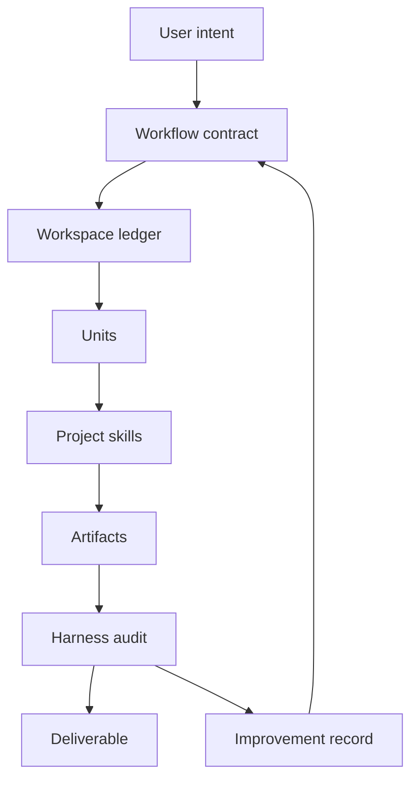

# research-units-pipeline-skills

> 语言：[English](README.md) | **简体中文**

一套面向研究写作与资料整理的人机协作系统。

这个仓库把 **semantic research skills** 和 **file-first harness** 组合在一起，
适合在 Codex 这类 coding agent 中运行研究工作流。它的重点不是替人完成所有研究，
而是把一次研究请求推进成一套可落盘、可检查、可恢复、可审计、可继续改进的
workspace。

最短链路是：

```text
intent -> workflow -> workspace -> unit -> skill -> artifact -> audit -> improvement
```

它不是通用 workflow engine，不是 prompt 集合，也不是“完全自主科学家”的宣称。
它的边界更务实：让模型处理语义阅读和写作，同时让研究过程留下足够清晰的中间产物，
方便人类检查、恢复、修复和复用。

## 它能产出什么

当你想要的不是一段聊天回答，而是一套有文件、有 checkpoint、有可复核证据的研究
交付物时，用这个仓库。

| 目标 | 入口 | 主要交付物 |
|---|---|---|
| 证据优先的文献综述 | `arxiv-survey` | `output/DRAFT.md` |
| 带 LaTeX/PDF 交付的综述 | `arxiv-survey-latex` | `output/DRAFT.md`, `latex/main.pdf` |
| 从一个主题生成课程论文或期末报告 | survey 使用场景，复用 `arxiv-survey` 或 `arxiv-survey-latex` | 报告草稿，可选 PDF |
| 快速主题研究简报和阅读路径 | `research-brief` | `output/SNAPSHOT.md` |
| 单篇论文 critique / referee-style review | `paper-review` | `output/REVIEW.md` |
| 按 protocol 做证据筛选、提取和结论整合 | `evidence-review` | `output/SYNTHESIS.md` |
| 基于文献的研究 idea | `idea-brainstorm` | `output/REPORT.md`, `output/REPORT.json` |
| 从网页、PDF、笔记、repo docs 生成教程 | `source-tutorial` | `output/TUTORIAL.md`, PDF, slides |
| 中文毕业论文材料组织引导 | `graduate-paper` | thesis project artifacts |

多数使用者只需要选择 workflow，然后检查 workspace 里的输出。维护者才需要深入
这些 workflow 背后的 pipeline contract、project skills、harness scripts 和
validation rules。

## 一次运行如何工作



- `workflow` 是面向用户的产品路径，比如 `paper-review`。
- `workspace` 是 `workspaces/<name>/` 下的一次运行目录。
- `unit` 是 `UNITS.csv` 里一个小而可检查的步骤。
- `skill` 是 `.codex/skills/` 下的可复用研究或写作能力。
- `artifact` 是中间或最终文件，通常是 Markdown、CSV、YAML、JSON、TeX 或 PDF。
- `audit` 是对 workspace 状态、run 状态或输出质量的有限范围检查。
- `improvement` 把薄弱输出映射回具体修复面：skill、pipeline、artifact、
  validator 或 decision。

这个项目最核心的设计选择是 artifact-first。模型不应该靠聊天上下文记住整条复杂
研究流程，而应该把状态、证据和决策写入文件，让人类和后续 unit 都能继续使用。

## 快速开始

在这个仓库里启动 agent session，然后直接描述你要的结果：

下面示例保留英文 workflow 名称；具体要求可以用中文写。

```text
Use paper-review to critique this manuscript and give me a lab-style review.
```

```text
Use research-brief to explain test-time adaptation for robotics and produce a reading path.
```

```text
Use source-tutorial to turn these webpages and repo docs into a tutorial with PDF and slides.
```

```text
Write an arxiv-survey-latex survey about embodied agents and show me the outline first.
```

```text
Use arxiv-survey-latex to write a compact course paper on robot learning. Keep the outline reviewable before drafting and target a final PDF.
```

如果你想更精确地控制执行路径，可以直接点名可执行 pipeline contract：

- [pipelines/arxiv-survey.pipeline.md](pipelines/arxiv-survey.pipeline.md)
- [pipelines/arxiv-survey-latex.pipeline.md](pipelines/arxiv-survey-latex.pipeline.md)
- [pipelines/research-brief.pipeline.md](pipelines/research-brief.pipeline.md)
- [pipelines/paper-review.pipeline.md](pipelines/paper-review.pipeline.md)
- [pipelines/evidence-review.pipeline.md](pipelines/evidence-review.pipeline.md)
- [pipelines/idea-brainstorm.pipeline.md](pipelines/idea-brainstorm.pipeline.md)
- [pipelines/source-tutorial.pipeline.md](pipelines/source-tutorial.pipeline.md)

研究阶段设计文档：

- [pipelines/graduate-paper-pipeline.md](pipelines/graduate-paper-pipeline.md)

功能说明：

| 入口 | English | 中文 |
|---|---|---|
| `arxiv-survey` / `arxiv-survey-latex` | [Guide](readme/arxiv-survey.md) | [说明](readme/arxiv-survey.zh-CN.md) |
| `research-brief` | [Guide](readme/research-brief.md) | [说明](readme/research-brief.zh-CN.md) |
| `paper-review` | [Guide](readme/paper-review.md) | [说明](readme/paper-review.zh-CN.md) |
| `evidence-review` | [Guide](readme/evidence-review.md) | [说明](readme/evidence-review.zh-CN.md) |
| `idea-brainstorm` | [Guide](readme/idea-brainstorm.md) | [说明](readme/idea-brainstorm.zh-CN.md) |
| `source-tutorial` | [Guide](readme/source-tutorial.md) | [说明](readme/source-tutorial.zh-CN.md) |
| `graduate-paper` | [Guide](readme/graduate-paper.md) | [说明](readme/graduate-paper.zh-CN.md) |

## 架构分层

这个仓库有两个相互配合的层。

**Skills** 负责语义研究行为：

- 读什么输入或材料；
- 写什么 artifact；
- 使用什么验收标准；
- 遵守哪些 guardrails。

**Harness** 负责确定性的执行支撑：

- workspace 初始化和恢复；
- pipeline contract 校验；
- unit 执行；
- doctor、audit、improve、pack 命令；
- output manifest 和 report schema；
- repo 级测试与 readiness checks。

扩展项目时请保持这个分工：研究判断放在 skills，可重复的检查、恢复和编排放在
harness。

完整架构图和当前功能图见
[docs/AUTO_RESEARCH_DESIGN_SYSTEM.md](docs/AUTO_RESEARCH_DESIGN_SYSTEM.md)。

## 当前状态

当前 workflow family 是：

- **Survey**：`arxiv-survey`、`arxiv-survey-latex`
- **Orientation**：`research-brief`
- **Review**：`paper-review`、`evidence-review`
- **Ideation**：`idea-brainstorm`
- **Tutorial**：`source-tutorial`
- **Thesis**：`graduate-paper`

其中 7 条 workflow 已经有 pipeline contract、unit template 和 harness validation。
`graduate-paper` 仍然是中文毕业论文组织引导：有 thesis-oriented skills 和设计
材料，但还不是严格的可执行 pipeline。

课程论文和期末报告现在被视为 survey 的使用场景 overlay，而不是单独新增
workflow family。
如果只需要 Markdown 草稿，用 `arxiv-survey`；如果课程最终需要 PDF，用
`arxiv-survey-latex`。

维护者路线图目前集中在 `paper-review`：完成一个 Auto Review workspace，包括
semantic rubric、scorecard、final review、audit、improvement report 和 artifact
pack。这里面有些 proof artifact 目前还不是 `paper-review` pipeline contract 的硬性
产物；下一阶段应该先围绕当前 contract 跑出完整 proof，再决定是否把这些产物提升为
contract 要求。这里的 artifact pack 指的是一份交付物 manifest，用来说明这次 run
哪些文件构成了可检查、可迁移的结果。在这个 proof 出来之前，不建议新增 workflow
family。

当前 workflow catalog 和成熟度见
[docs/PIPELINE_TAXONOMY.md](docs/PIPELINE_TAXONOMY.md)。

## 开发者入口

这一节给维护者使用。当你修改 pipeline contract、skill IO、workspace artifact、
schema 或 validation rule 时，使用这些检查：

```bash
uv run python scripts/validate_repo.py --no-check-quality --strict
uv run python scripts/readiness_audit.py --progress workspaces/harness-upgrade/GOAL_STATUS.md --strict
uv run python scripts/audit_skills.py --fail-on WARN
uv run --extra test python -m pytest -q
uv run python scripts/audit_skills.py --review-category template_placeholder --limit 20
uv run python scripts/audit_skills.py --summary-only
uv run python scripts/generate_skill_graph.py
```

Workspace 诊断命令：

```bash
uv run python scripts/pipeline.py doctor --workspace workspaces/<name> --write
uv run python scripts/pipeline.py audit --workspace workspaces/<name> --write
uv run python scripts/pipeline.py improve --workspace workspaces/<name> --write
uv run python scripts/pipeline.py pack --workspace workspaces/<name> --write
```

`doctor` 诊断 workspace 状态。`audit` 汇总 run。`improve` 把缺陷映射到修复面。
`pack` 生成交付物 manifest。

## 阅读地图

- [docs/AUTO_RESEARCH_DESIGN_SYSTEM.md](docs/AUTO_RESEARCH_DESIGN_SYSTEM.md)：
  系统模型和架构图。
- [docs/PIPELINE_TAXONOMY.md](docs/PIPELINE_TAXONOMY.md)：workflow catalog、
  成熟度和下一阶段 proof。
- [docs/PROJECT_LANGUAGE.md](docs/PROJECT_LANGUAGE.md)：workflow、workspace、
  unit、artifact、audit、improvement 的项目内统一语言。
- [docs/HARNESS_ROADMAP.md](docs/HARNESS_ROADMAP.md)：当前产品和工程方向。
- [docs/HARNESS_READINESS.md](docs/HARNESS_READINESS.md)：本地检查和 readiness 标准。
- [docs/SCHEMAS.md](docs/SCHEMAS.md)：生成报告的 schema 名称。
- [docs/adr/](docs/adr/)：架构决策记录。
- [SKILL_INDEX.md](SKILL_INDEX.md)：skill 索引。
- [SKILLS_STANDARD.md](SKILLS_STANDARD.md)：skill 编写标准。

多语言功能文档入口页放在 `readme/README.*.md`。

## Star History

[](https://star-history.com/#WILLOSCAR/research-units-pipeline-skills&Date)
