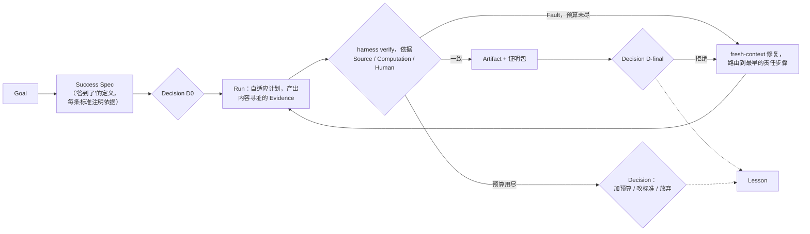

# Research Harness

[](https://github.com/WILLOSCAR/research-units-pipeline-skills/actions/workflows/verify.yml)

**研究不应该只留下答案，还应该留下答案是怎么来的。**

一个长研究任务即使交付了漂亮的 PDF，仍可能回答不了几个基本问题：这一段由哪些来源
支撑？上一次失败后改了什么？明天能否从断点继续，而不是重新翻聊天记录？报告里的
`PASS` 到底验证了哪一层——它验证的是我问的问题吗？

Research Harness 把研究 **Goal** 变成一次自我修正的 **Run**：每一步留下可核验的
**Evidence**，最终产出 **Artifact**——面向读者的交付物加上证明它如何产生的证明包。
信任来自 **Loop**（`verify → Fault → repair → re-run`），由 **harness** 作为外部裁判、
对照模型无法抹平的依据执行，人的 **Decision** 是 Loop 里的一个回合。一次 Run 从失败中
学到的东西不随它消失：沉淀为 **Lesson**，而 Lesson 是 harness 自身被允许 **evolve**
的唯一依据。

```text
内环（一次 Run）：  Goal -> criteria -> Run -> Evidence -> verify -> Fault -> repair -> re-run ... -> Artifact -> Decision
外环（整个项目）：  Run -> Faults + Decisions -> Lesson -> evolve(harness, SOP) -> next Run
```

它不是自主科学家；它是自主科学家要被相信所必须具备的那层：一个**面向 long-horizon
研究 agent 的 harness**——包在外部模型周围的状态、Evidence、verify、Decision、预算与
Lesson——让 Agent 协助的研究过程可检查、可续跑，也能诚实区分"已经证明"和"尚未
证明"。Auto research 系统可以把文献、想法、写作、评审阶段作为 Loop kind 跑在它里面；
`experiment` 是下一个自然的 kind。它既不是递归自我改进，也不是 self-evolving agent：
harness 只凭 Lesson、回放和人的 Decision 改变。

> **项目现状（2026-09-12）。** 上面这个故事经重新审视被确认为自洽。此前的代码对照
> 故事测量后发现结构性偏离——最关键的一条：Goal 从未进入验证侧，因此 Run 收敛的是
> workflow 模板而不是 Goal。那套实现保存在 git tag `snapshot/pre-refactor-2026-09-12`，
> 正基于 [`docs/PRODUCT_DESIGN.md`](docs/PRODUCT_DESIGN.md) 从零重建（见[现状](#现状)）。
> 仓库里每份文档都声明自己描述的是**产品**（目标态）还是**实现快照**（冻结态）；
> 本 README 描述的是产品。见
> [ADR 0026](docs/adr/0026-redesign-the-product-from-the-story-and-freeze-the-implementation.md)。

## 产品

### 你要做的事

说出 Goal 和想要的结果。做两次 Decision——一次决定"答到了"是什么意思，一次
对最终 Artifact 表态。拿到 Artifact 和它的证明包。

| 你想要…… | Loop kind | 你提供 | 你得到 |
|---|---|---|---|
| 理解一个主题并决定先读什么 | `brief` | topic | 一页 brief |
| 评审一篇 manuscript | `review` | manuscript | referee 风格评审 |
| 在已批准的 Protocol 下综合研究 | `evidence-synthesis` | Review 问题 | protocol + 有界综合 |
| 写文献 Survey 或有边界的报告 | `survey` | topic 与交付约束 | survey 稿（`--format pdf` 出 LaTeX/PDF） |
| 形成有文献依据的研究方向 | `ideas` | topic 与 scope | 方向备忘 |
| 把固定资料包转成教程 | `tutorial` | source pack 与受众 | 教程（+ PDF、slides） |

一个入口、四个动词、四种结果（维护者另有 `lessons()`）：

```text
start(goal, kind, format?)  continue()  decide(decision)  inspect()
NEEDS_DECISION | BLOCKED | PROGRESSED | COMPLETED
```

### 一次 Run 里发生什么



1. **Goal 进入验证侧。** Run 启动时从你的 Goal 派生 Success Spec——要回答的问题、
   范围边界、什么算跑题、预算——并为每条标准注明它能被什么核对：**Source**（原始
   材料）、**Computation**（确定性计算）或**你**。你确认它（D0）。下游每个门禁都
   读它。没有任何依据能核对的标准，被列为由你判断，绝不由门禁放行。
2. **verify 是两件事。** *完整性验证*是确定性的、模型无法影响：hash、manifest、
   状态一致、Decision 新鲜度。*质量门禁*是声明的代理指标；每个都标注类型
   （`structural` / `grounded` / `calibrated`）、依据，以及它到底能说明多少。任何
   门禁都不读生产方自己写的 verdict。
3. **Run 可以改计划，不能改标准。** 它可以增删、重排步骤；每一步仍进入 verify。
   遇到达不到的标准，它问你——不会悄悄把标准改掉。
4. **修复由 Fault 驱动、fresh-context、有界、回溯上游。** 门禁失败产出一个 Fault，
   指出最早与 Success Spec 冲突的步骤。修复者拿到的是 Fault 和 Evidence——不是失败
   的草稿。harness 以 converged / exhausted / escalated 三种方式之一停止修复并记录
   原因。预算用尽的 Loop 以你的 Decision 结束，绝不静默。
5. **最后一票是你的。** 每种 Loop kind 都以你对 Artifact 的 Decision 结束，证明包
   就在眼前——每条陈述都指向支撑它的 Evidence。Decision 绑定你审阅过的全部 hash；
   任何一项变了，Decision 即失效。拒绝会作为 Fault 重新进入 Loop。
6. **失败沉淀为 Lesson；Lesson 是 harness 演化的唯一依据。** 一次 Run 结束时，它的
   Fault 和 Decision 被蒸馏为项目级 Lesson。对门禁、预算或某种 Loop kind SOP 的改动
   必须引用 Lesson、在回放中抓住 Lesson 记录的 Fault，并且只能由人的 Decision 采纳。
   harness 从不为自己的改动背书。

### 一个 PASS 到底意味着什么

| 层级 | PASS 证明 | 不证明 |
|---|---|---|
| 执行完整性 | Run 的记录内部一致 | 答案好 |
| 合同验收 | Artifact 通过了声明的门禁，每个门禁带类型与校准状态 | 科学真理或穷尽检索 |
| 研究质量 | ——你的 D-final、held-out 评测、专家评审 | 普遍有效性 |

产品宣称前两层。第三层属于你；产品的工作是让你处在能做出这个判断的位置。

完整设计：[`docs/PRODUCT_DESIGN.md`](docs/PRODUCT_DESIGN.md)。术语：
[`CONTEXT.md`](CONTEXT.md)。

## 使用

需要 Python 3.10+ 与 [uv](https://docs.astral.sh/uv/)：

```bash
git clone https://github.com/WILLOSCAR/research-units-pipeline-skills.git
cd research-units-pipeline-skills
uv sync --extra test

uv run rh start --goal goal.md --kind brief          # 打开 Run；第一个 packet 负责派生 Success Spec
uv run rh continue                                   # 发出下一个 packet，或核验你刚完成的那一轮（spec 之后就是 D0）
uv run rh decide D0 --accept                         # 或 --reject --reason "..."
uv run rh inspect                                    # 状态、未关闭的 Fault、待决的 Decision、重新核验的完整性
uv run rh lessons list                               # 外环
```

`--kind` 从六种 Loop kind 中选一种：`brief`、`review`、`evidence-synthesis`、
`survey`、`ideas`、`tutorial`（`experiment` 暂缓）。`--format` 选择同一 Artifact
的导出形式：Horizon 0 交付 `md`，`pdf` / `slides` 适配器随 Horizon 1 到来。`rh`
是唯一入口；`python -m rh` 是它的别名。workspace 默认是 `workspaces/current`
（用 `-w DIR` 或 `$RH_WORKSPACE` 更改）。

### Agent 如何推进一次 Run

harness 从不调用模型；由 agent 来驱动。`rh continue` 在
`<workspace>/steps/<step>/pass-<n>/packet.md` 写下一个 packet：要遵循的 Skill、按
hash 给出的输入 Evidence、期望的输出名，以及这一步服务的标准。agent（Codex、
Claude Code、Cursor）读取 `.codex/skills/` 下的那个 Skill，把输出写到本轮的
`outputs/` 目录，再运行一次 `rh continue`。harness 把输出 hash 进 Evidence，运行
内核门禁，为需要阅读判断的门禁调度 prover Skill，然后要么放行这一步，要么把每个
Fault 路由到它所指认的最早步骤上开一轮修复——修复者拿到的是 Fault 和 Evidence，
从来不是失败的草稿。人回答 D0（Success Spec）和 D-final（Artifact）；达不到某条
标准的 agent 调用 `rh escalate --reason`，而不是改写标准。

### 维护者验证

```bash
uv run --extra test ruff check .
uv run python scripts/check_docs.py
uv run --extra test python -m pytest -q
```

## 现状

Horizon 0 重建（[`docs/HARNESS_ROADMAP.md`](docs/HARNESS_ROADMAP.md)、
[`docs/REBUILD_DESIGN.md`](docs/REBUILD_DESIGN.md)）正在本分支进行：`src/rh/` 下的
内核、上面的 CLI、`src/rh/kinds/` 下六种 Loop kind 的声明，以及 `tests/conformance/`
下的符合性测试（清单全部 22 行，由脚本化 agent 驱动）都已就位；各 kind 点名的
Skill 正在向新契约对齐，接下来是在真实来源上跑第一批 Run（先 `brief`，后 `review`）。此前的
实现、它的使用导航和已公开的示例保存在 git tag `snapshot/pre-refactor-2026-09-12`
（用 `git show snapshot/pre-refactor-2026-09-12:<path>` 可读取任意文件）；那套代码
走到了哪里、在哪里偏离了设计，记录在
[`docs/IMPLEMENTATION_SNAPSHOT_2026-09-12.md`](docs/IMPLEMENTATION_SNAPSHOT_2026-09-12.md)。
示例将在 Horizon 1 由新内核重新生成；快照里的示例不会被新内核重放。

## 文档

- [统一术语](CONTEXT.md)——十一个术语、两个环及其蕴含
- [产品设计](docs/PRODUCT_DESIGN.md)——设计承诺、产品形态、符合性清单
- [重建设计](docs/REBUILD_DESIGN.md)——内核、裁判协议、存储、Loop kind 格式、构建顺序
- [Roadmap](docs/HARNESS_ROADMAP.md)——Horizon 0 是重建
- [实现快照](docs/IMPLEMENTATION_SNAPSHOT_2026-09-12.md)——冻结代码对照设计的测量
- [架构决策](docs/adr/)——按 story / behavior / snapshot 分类
- [贡献指南](CONTRIBUTING.md)——本地门禁与代码位置

[English README](README.md)

## Star History

<a href="https://www.star-history.com/?repos=WILLOSCAR%2Fresearch-units-pipeline-skills&type=date&legend=top-left">
  <picture>
    <source media="(prefers-color-scheme: dark)" srcset="assets/star-history/star-history-dark.svg">
    
  </picture>
</a>
