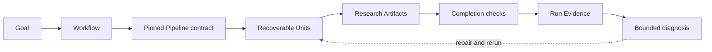

# Research Harness

[](https://github.com/WILLOSCAR/research-units-pipeline-skills/actions/workflows/verify.yml)

**研究不应该只留下答案，还应该留下答案是怎么来的。**

一个长研究任务即使交付了漂亮的 PDF，仍可能回答不了几个基本问题：这一段由哪些来源
支撑？上一次失败后改了什么？明天能否从断点继续，而不是重新翻聊天记录？报告里的
`PASS` 到底验证了哪一层？

Research Harness 把研究目标变成一次文件优先、可恢复的 Run。它把有边界的 Skills
组织成明确的 Workflows，保存中间 Artifacts 与决策，用可观测合同验收结果，并把失败
定位到最小修复面。

```text
Goal -> Run -> Evidence -> Improve
```

它不宣称自己是“自主科学家”。它提供的是一套基础设施，让 Agent 协助的研究过程
可检查、可续跑，也能诚实区分“已经证明”和“尚未证明”。

## 五分钟看懂一次 Run

Research Harness 当前从源码 checkout 运行，需要 Python 3.10+ 与
[uv](https://docs.astral.sh/uv/)：

```bash
git clone https://github.com/WILLOSCAR/research-units-pipeline-skills.git
cd research-units-pipeline-skills
uv sync --locked

uv run rh goal create \
  --goal "理解机器人中的测试时自适应，并决定优先阅读什么" \
  --workflow research-brief \
  --workspace workspaces/robot-adaptation

uv run rh run start --workspace workspaces/robot-adaptation
```

Run 会一直推进到完成或遇到未满足的前置条件。对于 `research-brief`，检查论文集合、
taxonomy、outline 与 C2 review block 后继续：

```bash
uv run rh run status --workspace workspaces/robot-adaptation
uv run rh run approve --workspace workspaces/robot-adaptation --checkpoint C2
uv run rh run resume --workspace workspaces/robot-adaptation
uv run rh evidence inspect --workspace workspaces/robot-adaptation --excerpt
```

Workspace 同时保存人类可读的结果和机器可核验的过程：

```text
GOAL.md                  目标与约束
UNITS.csv                显式计划与当前 Unit 状态
DECISIONS.md             人工 Checkpoint 与选择
papers/ + outline/       Research Evidence 与中间结构
output/                  交付物、Scorecards、Audits、修复报告
.harness/                Run 身份、Attempts、Events、Hashes、Provenance
```

合同失败时，不必盲猜整条链路：

```bash
uv run rh improve diagnose --workspace workspaces/robot-adaptation
```

## 先选你要的交付物

用户按结果选择 Workflow；只有需要检查或修复时，Skills 与 Units 才进入视野。

| 你想要…… | Workflow | 必需起点 | 主要交付物 |
|---|---|---|---|
| 理解一个主题并决定先读什么 | `research-brief` | topic | `output/SNAPSHOT.md` |
| 评审一篇论文或 manuscript | `paper-review` | manuscript | `output/REVIEW.md` |
| 在已批准的 Protocol 下综合研究 | `evidence-review` | Review 问题 | `output/SYNTHESIS.md` |
| 写文献 Survey 或有边界的报告 | `arxiv-survey` | topic 与交付约束 | `output/DRAFT.md` |
| 把 Survey 交付为 LaTeX 与 PDF | `arxiv-survey-latex` | topic 与交付约束 | `latex/main.pdf` |
| 形成有文献依据的研究方向 | `idea-brainstorm` | topic 与 scope | `output/REPORT.md` |
| 把固定资料包转成教程 | `source-tutorial` | source pack 与受众 | 教程、Article PDF、Slides |

在 Codex 或 Claude Code 中，调用入口就是一句自然语言：

```text
使用 research-brief 梳理机器人测试时自适应，并告诉我优先读什么。
使用 paper-review 评审我附上的论文，确保每条主要意见都能追溯到原文。
使用 arxiv-survey-latex 写一篇 8-10 页的 RAG 评测课程论文，并生成 PDF。
使用 source-tutorial 把 sources/manifest.yml 中的资料做成面向高级软件工程师的教程。
```

`graduate-paper` 仍是研究阶段的中文毕业论文路径，不属于当前七条可执行 Pipeline。

输入边界是有意设计的：`paper-review` 不会臆造 manuscript，`source-tutorial` 不会
臆造 source pack，`evidence-review` 会先写 Protocol，并在检索前等待批准。具体准备方式
见[中文使用导航](readme/README.zh-CN.md)。

## 研究任务变成 Run 后，发生了什么

没有 Harness 时，Agent 往往只留下最终答案和一段很长的对话。Research Harness 给每次
转换一个可检查的负责人：



这条证据链依靠三件事成立：

1. **合同会被锁定。** `harness-lock.v2` 快照化所选 Pipeline，并记录 Variant、Skill
   implementations 与 Harness Kernel 的 Hash。活跃 Run 遇到 Pipeline 或 Kernel 漂移时
   fail closed，不会在新规则下悄悄续跑。
2. **Completion 必须有证据。** `UNITS.csv` 里手改一个 `DONE` 不等于成功；Attempt、
   必需输出、Artifact Hash、Workflow 检查、Manifest 与 Completion Event 必须一致。
3. **失败有地址。** Doctor、Audit、Scorecard 与 Failure Ledger 把可观测缺陷路由到
   对应修复面。Improve 负责诊断，不会原地改写 Harness。

人工 Checkpoint 也遵循同一原则。批准会绑定当时审阅的 Artifact Hash；Scope、Outline
或 Protocol 改变后，旧授权自动失效。

## 一个 PASS 到底意味着什么

Research Harness 把常被混在一起的三种判断分开：

| 层级 | PASS 证明 | 不证明 |
|---|---|---|
| 执行完整性 | Attempts、State、Manifests、Hashes 与 Provenance 一致 | 答案本身优秀 |
| 合同验收 | 必需 Artifacts 满足可观测 Workflow 检查 | 科学真理或穷尽性检索 |
| 研究质量 | 真实输入上的有用性、正确性与充分性 | 超出评测案例的普遍有效性 |

当前仓库实现前两层。第三层需要重复 Runs、held-out 评测与专家判断。一个绿色 Scorecard
不会被包装成科学正确性或原创性证明。

## 一次失败如何变成真正的门禁

Survey Writer 可以根据结构化 Evidence Pack 与带版本的模板生成 provisional prose。
早期版本虽然走通了 PDF 交付，却把大量 scaffold 留在正文中：历史课程论文样本的
**140 句中有 96 句命中模板（68.6%）**。

现在，这个问题不再只是 Warning：

- `front-matter-writer` 在合并前检查摘要、引言、相关工作、讨论与结论；
- `subsection-writer` 与 `writer-selfloop` 检查 H3 正文；
- `pipeline-auditor` 检查整份合并稿、已选资产 Hash 与三个模板所属 Skill；
- “this run” 一类 pipeline voice 在读者正文中属于阻断项；
- 全稿残留上限为 10%。

当前公开重放在现行合同下完成了全部 49 个 Units：

| 证据 | 结果 |
|---|---:|
| Workflow 必选检查 | 31/31 PASS |
| Target Artifacts | 75/75 存在 |
| Harness Kernel lock | 35/35 匹配 |
| Ledger integrity issues | 0 |
| 模板残留 | 0/226 句（0.0%） |
| PDF 交付 | 10 页 |

这证明 10% 门槛对这一组保留 Artifact 可达，但不证明作者身份、语义原创性、全自动生成、
跨主题校准或专家论文质量。该 Run 使用人工 Artifact 复核，并从 dirty worktree 启动；
干净 revision 上从头复现仍未完成。详见[当前合同证据](examples/course-paper-residue-pass/README.md)
与[历史失败基线](examples/course-paper-pilot/README.md)。

## 已公开的证据

仓库发布经过裁剪的证据包，而不是包含私人日志的完整 Workspace：

| 快照 | 能证明什么 | 边界 |
|---|---|---|
| [`course-paper-residue-pass`](examples/course-paper-residue-pass/README.md) | 当前 v2 合同验收、0/226 残留、10 页 PDF | 人工重放、dirty revision、单一 topic |
| [`course-paper-pilot`](examples/course-paper-pilot/README.md) | 完成交付与可复现的 68.6% 失败基线 | 历史合同；不通过当前写作门禁 |
| [`research-brief-real-source-proof`](examples/research-brief-real-source-proof/README.md) | 一次真实 arXiv Brief 交付 | 历史 v1、单一 topic |
| [`research-brief-harness-proof`](examples/research-brief-harness-proof/README.md) | 可重复的恢复与 Audit 证据 | 合成来源、历史 v1 |

`paper-review`、`idea-brainstorm`、`evidence-review` 与 `source-tutorial` 还有 Scorecard
fixture 和 Failure-Repair 回归。跨 topic 稳定性、真实 model-token benchmark、专家对比
与 Harness candidate 自动晋升仍是开放问题。

## 运行依赖

- Python 3.10+ 与 `uv`；
- Source Tutorial PDF 摄取需要 `pdftotext`；
- LaTeX/PDF 交付需要 `latexmk`、XeLaTeX、BibTeX 与 `pdfinfo`。

Python 包声明了 `PyYAML` 与 `pypdf`；维护者依赖位于 `test` extra。GitHub Actions 安装
与 PDF 测试相同的 TeX/Poppler 边界。

## 维护者验证

运行与 `.github/workflows/verify.yml` 相同的检查：

```bash
uv run --locked python scripts/validate_repo.py --strict
uv run --locked python scripts/readiness_audit.py --strict
uv run --locked python scripts/audit_skills.py --fail-on WARN
uv run --locked python scripts/audit_workflow_context.py
uv run --locked --extra test ruff check .
uv run --locked --extra test python -m pytest -q
```

扩展 Workflow 时，需要同时对齐 Pipeline Contract、Unit Template、所属 Skills、测试与
证据声明。没有 Completed Run 或 Failure-Repair 回归，不应提高 Proof State。

## 文档

- [Auto Research 架构](docs/AUTO_RESEARCH_DESIGN_SYSTEM.md)
- [Workflow Catalog 与 Proof State](docs/PIPELINE_TAXONOMY.md)
- [统一项目语言](docs/PROJECT_LANGUAGE.md)
- [Loop 术语表](CONTEXT.md)
- [Roadmap](docs/HARNESS_ROADMAP.md)
- [当前 Readiness](docs/HARNESS_READINESS.md)
- [Schemas](docs/SCHEMAS.md)
- [架构决策](docs/adr/)
- [中文使用导航](readme/README.zh-CN.md)

[English README](README.md)

## Star History

<a href="https://www.star-history.com/?repos=WILLOSCAR%2Fresearch-units-pipeline-skills&type=date&legend=top-left">
  <picture>
    <source media="(prefers-color-scheme: dark)" srcset="assets/star-history/star-history-dark.svg">
    
  </picture>
</a>
