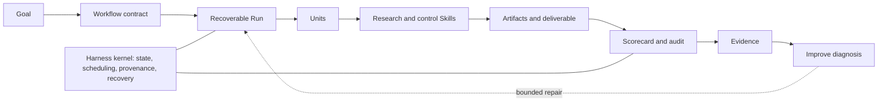

# Research Harness

把一个研究目标转成可复核的交付物，同时保留来源、决策与中间证据。

Research Harness 把可复用的研究 Skills 与 file-first 执行 Harness 组合起来。它可以交付
研究简报、论文评审、证据综述、文献 Survey、课程论文或基于给定资料的教程；长任务即使
中断，也能恢复、检查和审计。

```text
Goal -> Run -> Evidence -> Improve
```

从内部看，这是一套端到端 **Auto Research Design System**，不是完全自主的科学家。
Skills 完成研究转换，Workflow Contract 组织交付路径，Harness 保存状态、检查产物并定位
失败，让用户或 Agent 能做下一次有边界的修复。

## 跑一个小 Demo

最简单的 topic-seeded 入口是 `research-brief`：

```bash
uv run rh goal create \
  --topic "机器人中的测试时自适应" \
  --workflow research-brief \
  --workspace workspaces/robot-adaptation

uv run rh run start --workspace workspaces/robot-adaptation
uv run rh run status --workspace workspaces/robot-adaptation
uv run rh evidence inspect --workspace workspaces/robot-adaptation --excerpt
```

结果包括人类可读的简报 `output/SNAPSHOT.md`、机器可读的评分卡
`output/BRIEF_SCORECARD.json`，以及带 Hash 和 provenance 的 Artifact 索引。
如果质量门失败，可以运行：

```bash
uv run rh improve diagnose --workspace workspaces/robot-adaptation
```

`improve diagnose` 只定位失败 Contract 与修复位置，不会暗中改写 Workspace，也不会自动
把改动晋升为新的 Harness 基线。

`rh goal create` 最适合由主题直接启动的 Workflow。需要已有 Manuscript、Source Set、
Protocol 或人工 Checkpoint 的路径，会在缺少输入时停止并说明原因。也可以在 Codex 中用
自然语言直接调用：

```text
使用 paper-review 评审这篇论文，确保每条主要意见都能追溯到原文。
```

```text
使用 arxiv-survey-latex 写一篇 8-10 页的 RAG 评测课程论文，并生成 PDF。
```

## 选择 Workflow

| 想得到的结果 | Workflow | 主要交付物 |
|---|---|---|
| 快速理解主题并决定先读什么 | `research-brief` | `output/SNAPSHOT.md` |
| 评审一篇论文或 Manuscript | `paper-review` | `output/REVIEW.md` |
| 按明确 Protocol 综合多项研究 | `evidence-review` | `output/SYNTHESIS.md` |
| 构建证据优先的文献 Survey | `arxiv-survey` | `output/DRAFT.md` |
| 交付 Survey、课程论文或 PDF 报告 | `arxiv-survey-latex` | `latex/main.pdf` |
| 形成有文献依据的研究方向 | `idea-brainstorm` | `output/REPORT.md` |
| 把已有资料转成教程 | `source-tutorial` | 教程、Article PDF、Slides |

`graduate-paper` 仍是中文毕业论文的 research-stage 路径。它有可用 Skills 和设计材料，
但还没有上述 7 条 Workflow 使用的严格可执行 Contract。

课程论文是 Survey 家族的有界 Profile，不是新增 Workflow。明确提出课程论文时，系统会
缩小检索、证据、提纲、段落和引用预算，同时保留同一套可追溯性与质量门。当前公开的
[课程论文证据快照](examples/course-paper-pilot/README.md)记录了一次完成的 49-Unit Run、
通过的 Artifact Audit，以及针对 8-10 页 Goal 生成的 10 页 PDF。这是一份端到端交付
证明，不代表所有主题都已达到相同质量。

## 一个产品循环

| 阶段 | 用户的问题 | 持久记录 |
|---|---|---|
| **Goal** | 最终结果和约束是什么？ | 请求、Workflow、必需 Artifacts、成功标准 |
| **Run** | 做到哪里、下一步是什么、能否恢复？ | Units、Attempts、Events、Decisions、Checkpoints |
| **Evidence** | 结果为什么可信？ | Sources、中间 Artifacts、Hashes、Scorecards、Audits |
| **Improve** | 本次 Run 在哪里失败，谁负责修？ | Failure Ledger、诊断、明确 Repair Surface |



这里的分层是职责分离，不是僵硬的二分：

- **Research Skills** 负责检索、提取、比较、综合、评审和写作。
- **Control Skills** 生成报告、Checkpoint、Manifest 与局部质量门。
- **Workflow Contracts** 定义有序 Units、输入、输出和验收条件。
- **Harness Kernel** 管理 Run 身份、调度、Attempts、恢复、provenance、实现指纹、
  诊断与 Audit。

每个 Workspace 同时保留可读项目文件和机器可读 Run Ledger：

```text
workspaces/<run>/
├── GOAL.md
├── UNITS.csv
├── STATUS.md
├── DECISIONS.md
├── output/
└── .harness/
    ├── goal.json
    ├── run.json
    ├── harness.lock.json
    ├── events.jsonl
    ├── attempts.jsonl
    ├── artifacts.jsonl
    ├── failures/ledger.jsonl
    └── evaluations/ledger.jsonl
```

新 Run 会锁定初始 Pipeline、Unit、Skill 与 Kernel 修订。每个成功 Unit 还会记录实际使用
的 Skill 实现指纹；Skill 后续变化时，`doctor` 会把对应 DONE Unit 报告为 stale，要求从
最早受影响位置重新执行。

## 当前证据

7 条 Workflow 已有可执行 Contract 与 Unit Template，但结构可运行不等于语义已成熟：

- `paper-review`、`research-brief`、`idea-brainstorm`、`evidence-review` 已有各自的
  Scorecard 和 Failure -> Repair -> Rerun 测试。
- `source-tutorial` 已有从本地 Source 到 Article PDF 与 Beamer PDF 的严格交付测试。
- Survey 家族已有一条完成的紧凑课程论文/PDF Run 和较完整的 Contract 测试；多主题
  质量稳定性与真实 Token 对比仍未完成。
- 外部 Held-out Evaluation、Candidate Worktree、自动 Promotion 和 Hosted Run Store
  尚未实现。

Scorecard 检查可观察 Contract 与可追溯性，不会复现实验、判定科学真理或替代专家判断。

## 维护者接口

开发与审计时可直接使用底层 Pipeline Adapter：

```bash
uv run python scripts/pipeline.py doctor --workspace workspaces/<name> --write
uv run python scripts/pipeline.py audit --workspace workspaces/<name> --write
uv run python scripts/pipeline.py improve --workspace workspaces/<name> --write
uv run python scripts/pipeline.py pack --workspace workspaces/<name> --write
```

全仓验证：

```bash
uv run python scripts/validate_repo.py --no-check-quality --strict
uv run python scripts/readiness_audit.py --strict
uv run python scripts/audit_skills.py --fail-on WARN
uv run --extra test python -m pytest -q
```

扩展 Workflow 时，先修改 `pipelines/` 中的 Contract，再对齐
`templates/UNITS.*.csv`，在 `.codex/skills/` 实现对应能力，最后补 Completed Run 或
Failure/Repair 回归证据，再提高成熟度描述。

## 文档

- 从 [Workflow Catalog](docs/PIPELINE_TAXONOMY.md) 和
  [中文使用导航](readme/README.zh-CN.md) 开始。
- 理解 [Auto Research Architecture](docs/AUTO_RESEARCH_DESIGN_SYSTEM.md)、
  [Project Language](docs/PROJECT_LANGUAGE.md) 与
  [Pipeline Operability Audit](docs/PIPELINE_OPERABILITY_AUDIT.md)。
- 评审 [Schemas](docs/SCHEMAS.md)、[Roadmap](docs/HARNESS_ROADMAP.md)、
  [Readiness Gates](docs/HARNESS_READINESS.md) 与 [ADRs](docs/adr/)。

[English README](README.md)
