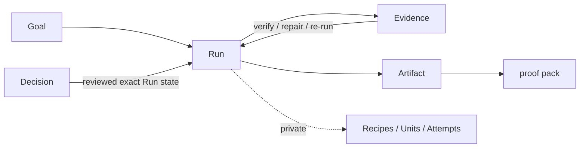

# Research Harness

[](https://github.com/WILLOSCAR/research-units-pipeline-skills/actions/workflows/verify.yml)

**一个会自己造出证据的研究 loop。**

一份精美报告会掩盖它是怎么产出的：哪一步产生了这一节？能不能复现？它通过了哪些
检查、上一次修复之后又发生了什么？Research Harness 不声称结论在科学上成立——它证明
的是：结论是被正确地、可复现地、且没有让模型给自己打分地产出的。

信任的单位是 Loop，不是答案：

```text
Goal -> Run -> Evidence -> Artifact，由一个 verify/repair/re-run 的 Loop 闭合
```

一个 **Run** 把 Goal 追成一张步骤图，节点的输入输出都内容寻址。**Evidence** 是每一步
留给下一步的中间产物；**Artifact** 是面向读者的交付物加上它的证明包。**harness** 是
外部裁判：它重算 scorecard 而不是相信自报的 PASS，只有当某步的 evidence、scorecard 与
Artifacts 一致时才放它出 Loop，并在人工 **Decision** 所审阅的输入发生变化时把它标记为
stale。

当前版本是明确的迁移阶段：源码 checkout 中的 Python module 在持久化本地引擎之上提供
这个转换 Interface，`.harness-v3/state.json` 仍是唯一可写 authority。跨 Run 的
normalized evidence store 是目标，不是已实现声明。稳定 `rh` 仍负责 legacy mutation，
只有 behavioral 与 quality gates 通过后才会切换。

## 五分钟看懂一个 Run

当前需要 Python 3.10+ 与 [uv](https://docs.astral.sh/uv/)：

```bash
git clone https://github.com/WILLOSCAR/research-units-pipeline-skills.git
cd research-units-pipeline-skills
uv sync --locked

uv run python -m research_harness loop work \
  --workspace workspaces/robot-adaptation \
  --goal "机器人测试时自适应应该先读什么？" \
  --kind brief \
  --repository .

uv run python -m research_harness loop show \
  --workspace workspaces/robot-adaptation --details
```

`loop work` 会推进到完成的 Artifact、阻塞条件或人工 Decision。继续同一个 Run 时省略
`--goal` 与 `--kind`：

```bash
uv run python -m research_harness loop work \
  --workspace workspaces/robot-adaptation \
  --repository .
```

等待 Decision 时，先审阅提示的文件，在 `DECISIONS.md` 中勾选当前 review basis，再让
harness 处理这一个 Decision：

```bash
uv run python -m research_harness loop decide \
  --workspace workspaces/robot-adaptation \
  --repository .
```

`loop show` 是只读操作，不需要源码仓库；增加 `--json` 可取得机器可读 projection。

Python 调用使用同一个小 Interface：

```python
from pathlib import Path
from research_harness import Loop, LoopKind, Continue, Start

run = Loop.open(Path("workspaces/robot-adaptation"), repository=Path("."))
run.advance(Start(goal="我应该先读什么？", kind=LoopKind.BRIEF))
run.advance(Continue())
inspection = run.inspect()
```

## Loop、Graph、Skills

三根支柱撑起产品，且都是真实代码：

- **Loop** —— 信任是一个收敛的不动点，不是开关。一步在 Loop 停止发现新缺陷之前都
  不被信任；修复有界且局部。`*-selfloop` 技能族（writer、evidence、deliverable、
  tutorial、argument）给中间产物打分、吐出确定性 scorecard，并生成一份有界修复计划
  由 harness 重跑。
- **Graph** —— 每个 Run 是一张内容寻址的 DAG，这正是复现和局部修复付得起代价的原因：
  一个失败的检查指向最小子图，而不是整个 Run。Graph 是引擎，不是卖点。
- **Skills** —— producer 技能产内容，prover 技能做检查。产品是二者的组合：只有
  producer 是“一个 agent 干了点活”；叠上 prover 和 harness，才是一次会自我验证的 run。

有界停止是刻意的：修复只在边际增益为正时进行，之后就停。没有外部依据的自我改进不会
收敛——校验必须来自模型文本之外——而相信一个有噪声的 verifier 会抬高通过率却降低真实
正确率，所以 Loop 按边际增益停，而不是按固定通过目标停。

## 选择 Loop Kind

用户只选择结果。当前 Workflow/Pipeline 名称是私有迁移 Recipes，不再是产品概念。

| 你想要…… | `--kind` | 当前 Recipe 实现 | 主要 Artifact |
|---|---|---|---|
| 理解主题并形成阅读路径 | `brief` | `research-brief` | Brief |
| 评审一篇已提供的 manuscript | `review` | `paper-review` | Review |
| 在批准的 Protocol 下综合研究 | `evidence-synthesis` | `evidence-review` | Synthesis |
| 写文献 Survey 或有边界的报告 | `survey` | `arxiv-survey` | Survey |
| 形成有文献依据的研究方向 | `ideas` | `idea-brainstorm` | Idea memo |
| 从固定资料包制作教程 | `tutorial` | `source-tutorial` | Tutorial |

只有 Survey PDF 使用 `--format pdf`。迁移期它仍走可执行 `arxiv-survey-latex` variant；
目标是 Export Adapter，不是第七种产品 kind。其他 kind 会拒绝这个 format；Tutorial 的
当前 Recipe 已自行声明 PDF 交付。

输入限制是有意的：Review 不会臆造 manuscript，Tutorial 不会臆造 source pack，
Evidence synthesis 会在检索前停下来请求 Protocol Decision。当前 Workspace 准备方式见
[中文使用导航](readme/README.zh-CN.md)。

## harness 验证了什么



当前引擎已支持可恢复执行、锁定合同、Artifact hashes、Decision review bases、
contract-scoped acceptance checks、重算 scorecard 与 legacy 只读检查；它不会持久化
research-quality Evaluation，也不会把语义不同的文件凭空拼成跨 Run 的 normalized
evidence graph。

Artifact 可以是 Brief、Review、Synthesis、Survey、PDF、Idea memo、Tutorial 或检查详情，
但始终只是对 Run 的 projection。修改 Artifact 不能形成第二份 authority；修改已审阅输入
会让原 Decision stale。

## 不过度声称的质量模型

| 层级 | 有限定的 PASS 能证明 | 不能证明 |
|---|---|---|
| Execution integrity | state、Attempts、Manifests、hashes 与 recovery 一致 | 研究本身优秀 |
| Contract acceptance | 必需 Artifacts 满足可观测 Recipe 检查 | 科学真理、创新性或穷尽检索 |
| Research quality | 在被评测真实输入上的有用性与正确性 | 超出这些输入的普遍有效性 |

前两层已有实现证据。Research quality 需要重复 Runs、held-out Evaluation 与专家判断。
绿色 Scorecard 只是契约信号，不是真值声明。

## 当前证据与边界

| 快照 | 能证明什么 | 开放边界 |
|---|---|---|
| [`course-paper-residue-pass`](examples/course-paper-residue-pass/README.md) | 当前 v2 contract acceptance、0/226 模板命中、10 页 PDF | 保留 Artifacts、人工重放、dirty revision、单一 topic |
| [`course-paper-pilot`](examples/course-paper-pilot/README.md) | 完成交付与可复现的 96/140 残留失败 | 历史合同；不通过当前写作门禁 |
| [`research-brief-real-source-proof`](examples/research-brief-real-source-proof/README.md) | 一次真实 arXiv Brief | 历史 v1、单一 topic |
| [`research-brief-harness-proof`](examples/research-brief-harness-proof/README.md) | 确定性 recovery 与 Audit | 合成来源、历史 v1 |

Fixtures 覆盖 `paper-review`、`idea-brainstorm`、`evidence-review` 与
`source-tutorial`。跨 topic 稳定性、专家对比、normalized evidence store
与 Harness candidate 自动晋升仍未完成。

## 运行依赖

- Python 3.10+ 与 `uv`；
- Tutorial PDF 摄取需要 `pdftotext`；
- LaTeX/PDF 交付需要 `latexmk`、XeLaTeX、BibTeX 与 `pdfinfo`。

Python 包声明 `PyYAML` 与 `pypdf`；维护者依赖位于 `test` extra。

## 维护者验证

```bash
uv run --locked python scripts/validate_repo.py --strict
uv run --locked python scripts/readiness_audit.py --strict
uv run --locked python scripts/audit_skills.py --fail-on WARN
uv run --locked python scripts/audit_workflow_context.py
uv run --locked --extra test ruff check .
uv run --locked --extra test python -m pytest -q
```

没有 completed execution evidence 或 failure-repair regression，不应提高 Recipe proof
state；contract acceptance 也不能被描述成 research quality。

## 文档

- [Canonical domain language](CONTEXT.md)
- [Research Loop Architecture](docs/AUTO_RESEARCH_DESIGN_SYSTEM.md)
- [产品对象决策](docs/adr/0025-make-the-self-correcting-run-the-product-object.md)
- [全项目重构审计](docs/REFACTORING_AUDIT.md)
- [Recipe catalog 与 proof states](docs/PIPELINE_TAXONOMY.md)
- [实现语言映射](docs/PROJECT_LANGUAGE.md)
- [Roadmap](docs/HARNESS_ROADMAP.md)
- [当前 Readiness](docs/HARNESS_READINESS.md)
- [Schemas 与 projections](docs/SCHEMAS.md)
- [架构决策](docs/adr/)
- [中文使用导航](readme/README.zh-CN.md)

[English README](README.md)

## Star History

<a href="https://www.star-history.com/?repos=WILLOSCAR%2Fresearch-units-pipeline-skills&type=date&legend=top-left">
  <picture>
    <source media="(prefers-color-scheme: dark)" srcset="assets/star-history/star-history-dark.svg">
    
  </picture>
</a>
