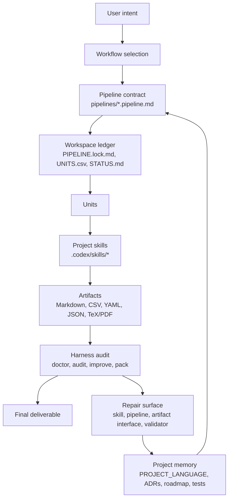

# Auto Research Design System

This is the main architecture document for the project.

The project is a backend-oriented Auto Research design system for end-to-end
work agents. It combines semantic skills with a file-first harness so a model
can turn a research request into durable workspace artifacts, run audits, and
bounded improvement records.

It is not a generic workflow engine, a prompt bundle, or a fully autonomous
scientist. It is an execution design system for research work.

## Core Loop

```text
Intent
-> Workflow
-> Workspace
-> Unit
-> Skill
-> Artifact
-> Audit
-> Improvement
-> Project Memory
```

- `Intent`: what the user wants to produce.
- `Workflow`: the product path, such as `paper-review` or `source-tutorial`.
- `Workspace`: one durable run ledger under `workspaces/<name>/`.
- `Unit`: one executable row in `UNITS.csv`.
- `Skill`: semantic research capability under `.codex/skills/`.
- `Artifact`: intermediate or final file written by a unit.
- `Audit`: doctor, run audit, quality gate, manifest, or artifact pack.
- `Improvement`: repair map from weak output to a local repair surface.
- `Project Memory`: project language, ADRs, roadmap, tests, validation.

## Architecture Diagram



## Current Function Map

| Family | Workflows | What works today | Completion |
|---|---|---|---|
| Survey | `arxiv-survey`, `arxiv-survey-latex` | Evidence-first survey pipeline, section artifacts, writing loop, LaTeX/PDF variant | High |
| Review | `research-brief`, `paper-review`, `evidence-review` | Briefing, single-paper review, protocol evidence synthesis, shared review tooling | Medium-high |
| Tutorial | `source-tutorial` | Multi-source tutorial generation with tutorial, PDF, and slide deliverables | Medium-high |
| Ideation | `idea-brainstorm` | Literature-grounded idea reports and JSON sidecar | Medium |
| Thesis | `graduate-paper` | Guided Chinese thesis workflow and thesis skills | Low; not executable pipeline |
| Harness | all executable workflows | Workspace init, unit execution, doctor, audit, improve, pack, validation | Medium-high |
| Evaluation | mainly review/harness | Structural validation and quality gates | Medium; semantic rubric still thin |

## What Is Done

- Eight current workflow names are stable.
- Seven workflows have executable pipeline contracts and `UNITS.*.csv`
  templates.
- Workspaces persist state outside chat memory.
- Project skills produce durable artifacts rather than only chat responses.
- Harness commands can diagnose, audit, improve, and pack a workspace.
- Validation protects pipeline contracts, docs entrypoints, schema references,
  ADR format, and taxonomy drift.
- Review workflows now share Python helper modules under `tooling/review_*`.

## What Is Not Done

- `paper-review` still needs a completed Auto Review proof workspace with
  input, intermediate artifacts, final review, audit, improvement report,
  artifact pack, semantic rubric, and scorecard.
- Semantic quality evaluation is not yet as strong as structural validation.
- `graduate-paper` is not an executable pipeline.
- There is no database-backed run store, dashboard, external runtime, or stable
  benchmark corpus.
- The repo still has many skills whose interface depth should be reviewed only
  after the Auto Review proof shows concrete pressure.

## Skill Invocation Boundary

There are two kinds of skills around this repository:

- Project skills under `.codex/skills/`
- Global engineering skills such as `improve-codebase-architecture`, `tdd`,
  `to-prd`, or `grill-with-docs`

Normal Auto Research execution should use project workflows, project skills,
and the harness. Global engineering skills are maintainer tools for changing
the codebase itself.

```text
Run a research workflow -> use pipeline + workspace + project skills.
Refactor the repository -> optionally use global engineering skills.
```

## Refactor Direction

The next substantial proof should stay concrete:

1. Use `paper-review` as the Auto Review pilot.
2. Produce a completed workspace.
3. Add a semantic rubric and scorecard.
4. Use audit/improvement outputs to find real repair surfaces.
5. Only then decide whether to add a product facade, new runtime, dashboard, or
   larger directory migration.

## Drift Judgment

The target has not drifted away from the original project. It has become more
precise.

The repo started as skills plus research pipelines. The useful direction is
now clearer: a skills-plus-harness Auto Research design system for end-to-end
work agents. The risk is not the direction; the risk is adding more narrative
before proving the system with completed runs.
