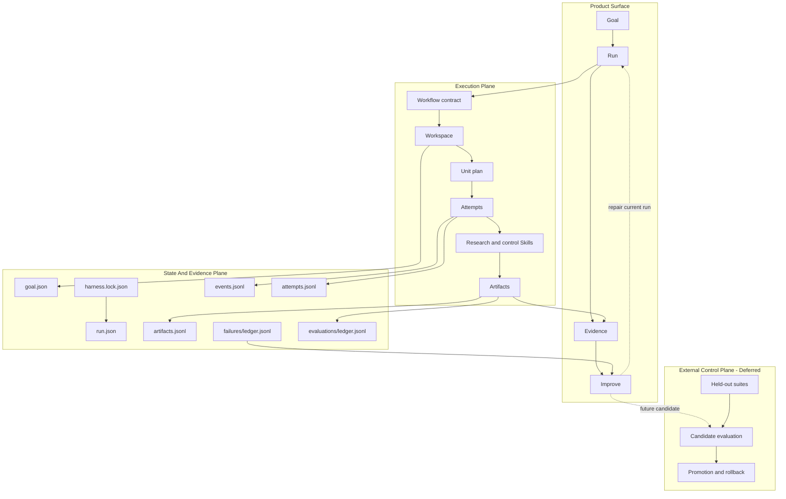

# Auto Research Design System

This document describes the internal architecture behind the public product
loop:

```text
Goal -> Run -> Evidence -> Improve
```

The repository combines research Skills, deterministic control Skills, and a
file-first Harness kernel. It is designed to turn a research request into an
inspectable end-to-end delivery process, not merely a sequence of prompts.

## 1. System Thesis

Long research tasks fail in predictable ways: context disappears, intermediate
decisions are overwritten, evidence becomes detached from claims, retries hide
their history, and output defects are described without locating their cause.

The system addresses those failures through four invariants:

1. Every meaningful Run has a durable identity, an initial execution lock, and
   per-Attempt implementation fingerprints.
2. Every step produces addressable artifacts or an explicit failure record.
3. Human-readable files and machine-readable ledgers describe the same run.
4. Improvement starts from observed evidence and is constrained to an explicit repair surface.

This is the practical meaning of Harness in this project: it constrains how
project Skills are selected, executed, observed, resumed, audited, and
improved without embedding research judgment inside the deterministic runtime.

## 2. Two Views Of One System

### Product view

The user should only need four concepts.

| Stage | Contract |
|---|---|
| Goal | Outcome, constraints, workflow choice, success criteria |
| Run | Recoverable execution with visible progress and human checkpoints |
| Evidence | Sources, intermediate artifacts, provenance, audit, final deliverable |
| Improve | Diagnosis and repair routing for the current Run; bounded Harness candidates remain future work |

### Internal view

The implementation keeps the existing project vocabulary:

```text
GoalSpec
  -> Workflow / Pipeline contract
  -> Workspace / Run ledger
  -> Units / Attempts
  -> Skills / Context / Retrieval
  -> Artifacts / Evidence
  -> Doctor / Audit / Failure attribution
  -> Run-local repair
```

The product view compresses this chain; it does not replace it.

## 3. Architecture



The Execution and State planes exist in the current codebase. The External
Control Plane is an architectural constraint and roadmap item; candidate
evaluation and promotion are not implemented today.

## 4. Module Responsibilities

| Module | Interface | Implementation responsibility |
|---|---|---|
| Product CLI | `rh goal/run/evidence/improve` | Maps user stages to existing pipeline operations |
| Pipeline adapter | `scripts/pipeline.py` commands | Workspace setup, execution commands, audit commands, human transitions |
| Run State | `tooling/run_state.py` functions | Run identity, initial revision lock, events, attempts, artifacts, failures, decisions |
| Executor | `run_one_unit(...)` | Unit selection, skill process dispatch, output checks, recovery transitions |
| Harness reports | `tooling/harness.py` builders | Doctor, run audit, audit diff, improvement report, Artifact index |
| Quality registry | `tooling/quality_gate.py` | Stable Skill-to-check dispatch and compatibility entrypoints |
| Quality domains | `tooling/quality_checks/` | Workflow-family semantic checks for survey, review, ideation, tutorial, and delivery Artifacts |
| Scorecard kernel | `tooling/scorecards.py` | Shared policy loading, scoring, failure projection, validation, rendering, and persistence |
| Workflow evaluators | `tooling/*_evaluation.py` | Workflow-local dimensions and Evidence semantics behind the shared scorecard envelope |
| Research Skills | `.codex/skills/<skill>/SKILL.md` and optional scripts | Retrieval, extraction, synthesis, review, and writing transformations |
| Control Skills | deterministic scripts under `.codex/skills/` | Checkpoints, manifests, scorecards, local quality gates, and delivery checks |
| Pipeline contracts | `pipelines/*.pipeline.md` | Workflow stages, required skills, checkpoints, target artifacts |
| Unit plans | `templates/UNITS.*.csv` | Dependency graph, inputs, outputs, acceptance, owner, status |

The current product CLI is a convenience adapter, not a universal input form.
`rh goal create` can materialize a topic-seeded Workspace; Workflows that own an
existing manuscript, source set, protocol, or human approval still require
those inputs through the Workspace or Codex interaction and will block
explicitly when they are absent.

The Run State module is intentionally deep: callers record a transition while
the module owns IDs, timestamps, event sequence, JSONL append behavior, hashes,
and snapshot projection. This creates locality for recovery and provenance
logic that was previously spread across the CLI, executor, status log, and
manifests.

## 5. Workspace Contract

The workspace serves two readers.

```text
workspaces/<run>/
├── GOAL.md                   human goal view
├── PIPELINE.lock.md          human pipeline view
├── UNITS.csv                 human-editable plan and compatibility status
├── STATUS.md                 human progress view
├── CHECKPOINTS.md            acceptance checkpoints
├── DECISIONS.md              human sign-off view
├── output/                   intermediate and final deliverables
└── .harness/                 machine-readable run ledger
    ├── goal.json
    ├── run.json
    ├── harness.lock.json
    ├── events.jsonl
    ├── attempts.jsonl
    ├── decisions.jsonl
    ├── artifacts.jsonl
    ├── failures/ledger.jsonl
    ├── evaluations/ledger.jsonl
    └── plan/
        ├── planned.json
        └── effective.json
```

The current compatibility rule is:

- `UNITS.csv` remains the scheduler plan and editable operator surface.
- `STATUS.md` remains a concise human projection.
- `.harness/events.jsonl` and `.harness/attempts.jsonl` preserve history that must not be overwritten.
- `.harness/run.json` is the current machine snapshot.
- `planned.json` preserves the initial unit plan; `effective.json` records accepted operator changes.

This first implementation remains single-process. Worker leases, heartbeats,
and distributed scheduling are deferred until there is a real multi-worker
runtime.

## 6. Run Identity And Reproducibility

Each new workspace receives:

- `goal_id`: identity of the requested outcome;
- `run_id`: identity of this execution;
- `attempt_id`: identity of each concrete Unit execution;
- `artifact_id`: identity of each registered output version;
- `failure_id`: identity of each durable failure record.

`harness.lock.json` records the Git revision and dirty state, pipeline hash,
unit-template hash, each referenced Skill's complete implementation-directory
hash (including scripts, assets, and references), and deterministic Kernel
hashes. The local CLI does not know the model/provider parameters, so it records
that they were not captured instead of inventing them.

Each successful Unit manifest additionally fingerprints the Skill directory
that executed that Attempt. If the implementation later changes, `doctor`
reports the DONE Unit as stale and identifies the earliest replay boundary.
Older manifests without this additive field remain inspectable.

## 7. Event And Attempt Semantics

The first event vocabulary includes:

```text
run.created
run.planned
run.waiting_human
run.completed
evaluation.recorded
unit.attempt.started
unit.attempt.succeeded
unit.attempt.failed
unit.attempt.interrupted
artifact.registered
failure.recorded
failure.resolved
decision.recorded
```

Retries receive new `attempt_id` values. An interrupted `DOING` state is
recorded as `INTERRUPTED` before another attempt begins. Earlier attempts are
preserved rather than overwritten by a later result.

## 8. Evidence And Artifact Provenance

The current common evidence layer is artifact-level:

- Unit manifests record declared outputs and file hashes.
- `artifacts.jsonl` records output versions against Run, Unit, and Attempt IDs.
- Run audit checks target-artifact coverage and structural issues.
- Artifact index produces a reviewable handoff manifest; it is not a portable archive.

Workflow-specific evidence remains heterogeneous. Survey and tutorial paths
already contain structured source and citation records. `paper-review` now has
a local machine-joinable chain across `CLAIMS.jsonl`,
`EVIDENCE_AUDIT.jsonl`, `NOVELTY_MATRIX.tsv`, the final review, and its
scorecard. This is a Workflow-local contract, not yet a global evidence graph.

The intended review model is:

```text
Source <- Evidence <- Claim-Evidence Link -> Claim -> Review finding
```

The Auto Review pilot implements this model with stable Claim and Gap IDs. The
next design question is which fields survive repeated Runs and genuinely apply
to another Workflow.

`research-brief` now provides the second local evaluator. It checks briefing
structure, compactness, reading-path quality, and whether every paper pointer
resolves to `papers/core_set.csv`. `idea-brainstorm` provides the third: it
checks the signal-to-shortlist trace, lead-direction actionability and
diversity, and whether literature anchors resolve to the core set.
`evidence-review` provides the fourth: it checks protocol operability,
clause-linked screening, extraction coverage, bias fields, and synthesis
pointers. All four evaluators append `run-evaluation.v1` records to the same
Run ledger while keeping their semantic schemas local.
Optional model, token, cost, and latency fields remain empty until a runtime
adapter can measure them reliably.

## 9. Failure Attribution

The failure ledger uses four explicit fields:

```text
Observable Failure
  -> Causal Behavior
  -> Harness Mechanism
  -> Repair Surface
```

This prevents vague recommendations such as “improve the prompt.” Mechanical
failures such as missing adapters, missing outputs, script exits, quality-gate
failures, and interrupted attempts are recorded now. Auto Review also records
`semantic_quality_gate_failed` when its declared scorecard fails, including the
specific structured artifact or Skill contract that should be repaired.

## 10. Improve Has Two Meanings

These operations must remain separate.

### Run-local repair protocol: implemented

- rerun or unblock a Unit;
- add missing evidence;
- change a human decision;
- repair an artifact or skill output;
- regenerate audit and Artifact index.

### Harness evolution: deferred

- create a candidate change to Skills, Pipelines, or Policies;
- replay the target failure;
- run regression and held-out evaluation;
- compare quality, cost, latency, and stability;
- request human-approved promotion.

The current `improve` command only writes the diagnostic repair map. A person
or Agent applies the named Run-local repair and reruns affected Units; the
command itself does not mutate the Workspace or promote the Harness.

## 11. Evolvable Policy And Protected Kernel

The future self-improvement loop may propose changes to semantic policy:

```text
.codex/skills/**
pipelines/**
templates/UNITS.*.csv
future context/retrieval/retry policies
```

The same candidate must not be allowed to rewrite the currently implemented
mechanisms that judge it:

```text
scripts/pipeline.py
tooling/common.py
tooling/executor.py
tooling/harness.py
tooling/harness_contracts.py
tooling/ideation.py
tooling/pipeline_spec.py
tooling/quality_gate.py
tooling/quality_reporting.py
tooling/quality_checks/**
tooling/run_state.py
tooling/scorecards.py
tooling/brief_evaluation.py
tooling/evidence_review_evaluation.py
tooling/idea_evaluation.py
tooling/review_evaluation.py
tooling/review_protocol.py
```

The exact file inventory is defined once as `HARNESS_KERNEL_PATHS` in
`tooling/harness_contracts.py`. Run initialization hashes every existing path
from that contract into `.harness/harness.lock.json`; readiness validation uses
the same inventory, so the documented protection boundary and the executable
lock cannot silently diverge.

When promotion is implemented, its schema validators, Artifact provenance,
permission and budget enforcement, held-out fixtures, and rollback rules must
join the protected Kernel before candidates can rely on them.

Today this is a documented architecture rule, not a security sandbox. A real
candidate system must enforce it through process and filesystem permissions.

## 12. Current Maturity

| Area | Current evidence | Maturity |
|---|---|---|
| Workflow contracts | Seven executable pipelines and Unit templates | High structural maturity |
| Project Skills | Broad research, review, tutorial, writing, and control capability | Uneven by Workflow |
| Run recovery | Durable IDs, events, attempts, stale-state interruption records | First implementation |
| Artifact provenance | Unit manifests, hashes, Artifact ledger, index | Medium-high |
| Implementation freshness | per-Attempt Skill fingerprints and stale-DONE diagnosis | First implementation |
| Mechanical failure diagnosis | Doctor, errors, failure ledger, repair map | Medium-high |
| Semantic evaluation | Auto Review, Research Brief, Research Idea, and Evidence Review scorecards feed one Evaluation ledger; no diverse scored corpus | Medium |
| Auto Review proof | Completed scorecard failure, repair, rerun, audit, and pack | First vertical proof |
| Research Brief proof | Compact defaults plus pointer failure, repair, and rerun | Second vertical proof |
| Research Idea proof | Bounded defaults plus anchor failure, repair, and rerun | Third vertical proof |
| Evidence Review proof | Protocol-to-synthesis pointer failure, repair, and rerun | Fourth vertical proof |
| Source Tutorial delivery | Local source fixture compiles article and Beamer PDFs under strict gates | Delivery proof |
| Bounded-report delivery | [49-Unit course-paper Run snapshot](../examples/course-paper-pilot/README.md), passing audit, 10-page PDF | First completed pilot; other report genres open |
| Bounded Self-Harness | Architecture described; external evaluator absent | Not implemented |

## 13. Current Proof Strategy

`paper-review` is the first vertical proof because it naturally exposes
the system's main claims: traceability, evidence discipline, failure diagnosis,
human intervention, and semantic evaluation.

The first proof now contains:

1. a pinned Goal and Run;
2. claim and evidence artifacts;
3. a final review whose major findings are traceable;
4. attempt, artifact, and failure history;
5. doctor, run audit, improvement report, and Artifact index;
6. a semantic rubric and scorecard;
7. at least one documented repair-and-rerun example.

This proves the local Harness loop, not autonomous Harness evolution. Candidate
worktrees, held-out evaluation, promotion, dashboards, and model-weight
experiments still require a broader completed-run corpus.

`research-brief` is the adjacent proof that the Harness protocol is not tied to
review-specific Claims. It uses a smaller Workflow-local scorecard and a
reduced retrieval/core-set budget, then enters the same Evaluation and Failure
history.

`idea-brainstorm` proves that the same protocol can supervise an open-ended
research judgment task without pretending to solve novelty automatically. Its
scorecard checks whether literature signals remain traceable through screening
into a small, falsifiable, discussion-ready lead set.

`evidence-review` proves that the Harness can supervise a heavier evidence
chain without reducing quality to file presence. Its scorecard joins protocol
clauses, screening decisions, extraction rows, and synthesis pointers. This is
an execution and traceability proof, not evidence that the retrieval pool is
exhaustive or that the conclusions are scientifically correct.

## 14. Drift Judgment

The project direction has not moved away from its original Skills and research
Pipeline foundation. The change is a clarification of product hierarchy:

- Skills remain reusable research and control capabilities.
- Pipelines remain internal Workflow contracts.
- Workspaces remain durable execution containers.
- Harness becomes the state, evidence, recovery, and improvement discipline.
- `Goal -> Run -> Evidence -> Improve` becomes the user-facing product model.

The direction is still aligned with the original repository: Skills perform
bounded work, Pipelines compose them, and the Harness makes execution durable
and inspectable. The main remaining risk is overgeneralizing a small set of
fixture proofs and one bounded-report pilot into cross-Workflow scientific
maturity.
