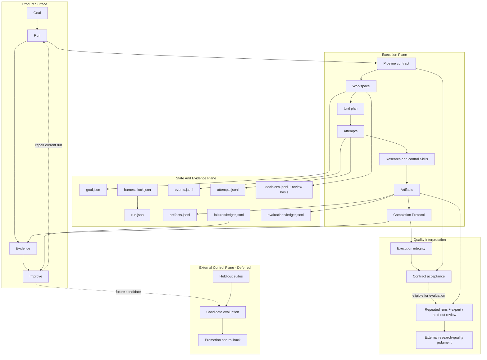

# Auto Research Design System

This document describes the internal architecture behind the public product
loop:

```text
Goal -> Run -> Evidence -> Improve
```

The repository combines research Skills, deterministic control Skills, and a
file-first Harness kernel. It is designed to turn a research request into an
inspectable end-to-end delivery process, not merely a sequence of prompts.

## 1. System Thesis

Long research tasks fail in predictable ways: context disappears, intermediate
decisions are overwritten, evidence becomes detached from claims, retries hide
their history, and output defects are described without locating their cause.

The system addresses those failures through four design invariants:

1. Every meaningful Run has a durable identity, a Workspace-local Pipeline
   contract snapshot, an initial Harness revision lock, serialized local
   Workspace commands, and per-Attempt implementation fingerprints.
2. Every Unit transition that claims progress leaves addressable Artifacts,
   an explicit Decision, or durable Attempt/Failure evidence.
3. Human-readable files are operator projections; machine-readable ledgers
   preserve history, and Audit detects disagreement between them.
4. Improvement starts from observed evidence and is constrained to an explicit repair surface.

This is the practical meaning of Harness in this project: it constrains how
project Skills are selected, executed, observed, resumed, audited, and
improved without embedding research judgment inside the deterministic runtime.

## 2. Two Views Of One System

### Product view

The user should only need four concepts.

| Stage | Contract |
|---|---|
| Goal | Outcome, constraints, workflow choice, success criteria |
| Run | Recoverable execution with visible progress and human checkpoints |
| Evidence | Research Evidence supports the deliverable; Run Evidence supports its execution and checks |
| Improve | Diagnosis and repair routing for the current Run; bounded Harness candidates remain future work |

### Internal view

The implementation keeps the existing project vocabulary:

```text
GoalSpec
  -> Workflow / Pipeline contract
  -> Workspace / Run ledger
  -> Units / Attempts
  -> Skills / Context / Retrieval
  -> Artifacts / Evidence
  -> Doctor / Audit / Failure attribution
  -> Run-local repair
```

The product view compresses this chain; it does not replace it.

## 3. Architecture



The Execution and State planes exist in the current codebase. The External
Control Plane is an architectural constraint and roadmap item; candidate
evaluation and promotion are not implemented today.

### Quality interpretation

The Harness separates three claims that are easy to blur:

1. **Execution integrity:** the Unit has a successful Attempt, declared
   Artifacts, consistent Manifests, and recoverable provenance.
2. **Contract acceptance:** the active Workflow's mandatory checks and declared
   scorecard conditions pass at the Completion boundary.
3. **Research quality:** the result is relevant, correct, sufficiently complete,
   and useful on realistic inputs under expert or held-out evaluation.

The first two layers are machine-observable today. The third is an empirical
program, not a boolean supplied by the kernel. A contract-acceptance PASS must
therefore never be narrated as proof of novelty, scientific truth, exhaustive
retrieval, or expert-level judgment.

## 4. Module Responsibilities

| Module | Interface | Implementation responsibility |
|---|---|---|
| Product CLI | `rh goal/run/evidence/improve` | Maps user stages to existing pipeline operations |
| Pipeline adapter | `scripts/pipeline.py` commands | Workspace setup, execution commands, audit commands, human transitions |
| Run State | `tooling/run_state.py` functions | Run identity, initial revision lock, Workspace invocation lock, append-only ledgers, reconciliation, and cross-ledger integrity |
| Completion Protocol | `commit_unit_completion(...)` | Required outputs, Workflow-mandatory acceptance checks, recomputed scorecard consistency, acceptance evidence, two-phase Manifest, successful Attempt, Artifact registration, and DONE projection |
| Executor | `run_one_unit(...)` | Unit selection, Skill process dispatch, pre-completion failures, and delegation to the Completion Protocol |
| Harness reports | `tooling/harness.py` builders | Standalone Doctor uses a shallow snapshot; Audit, diagnosis, and Artifact-index views share the deeper snapshot; reconciliation runs only for a current matching Run, never while diagnosing lock drift |
| Quality registry | `tooling/quality_gate.py` | Stable Skill-to-check dispatch, Workflow-mandatory completion checks, and additional strict diagnostics |
| Quality domains | `tooling/quality_checks/` | Workflow-family semantic checks for survey, review, ideation, tutorial, and delivery Artifacts |
| Scorecard kernel | `tooling/scorecards.py` | Shared policy loading, scoring, failure projection, validation, rendering, and persistence |
| Workflow evaluators | `tooling/*_evaluation.py` | Workflow-local dimensions and Evidence semantics behind the shared scorecard envelope |
| Research Skills | `.codex/skills/<skill>/SKILL.md` and optional scripts | Retrieval, extraction, synthesis, review, and writing transformations |
| Control Skills | deterministic scripts under `.codex/skills/` | Checkpoints, manifests, scorecards, local quality gates, and delivery checks |
| Pipeline contracts | `pipelines/*.pipeline.md` | Workflow stages, required skills, checkpoints, target artifacts |
| Unit plans | `templates/UNITS.*.csv` | Dependency graph, inputs, outputs, acceptance, owner, status |

The current product CLI is a convenience adapter, not a universal input form.
`rh goal create` materializes the Goal and Workflow Workspace. Topic-seeded
paths can proceed directly; `paper-review` and `source-tutorial` still require
their manuscript or source set through the Workspace or Codex interaction.
`evidence-review` is different: it generates the Protocol from the review
question, then blocks before retrieval until the user approves or revises it.

`rh run start` is valid only while a Run remains `PLANNED`. `rh run resume`
first reconciles persisted state and then re-enters the same scheduler. The two
commands share execution mechanics but have different lifecycle preconditions.

The Run State module is intentionally deep: callers record a transition while
the module owns IDs, timestamps, event sequence, JSONL append behavior, hashes,
snapshot projection, reconciliation, and referential-integrity checks. The
Completion Protocol is the single commit boundary shared by scripted execution,
manual completion, and checkpoint approval. This creates locality for recovery
and provenance logic that was previously spread across the CLI, executor,
status log, and manifests.

## 5. Workspace Contract

The workspace serves two readers.

```text
workspaces/<run>/
├── GOAL.md                   human goal view
├── PIPELINE.lock.md          human pipeline view
├── UNITS.csv                 operator-visible plan and compatibility status
├── STATUS.md                 human progress view
├── CHECKPOINTS.md            acceptance checkpoints
├── DECISIONS.md              human sign-off view
├── output/                   intermediate and final deliverables
└── .harness/                 machine-readable run ledger
    ├── goal.json
    ├── run.json
    ├── harness.lock.json
    ├── contracts/pipelines/       immutable Pipeline snapshot bundle
    ├── invocation.lock
    ├── events.jsonl
    ├── attempts.jsonl
    ├── decisions.jsonl
    ├── artifacts.jsonl
    ├── failures/ledger.jsonl
    ├── evaluations/ledger.jsonl
    └── plan/
        ├── planned.json
        └── effective.json
```

The current compatibility rule is:

- `UNITS.csv` remains the scheduler plan and compatibility projection. Use the
  Pipeline adapter for status transitions; a hand-edited `DONE` value is not
  Completion evidence.
- `PIPELINE.lock.md` remains the human Workflow projection; under
  `harness-lock.v2` it must resolve to the same source contract as the pinned
  machine lock or execution fails closed.
- `STATUS.md` remains a concise human projection.
- `.harness/events.jsonl` and `.harness/attempts.jsonl` preserve history that must not be overwritten.
- `.harness/run.json` is the current machine snapshot.
- `planned.json` preserves the initial unit plan; `effective.json` records accepted operator changes.

One outer CLI or product operation owns `.harness/invocation.lock` for the full
Workspace transaction. A second local command fails immediately; an owner crash
releases the operating-system lock automatically. Doctor, Status, Audit,
Evidence inspection, and Improvement diagnosis participate because they may
reconcile projections or materialize reports. Internal Python mutation helpers
assume this outer boundary and must not invoke another CLI command for the same
Workspace.

Preflight validation runs before lock metadata is created, so an invalid
Workspace path or Pipeline cannot leave a partial Workspace behind. Automated
Attempts record a local owner PID and host. A later inspection or Run command
may interrupt a `DOING` Attempt only when that recorded process is gone; manual
Attempts are allowed to remain open across commands.

If a legacy or hand-edited `DOING` projection has no unique open Attempt, the
Harness reports an integrity error and leaves it unchanged. Recovery never
invents ownership evidence merely to make the scheduler move again.

A human Checkpoint is authorized only when its readable checkbox, append-only
Decision record, and `checkpoint-review-basis.v1` fingerprints all agree with
the current review Artifacts. A checkbox edited by itself cannot pass
Completion, and changing an approved outline, protocol, or scope invalidates
the stale authorization. Before another Unit runs, the Harness reopens that
Checkpoint, clears its readable approval, and invalidates dependent Unit
projections; PREPARED recovery and Audit enforce the same review basis.

This first implementation remains single-process. The invocation lock prevents
local command interleaving; it is not a worker lease or multi-host coordination
protocol. Heartbeats and distributed scheduling remain deferred until there is
a real multi-worker runtime.

## 6. Run Identity And Reproducibility

Each new workspace receives:

- `goal_id`: identity of the requested outcome;
- `run_id`: identity of this execution;
- `attempt_id`: identity of each concrete Unit execution;
- `artifact_id`: identity of each registered output version;
- `failure_id`: identity of each durable failure record.

`harness-lock.v2` records the Git revision and dirty state, source Pipeline
hash, Workspace-local Pipeline snapshot and inheritance-bundle hashes,
unit-template hash, each referenced Skill's complete implementation-directory
hash (including scripts, assets, and references), and deterministic Kernel
hashes. Runtime policy is loaded from the pinned snapshot. Missing or modified
snapshot files fail closed instead of silently switching an old Run to the
current checkout's contract. Before an active v2 Run executes a Unit or accepts
a mutation, every current Kernel path must also match its pinned digest;
otherwise the command exits before creating an Attempt. Doctor and Audit remain
available, and completed Runs remain interpretable under their original
contract. Historical v1 locks remain readable but do not claim these snapshot
or execution-boundary guarantees. The local CLI does not know the
model/provider parameters, so it records that they were not captured instead
of inventing them.

Each successful Unit manifest additionally fingerprints the Skill directory
that executed that Attempt. If the implementation later changes, `doctor`
reports the DONE Unit as stale and identifies the earliest replay boundary.
Older manifests without this additive field remain inspectable.

## 7. Event And Attempt Semantics

The first event vocabulary includes:

```text
run.created
run.planned
run.waiting_human
run.completed
evaluation.recorded
unit.attempt.started
unit.attempt.succeeded
unit.attempt.failed
unit.attempt.interrupted
unit.completion.prepared
unit.completion.committed
unit.completion.recovered
artifact.registered
failure.recorded
failure.resolved
decision.recorded
```

Retries receive new `attempt_id` values. A `DOING` state owned by a dead local
process is recorded as `INTERRUPTED` before another automated Attempt begins.
Manual Attempts are not treated as stale merely because the command that opened
them has exited. Earlier Attempts are preserved rather than overwritten by a
later result.

Finished scripted Attempts may carry an additive `execution` record containing
the adapter path, measured subprocess time, captured stdout/stderr character
counts, and the durable log path when one exists. Run Audit aggregates these
records with retry, terminal-status, and execution-mode counts. This is local
adapter telemetry, not a model Token estimate: manual and legacy Attempts remain
valid without it, and model/provider metrics stay nullable until measured by an
appropriate runtime.

Completion is a recoverable provenance transaction rather than a status-cell
update. The Harness first validates outputs, mandatory Workflow invariants, and
any declared scorecard. It then writes a `PREPARED` Manifest, records the
prepared Event, finishes the Attempt and registers Artifacts, finalizes the
Manifest as `DONE`, and only then projects the Unit as `DONE`. Reconciliation
can finish a valid prepared transaction or restore a missing DONE projection
from a successful Attempt plus matching Manifest and current hashes. If a
process stops after writing the PREPARED Manifest but before appending its
prepared Event, reconciliation first reconstructs that Event only when Run,
Unit, latest Attempt, Skill, declared outputs, and hashes all agree. An older
Attempt's prepared evidence cannot finalize over a newer Attempt.

The Run lock records this contract as
`protocols.completion = recoverable-provenance.v2`. A recognized v1 PREPARED
transaction can migrate only after current Workflow acceptance passes again;
failed reconstruction becomes a durable Failure and a BLOCKED Unit. A lock
without any protocol marker is audited as `legacy_unversioned`:
compatibility-sensitive gaps are identified for interpretation, but remain
errors. Run Audit Diff can compare
retry and measured adapter-runtime summaries when both audits expose them; it
does not use those descriptive deltas as a quality verdict.

`run-audit.v2` requires cross-ledger Workflow acceptance coverage and uses
distinct `PASS`, `IN_PROGRESS`, `INCOMPLETE`, and `ATTENTION` verdicts. Only
`PASS` exits zero, so Improvement and Artifact Pack cannot promote an unfinished
Run into a success signal. Audit loads the immutable Pipeline snapshot pinned by
the Run rather than the mutable live contract, so later policy changes cannot
retroactively add or remove acceptance requirements. Its additive quality
observations project the latest recorded Survey template-residue scorecard
without turning that Workflow-local measure into a universal research-quality
claim. Historical v1 reports remain readable.

## 8. Evidence And Artifact Provenance

The current common evidence layer is artifact-level:

- Unit manifests record declared outputs and file hashes.
- `artifacts.jsonl` records output versions against Run, Unit, and Attempt IDs.
- Run Audit checks target-artifact coverage and referential integrity across
  Run identity, Events, Attempts, Manifests, Artifacts, Decisions, Failures,
  Evaluations, and DONE Units.
- Artifact index produces a reviewable handoff manifest; it is not a portable archive.

Workflow-specific evidence remains heterogeneous. Survey and tutorial paths
already contain structured source and citation records. `paper-review` now has
a local machine-joinable chain across `CLAIMS.jsonl`,
`EVIDENCE_AUDIT.jsonl`, `NOVELTY_MATRIX.tsv`, the final review, and its
scorecard. Claim and Gap IDs must be unique, and novelty Completion requires at
least five unique related works. This is a Workflow-local contract, not yet a
global evidence graph.

Accordingly, `rh evidence inspect` currently audits Run Evidence and indexes
Workflow-local research Artifacts. A normalized cross-Workflow research-evidence
view is not implemented and should not be inferred from the umbrella command.

The intended review model is:

```text
Source <- Evidence <- Claim-Evidence Link -> Claim -> Review finding
```

The `paper-review` fixture proof implements this model with stable Claim and Gap IDs. The
next design question is which fields survive repeated Runs and genuinely apply
to another Workflow.

`research-brief` now provides the second local evaluator. It checks briefing
structure, compactness, reading-path quality, and whether every paper pointer
resolves to `papers/core_set.csv`. `idea-brainstorm` provides the third: it
checks the signal-to-shortlist trace, lead-direction actionability and
diversity, whether literature anchors resolve to the core set, and whether C2
focus and hard-exclusion Decisions actually constrain direction generation.
`evidence-review` provides the fourth: it checks protocol operability,
one decision per candidate, unique extraction coverage, bias fields, and
synthesis pointers. `source-tutorial` joins manifest, index, provenance, local
source paths, module coverage, and the current tutorial body at Completion. All
four scorecard evaluators append `run-evaluation.v1` records to the same Run
ledger while keeping their semantic schemas local.
Optional model, token, cost, and latency fields remain empty until a runtime
adapter can measure them reliably.

## 9. Failure Attribution

The failure ledger uses four explicit fields:

```text
Observable Failure
  -> Causal Behavior
  -> Harness Mechanism
  -> Repair Surface
```

This prevents vague recommendations such as “improve the prompt.” Mechanical
failures such as missing adapters, missing outputs, script exits, quality-gate
failures, and interrupted attempts are recorded now. `paper-review` also records
`semantic_quality_gate_failed` when its declared scorecard fails, including the
specific structured artifact or Skill contract that should be repaired.
Successful completion resolves only the Failure types that the succeeding path
explicitly reverified; an unrelated open Failure cannot disappear merely
because the same Unit later returned exit code zero.

## 10. Improve Has Two Meanings

These operations must remain separate.

### Run-local diagnosis implemented; repair convention documented

- rerun or unblock a Unit;
- add missing evidence;
- change a human decision;
- repair an artifact or skill output;
- regenerate audit and Artifact index.

### Harness evolution: deferred

- create a candidate change to Skills, Pipelines, or Policies;
- replay the target failure;
- run regression and held-out evaluation;
- compare quality, cost, latency, and stability;
- request human-approved promotion.

The current `improve` command writes the diagnostic repair map. A person or
Agent applies the named Run-local repair and reruns affected Units; applied
repair is not yet a first-class transaction of its own, and the command does
not mutate the Workspace or promote the Harness.

## 11. Evolvable Policy And Protected Kernel

The future self-improvement loop may propose changes to semantic policy:

```text
.codex/skills/**
pipelines/**
templates/UNITS.*.csv
future context/retrieval/retry policies
```

The same candidate must not be allowed to rewrite the currently implemented
mechanisms that judge it:

```text
assets/limitation-signals.json
scripts/pipeline.py
tooling/common.py
tooling/checkpoint_brief.py
tooling/completion.py
tooling/executor.py
tooling/harness.py
tooling/harness_contracts.py
tooling/ideation.py
tooling/pipeline_spec.py
tooling/pipeline_snapshot.py
tooling/quality_gate.py
tooling/quality_reporting.py
tooling/quality_checks/**
tooling/run_state.py
tooling/scorecards.py
tooling/source_text_hygiene.py
tooling/brief_evaluation.py
tooling/evidence_review_evaluation.py
tooling/idea_evaluation.py
tooling/review_evaluation.py
tooling/review_protocol.py
```

The exact file inventory is defined once as `HARNESS_KERNEL_PATHS` in
`tooling/harness_contracts.py`. Run initialization hashes every existing path
from that contract into `.harness/harness.lock.json`; readiness validation uses
the same inventory, so the documented protection boundary and the executable
lock cannot silently diverge. Active v2 mutations now fail closed when that
manifest differs from the executing checkout. This is an execution-integrity
boundary for one local Run, not permission isolation for a future candidate
system.

When promotion is implemented, its schema validators, Artifact provenance,
permission and budget enforcement, held-out fixtures, and rollback rules must
join the protected Kernel before candidates can rely on them.

Today Kernel drift is enforced at the local Run mutation boundary, but this is
not a security sandbox. A real candidate system must additionally enforce
process and filesystem permissions.

## 12. Current Maturity: Implementation And Evidence Snapshot

System rows below describe implementation readiness in ordinary language.
Workflow rows quote the canonical proof states defined in
`docs/PIPELINE_TAXONOMY.md`; this table does not introduce another maturity
scale.

| Area | Current evidence | Interpretation |
|---|---|---|
| Pipeline contracts | Seven executable Pipelines and Unit templates | Executable contracts; proof varies by Workflow |
| Pipeline reproducibility | `harness-lock.v2` snapshots the selected Pipeline plus local variant dependencies and fails closed on hash drift | First local implementation; historical v1 Runs remain compatibility evidence |
| Project Skills | Broad research, review, tutorial, writing, and control capability | Uneven by Workflow |
| Completion integrity | Shared v2 two-phase Completion Protocol, cross-ledger acceptance evidence, recomputed scorecard consistency, and mandatory Workflow checks for scripted, manual, default, and strict completion | First local implementation; key paths tested |
| Run recovery | Durable IDs, Events, Attempts, acceptance-aware prepared-transaction recovery, v1 PREPARED migration, and stale-state interruption records | First local implementation; key crash windows tested |
| Workspace serialization | Non-blocking process-scoped lock across all local Workspace commands; owner-crash release tested | First local implementation; distributed leases absent |
| Inspection composition | Standalone Doctor uses a shallow snapshot; composed Doctor, Audit, Improvement, and Artifact index share one deep snapshot | Landed; Artifact hashing retains a distinct pass |
| Artifact provenance | Unit Manifests, hashes, Artifact ledger, index, and current immutable-output checks | Implemented; Survey has a public current-contract replay, while clean-revision and other-Workflow proofs remain open |
| Ledger integrity | `run-audit.v2` checks cross-ledger identities, references, completion evidence, acceptance coverage, Kernel status, and hashes against the pinned Pipeline snapshot; only a complete verified Run can PASS | Targeted tests plus one published 31-check Survey replay with zero integrity issues |
| Implementation freshness | per-Attempt Skill fingerprints and stale-DONE diagnosis | First implementation |
| Mechanical failure diagnosis | Doctor, errors, Failure ledger, blocking repair map, and non-blocking scorecard headroom | Implemented; applied repair is not yet a first-class transaction |
| Contract evaluation | `paper-review`, `research-brief`, `idea-brainstorm`, and `evidence-review` scorecards feed one Evaluation ledger; no diverse expert-scored corpus | Implementation landed; external research-quality evidence open |
| `paper-review` proof | Realistic fixture completes scorecard failure, repair, rerun, audit, and pack | `Scored fixture proof`; real-manuscript/expert comparison open |
| `research-brief` proof | [Versioned synthetic Harness snapshot](../examples/research-brief-harness-proof/README.md), [online arXiv snapshot](../examples/research-brief-real-source-proof/README.md), plus pointer failure/repair coverage | `Completed outcome pilot`; cross-topic and expert comparison open |
| `idea-brainstorm` proof | Realistic fixture covers bounded defaults plus anchor failure, repair, and rerun | `Scored fixture proof` |
| `evidence-review` proof | Realistic fixture covers protocol-to-synthesis pointer failure, repair, and rerun | `Scored fixture proof` |
| `source-tutorial` delivery | Local-source fixture compiles article and Beamer PDFs under strict gates | `Compiled delivery proof` |
| Bounded-report delivery | [Historical 68.6% residue baseline](../examples/course-paper-pilot/README.md) plus [current-contract 0/226 PASS snapshot](../examples/course-paper-residue-pass/README.md), 49 completed Units, 31/31 checks, 35/35 Kernel paths, zero ledger issues, and a 10-page PDF | `arxiv-survey`: `Completed outcome pilot`; `arxiv-survey-latex`: `Compiled delivery proof`; fresh retrieval, clean-revision reproduction, autonomy, repetition, and expert quality open |
| Bounded Self-Harness | Architecture described; external evaluator absent | Not implemented |

## 13. Current Proof Strategy

`paper-review` is the first fixture-scale vertical proof because it naturally exposes
the system's main claims: traceability, evidence discipline, failure diagnosis,
human intervention, and semantic evaluation.

The fixture proof now contains:

1. a pinned Goal and Run;
2. claim and evidence artifacts;
3. a final review whose major findings are traceable;
4. attempt, artifact, and failure history;
5. doctor, run audit, improvement report, and Artifact index;
6. a semantic rubric and scorecard;
7. at least one documented repair-and-rerun example.

This exercises the local Harness loop under a realistic fixture; it does not
prove expert agreement, cross-manuscript stability, or autonomous Harness evolution. Candidate
worktrees, held-out evaluation, promotion, dashboards, and model-weight
experiments still require a broader completed-run corpus.

`research-brief` is the adjacent proof that the Harness protocol is not tied to
review-specific Claims. It uses a smaller Workflow-local scorecard and a
reduced retrieval/core-set budget, then enters the same Evaluation and Failure
history. Its real-source pilot demonstrates the online arXiv path and a concrete
artifact-mediated improvement loop, while also showing that a passing delivery
scorecard does not resolve lexical-ranking or expert-relevance questions.

`idea-brainstorm` proves that the same protocol can supervise an open-ended
research judgment task without pretending to solve novelty automatically. Its
scorecard checks whether literature signals remain traceable through screening
into a small, falsifiable, discussion-ready lead set.

`evidence-review` proves that the Harness can supervise a heavier evidence
chain without reducing quality to file presence. Its scorecard joins protocol
clauses, screening decisions, extraction rows, and synthesis pointers. This is
an execution and traceability proof, not evidence that the retrieval pool is
exhaustive or that the conclusions are scientifically correct.

## 14. Drift Judgment

The project direction has not moved away from its original Skills and research
Pipeline foundation. The change is a clarification of product hierarchy:

- Skills remain reusable research and control capabilities.
- Pipelines remain internal execution contracts for user-facing Workflows.
- Workspaces remain durable execution containers.
- Harness becomes the state, evidence, recovery, and improvement discipline.
- `Goal -> Run -> Evidence -> Improve` becomes the user-facing product model.

The direction is still aligned with the original repository: Skills perform
bounded work, Pipelines compose them, and the Harness makes execution durable
and inspectable. The main remaining risk is overgeneralizing a small set of
fixture proofs and one bounded-report pilot into cross-Workflow scientific
maturity.
