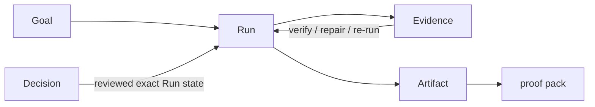
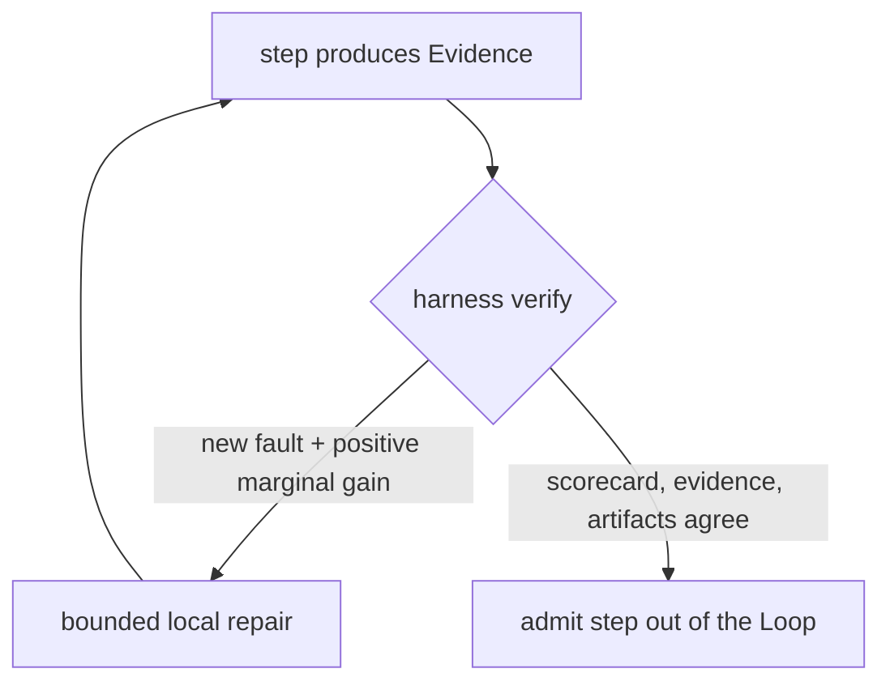
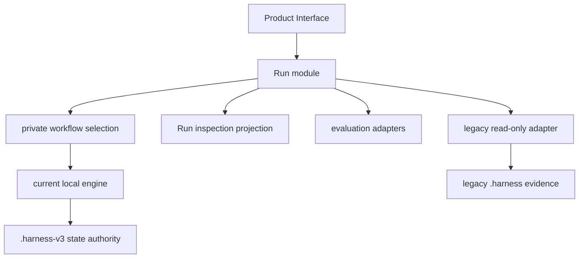

# Research Loop Architecture

Research Harness keeps a bounded body of research work inspectable, recoverable,
and correctable while the Goal, Evidence, and human Decisions change. The unit
of trust is the Loop, not the answer.

```text
Research should be easy to challenge, not merely easy to read.
```

The canonical language is [`CONTEXT.md`](../CONTEXT.md). The product-object
decision is [ADR 0025](adr/0025-make-the-self-correcting-run-the-product-object.md),
which supersedes the earlier framing.

**Tagline: a research loop that engineers its own evidence.**

## 1. System Thesis

A polished report is insufficient when a reader cannot tell how it was produced,
cannot reproduce it, and cannot see the checks it survived. We do not claim a
result is scientifically true; we prove it was produced correctly, reproducibly,
and without letting the model grade itself. The product therefore centers one
small object:

```text
Goal -> Run -> Evidence -> Artifact,  closed by a verify/repair/re-run Loop
```

A Run is not an execution transcript to be trusted on sight, and an Artifact is
not a claim of correctness. The harness may use skills, a Run DAG, repair
cycles, quality checks, and recovery privately, but callers coordinate none of
them. The causal spine is deliberate: **verify** is the soul, the **harness** is
the external referee that performs verify, and the **self-correcting Loop** is
the shape that spine takes. The word is self-*correct*, never self-evolve.

## 2. Domain Shape



A Goal is a bounded request plus its constraints — the target a Run converges
toward, not a promise about the truth of the result. Evidence is a
content-addressed intermediate produced by one step and consumed by the next; it
faces inward, feeds the next step, and enables reproduction and local repair. An
Artifact is a reader-facing deliverable plus its proof pack; it faces the reader.
Both are reproducible. The model omits a universal ontology, a single confidence
score, and any autonomous promotion of the agent itself.

## 3. The Loop

Trust is a converged fixed point, not a switch. A step is not trusted until the
Loop stops finding new faults; repair is bounded and local, and stopping is a
decision about marginal gain, not a fixed pass target. The Loop is real code:
the `*-selfloop` skill family (for example `writer-selfloop`, `evidence-selfloop`,
`deliverable-selfloop`, `tutorial-selfloop`, `argument-selfloop`) scores an
intermediate or deliverable, emits a deterministic scorecard, and produces a
bounded repair plan that the harness re-runs.



Bounded stopping is the intended discipline: repair while marginal gain is
positive, then stop. This is grounded in external work used as evidence, not
slogan. Ungrounded recursive self-refinement does not converge — it produces
fluent restatement, not correctness (the Mirror Loop result) — so verification
must come from outside the model's own text. And verify–repair loops that trust
a noisy verifier can raise reported pass rates while lowering true validity (the
VRR-Stop result), so stopping must be bounded rather than run to a fixed target.

## 4. The Harness As Referee

The harness is the deterministic executor that performs verify. It is the one
part of the system we can point at line-by-line in code:

1. it **recomputes** the scorecard checks rather than reading the verdict a
   report claims; the structural report checks vary — some validate the
   report's shape, others accept its `Status: PASS` line on its own;
2. it admits a step out of the Loop only when its required-check Evidence,
   recomputed scorecard, and matching Artifacts and manifest all agree;
3. it marks a human Decision **stale** when the reviewed inputs it was bound to
   change;
4. it detects when stored state no longer matches its content-addressed inputs,
   and recovers a prepared Completion.

A Decision is the human's turn to verify inside the Loop — an explicit judgment
over the exact Run state reviewed. The current engine binds approval to reviewed
Artifact hashes; if they change, the Decision becomes stale. Codes such as `C2`,
checkboxes, and internal step IDs are private compatibility details, not the
human-facing question.

## 5. Three Pillars

The product is the *combination* of three real, code-grounded parts.

| Pillar | What it is | Where it lives |
|---|---|---|
| Loop | `verify -> repair -> re-run`; trust is a converged fixed point | `*-selfloop` skills + the harness repair cycle |
| Graph | every Run is a DAG with content-addressed nodes, giving reproduction and local repair | execution DAG plus a content graph layer |
| Skills | producer skills make content, prover skills check it | the skill catalog below |

Graph is the engine, not the pitch. There are two layers: the **execution DAG**
(steps with content-addressed inputs and outputs) and a **content graph**
(structures such as `concept-graph`, `claim-evidence-matrix`, and
`novelty-matrix` produced *inside* skills). Producer skills and prover skills are
complementary halves of one Loop, not competing stories.

## 6. Product Interface

The public interface owns creation, continuation, bounded faults, meaningful
stops, inspection, and one state authority. It does not expose workflow
selection, step scheduling, attempt choreography, completion phases, process
ownership, or evaluator dispatch.

```python
from research_harness import Loop, Start, Continue, Decide

run = Loop.open(workspace, repository=repository)
started   = run.advance(Start(goal=goal, kind=kind))
continued = run.advance(Continue())
decided   = run.advance(Decide())
inspection = run.inspect()
```

The source-checkout module CLI exposes the same transition under the `loop`
command group:

```bash
uv run python -m research_harness loop work \
  --workspace workspaces/example \
  --goal "Which manuscript claims lack adequate support?" \
  --kind review \
  --repository .

uv run python -m research_harness loop show \
  --workspace workspaces/example --details

uv run python -m research_harness loop decide \
  --workspace workspaces/example --repository .
```

`work` creates and advances when a Goal is supplied; without it, it continues
the current Run. `show` is read-only. `decide` handles the single pending
Decision only after its checked review basis exists in the Workspace. The stable
`rh` executable has not cut over; it retains legacy mutation until behavioral
conformance and quality gates pass. The module CLI is the current migration
surface, not evidence of a Loop-native write model. The read and write JSON
carry the frozen machine-contract schema names `research-harness.case-result/v1`
and `research-harness.case-inspection/v1`, which are not renamed.

The read and write shapes are described by machine contracts, kept verbatim:
`research-harness.case-result/v1` and `research-harness.case-inspection/v1`.

## 7. Private Execution



Real seams exist for the multiple workflow adapters, the multiple evaluation
adapters, and the current/legacy inspection adapters. Remote execution and a
generic store interface remain hypothetical until a second supported adapter
exists. LaTeX/PDF is an export-adapter target, but `arxiv-survey-latex` remains a
migration implementation. No adapter may advance canonical state independently.

For a current Run Workspace, `.harness-v3/state.json` is the sole mutable
authority. It stays Run-shaped because this phase changes the public object
without reinterpreting execution history. The state and event shapes are pinned
by machine contracts. The current engine writes
`research-harness.run-aggregate/v1` and `research-harness.completion-manifest/v1`
into `.harness-v3`, and reads its Workflow snapshot through
`research-harness.workflow-snapshot/v1` and `/v2`. The legacy `.harness`
contracts — `goal-spec.v2`, `run-state.v1`, `harness-lock.v1`, `harness-lock.v2`,
`run-event.v1`, `unit-attempt.v1`, `run-decision.v1`, `artifact-record.v1`,
`failure-record.v1`, `run-evaluation.v1`, and `unit-output-manifest.v1` — are
kept verbatim so an existing Workspace still reads.
`checkpoint-review-basis.v1` spans both.

Step snapshots, completion manifests, Artifact hashes, execution snapshots,
process metadata, Markdown, reports, deliverables, and Run inspection are
Evidence or projections. None is another state authority. A Workspace containing
legacy `.harness` is inspection-only through the interface: it can be summarized
without a live repository but is never silently upgraded or mixed with
`.harness-v3` state.

## 8. Skills And Workflows

Producer skills make content; prover skills check it. A workflow is a private
composition of skills whose intermediates are Evidence and whose deliverable plus
proof pack is the Artifact.

| Requested outcome | Current workflow | Maturity |
|---|---|---|
| Orient to a topic | `research-brief` | Executable |
| Review one manuscript | `paper-review` | Executable |
| Synthesize under a protocol | `evidence-review` | Executable |
| Survey a literature | `arxiv-survey` | Executable |
| Generate grounded directions | `idea-brainstorm` | Executable |
| Teach from fixed sources | `source-tutorial` | Executable |
| Render a survey as LaTeX/PDF | `arxiv-survey-latex` | Executable variant |
| Long-form graduate manuscript | `graduate-paper` | Research-stage |

Workflow-local sidecars stay valid compatibility contracts; they are not a
normalized cross-workflow content schema. `graduate-paper` remains research-stage.

## 9. Quality Without Overclaiming

There are three quality layers, and we claim only the first two. A scorecard
PASS is a contract signal, never a truth claim.

| Layer | Question | Current interpretation |
|---|---|---|
| Execution integrity | Did private execution commit consistently? | Attempts, Events, Manifests, hashes, and recovery agree |
| Contract acceptance | Did required Artifacts satisfy observable checks? | Workflow checks and recomputed scorecards pass |
| Research quality | Is the result useful and correct enough? | Requires repeated realistic Runs, held-out evidence, or expert review — NOT claimed |

A PASS in one layer is not evidence for another. The Run projection preserves the
qualifier rather than merging layers into one badge or score. The `ARTIFACT_PACK`
proof pack is positioned as an instance of the emerging reproducible-provenance
standard (the direction of Rollout Cards / TRACER), not a new schema and not a
validity certificate.

## 10. Current Maturity

The current engine has durable local execution, recovery, checkpoint review
bases, Artifact provenance, workflow acceptance, legacy read-only inspection, and
multi-workflow simulations. The interface is a transitional projection over those
capabilities, reported through `harness-readiness-audit.v2` (with
`harness-readiness-audit.v1` retained as historical evidence about its own
checkout).

| Current workflow | Proof state | Open boundary |
|---|---|---|
| `arxiv-survey` | `Completed outcome pilot` | Retained-Artifact replay passes 0/226 residue and 31/31 checks; fresh retrieval, cross-topic calibration, and expert quality remain open |
| `arxiv-survey-latex` | `Compiled delivery proof` | One audited 10-page PDF; exporter migration and from-scratch portability remain open |
| `research-brief` | `Completed outcome pilot` | Current-engine public proof and expert usefulness remain open |
| `paper-review` | `Scored fixture proof` | Real-manuscript and expert comparison remain open |
| `evidence-review` | `Scored fixture proof` | Retrieval completeness and validity judgment remain open |
| `idea-brainstorm` | `Scored fixture proof` | Novelty judgment and cross-topic stability remain open |
| `source-tutorial` | `Compiled delivery proof` | Mixed-source grounding depth remains open |
| `graduate-paper` | `Design and Skills only` | End-to-end execution remains open |

These are contract or fixture claims, not product-wide research-quality evidence.
Cross-workflow normalized content, a Loop-native store, stable `rh` cutover,
remote execution, portable research-object export, and product-wide research
quality remain open. Current proof labels describe fixtures or retained Runs; none
establishes general scientific validity.

## 11. Migration Gates

### Phase 1: read-only Run projection

- expose the Python Run interface and the transitional module CLI;
- delegate mutation to the existing `.harness-v3` engine;
- project Loop language without fabricating normalized content;
- preserve every executable workflow behavior and Decision semantics;
- measure reproducibility, correction cost, runtime, and reviewer usefulness;
- keep stable `rh` on its legacy path.

### Phase 2: Loop-native write model

Only after the gates pass:

- introduce immutable Run revisions and content-addressed Evidence records;
- make workflows private adapters and render all deliverables from one revision;
- move `arxiv-survey-latex` behind an export adapter;
- cut stable `rh` over and freeze legacy mutation;
- delete superseded compatibility paths.

Required evidence includes: staleness marks all affected outputs with under 5%
false positives; source-lookup and reviewer time improve at least 20%; every
workflow preserves behavioral conformance and qualified quality results; and
legacy Workspaces remain byte-identical and read-only. If correction cost or
reviewer time does not improve across realistic Runs, keep the Run as a
projection. Migration is replace-not-layer: no third product story, no second
state authority, and no permanent synchronization layer.

## 12. Positioning And Rejected Shapes

Others evolve the agent — self-evolving agents whose own open problem is
trustworthy verification. We make each Run verify itself. Self-evolution stays a
human-approved direction on the roadmap's Deferred list, never an active claim.

Reject a single truth score, sentence-level normalized content storage, a
graph-first UI as the primary interface, parallel writable state, hypothetical
remote seams, and autonomous promotion. Reproducible-provenance formats such as
PROV or RO-Crate may later be export adapters, never the normal interface. The
Loop, the Graph, and the Skills stay one combined product: an external referee
making each pass count.
