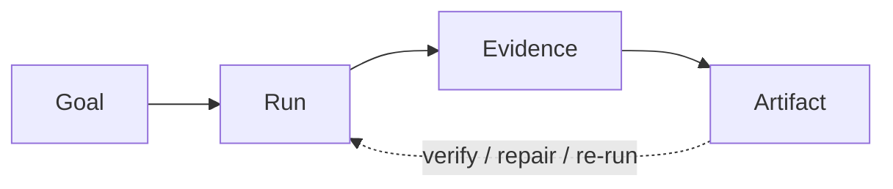

# Recipe Catalog

This catalog records the private research Recipes currently implemented by
Workflow and Pipeline compatibility contracts. Users pick a Loop kind and a
desired format; they never need Workflow, Pipeline, Unit, or Skill names.

The unit of trust here is the Loop, not the answer. A Recipe does not promise a
scientifically true result — it runs a `verify → repair → re-run` Loop and, when
the Run converges, keeps the checkable Evidence and proof pack that show the
Artifact was produced correctly, reproducibly, and without the model grading
itself. "A research loop that engineers its own evidence."

So this catalog separates two things and claims only what it can point at in
code:

- **executable structure** — the Recipe contract that lets a Run start, replay,
  and repair;
- **observed proof** — the retained scorecards and Artifacts from Runs that
  actually converged.

Neither an executable Recipe nor a passing scorecard establishes research
quality. A scorecard PASS is a contract signal — the harness recomputed the
check and the Evidence, scorecard, and Artifacts agree — never a claim that the
research is true.



Underneath, every Run is a DAG of content-addressed steps; the Loop repairs
locally and within bounds; the harness — the external referee — decides whether
each pass counts. The engine is real (durable local Runs, recovery, recomputed
scorecards, stale-Decision invalidation); research quality is not.

## Recipe Maturity

**Contract status** describes current migration implementation:

- `Executable`: Pipeline frontmatter, Unit template, target Artifacts, and
  Harness validation exist.
- `Executable variant`: an executable extension of another Recipe's current
  Workflow contract.
- `Research-stage`: design and Skills exist, but no complete executable
  contract exists.

**Proof state** describes retained Evidence from Runs that converged:

- `Contract-tested`: schema, routing, gates, and failure behavior are covered.
- `Scored fixture proof`: a local fixture completed a semantic scorecard and one
  full Loop pass — a `verify → repair → re-run` cycle recomputed by the harness.
- `Compiled delivery proof`: final document formats were built and audited.
- `Completed outcome pilot`: one end-to-end Run produced a reader-facing Artifact
  from non-placeholder research Evidence.

No proof state means scientific correctness, cross-topic stability, autonomous
generation, or held-out expert validation. A converged Loop bounds how the
Artifact was produced; it does not establish that the Artifact is right.

## Current Recipes

| Family | Current Workflow | Pipeline contract | Unit template | Primary Artifacts | Contract status | Proof state | Open boundary |
|---|---|---|---|---|---|---|---|
| Survey | `arxiv-survey` | `pipelines/arxiv-survey.pipeline.md` | `templates/UNITS.arxiv-survey.csv` | `output/DRAFT.md`, residue scorecard | `Executable` | `Completed outcome pilot` | Retained-Artifact replay passes 0/226 residue with 49/49 Units and 31/31 required checks; fresh retrieval, clean-revision reproduction, cross-topic calibration, and expert review remain open |
| Survey export | `arxiv-survey-latex` | `pipelines/arxiv-survey-latex.pipeline.md` | `templates/UNITS.arxiv-survey-latex.csv` | `latex/main.pdf` plus Survey Artifacts | `Executable variant` | `Compiled delivery proof` | One audited 10-page PDF; from-scratch portability, repetition, and expert review remain open |
| Orientation | `research-brief` | `pipelines/research-brief.pipeline.md` | `templates/UNITS.research-brief.csv` | `output/SNAPSHOT.md`, scorecard | `Executable` | `Completed outcome pilot` | One online arXiv execution; cross-topic relevance and reading-path usefulness remain open |
| Review | `paper-review` | `pipelines/paper-review.pipeline.md` | `templates/UNITS.paper-review.csv` | `output/REVIEW.md`, scorecard | `Executable` | `Scored fixture proof` | Real-manuscript and expert comparison remain open |
| Review | `evidence-review` | `pipelines/evidence-review.pipeline.md` | `templates/UNITS.evidence-review.csv` | `output/SYNTHESIS.md`, scorecard | `Executable` | `Scored fixture proof` | Retrieval completeness and validity judgment remain open |
| Ideation | `idea-brainstorm` | `pipelines/idea-brainstorm.pipeline.md` | `templates/UNITS.idea-brainstorm.csv` | `output/REPORT.md`, scorecard | `Executable` | `Scored fixture proof` | Novelty judgment and cross-topic stability remain open |
| Tutorial | `source-tutorial` | `pipelines/source-tutorial.pipeline.md` | `templates/UNITS.source-tutorial.csv` | `output/TUTORIAL.md`, PDF, slides | `Executable` | `Compiled delivery proof` | Fixture-tested source coverage; mixed-source grounding depth remains open |
| Thesis | `graduate-paper` | `pipelines/graduate-paper-pipeline.md` | Unit template: none yet | thesis project Artifacts | `Research-stage` | None | Design and Skills only |

### Exporter migration

`arxiv-survey-latex` remains an `Executable variant` while behavioral
conformance is measured. It inherits the Survey research lifecycle and adds
TeX/PDF Units. Its **exporter target** is a LaTeX/PDF Export Adapter over the
Survey Recipe; it should not remain a separate Loop kind after Loop-native
cutover.

`research-brief` proof is backed by a
[curated Harness snapshot](../examples/research-brief-harness-proof/README.md)
and a separate
[real-source snapshot](../examples/research-brief-real-source-proof/README.md).
Both use historical `recoverable-provenance.v1`; neither is current-engine or
expert-quality proof.

## Loop Kinds

A user states a requested outcome; that selects a **loop kind**, which routes to
the current Recipe that runs the matching `verify → repair → re-run` Loop. The
loop kind is the whole interface — one requested outcome, one Loop, one converged
Artifact plus its proof pack.

| Requested outcome | Loop `kind` | Current Recipe | Required starting point |
|---|---|---|---|
| Orient to a topic | `brief` | `research-brief` | question/topic |
| Review one manuscript | `review` | `paper-review` | supplied manuscript |
| Synthesize under a protocol | `evidence-synthesis` | `evidence-review` | review question, then a Protocol Decision |
| Survey a literature | `survey` | `arxiv-survey` | question and delivery constraints |
| Develop grounded directions | `ideas` | `idea-brainstorm` | question and scope |
| Teach from fixed sources | `tutorial` | `source-tutorial` | source pack and audience |

`--format pdf` currently applies only to a Survey loop. During migration it
selects `arxiv-survey-latex`; Tutorial already declares its PDF Artifacts, and
other kinds reject the option. Format intent picks an export target inside the
same Loop; it does not create another research lifecycle.

### Survey delivery profiles

Survey profiles change execution density and contract checks, not the loop kind:

| Reader outcome | Use-case overlay | Delivery profile | Current boundary |
|---|---|---|---|
| Course, seminar, or short literature report | bounded-report use-case overlay | `course_paper` | Multi-source literature assignment, not an experiment report |
| Focused technical survey | optional bounded-report overlay | `course_paper` or `survey` | Literature-first; live market or policy monitoring is outside the contract |
| Full literature survey | none | `survey`, optionally `deep` | Broader taxonomy and denser Evidence requirements |

Survey defaults to `evidence_mode=abstract`; `fulltext` raises grounding depth
and execution cost when methods, results, or limitations require it.

The historical course-paper snapshot measures 96/140 whole-draft template
matches (68.6%) and remains a failure baseline — a Loop that had not converged.
The current-contract retained Artifact replay measures 0/226 residue, passes
31/31 checks, and compiles a 10-page PDF. This proves attainability for one
Artifact set, not fresh autonomous execution or cross-topic calibration.

## Current Evaluation Surfaces

Recipe-local scorecards share an Evaluation envelope but keep their own
semantics. The harness recomputes the scorecard checks rather than reading the
verdict they report — so a passing scorecard is a converged Loop pass, not a
normalized
cross-Recipe truth graph. These are contract-acceptance evidence, not research
validation.

| Current Recipe | Observable join | Boundary |
|---|---|---|
| `paper-review` | manuscript assertion -> evidence gap -> related work -> concern | Traceability and recommendation consistency, not scientific truth |
| `research-brief` | core paper -> grounded theme -> reading path | Structure and pointer integrity, not broad topic completeness |
| `idea-brainstorm` | Decision -> literature signal -> direction -> shortlist | Trace consistency, probes, and kill criteria, not novelty proof |
| `evidence-review` | protocol clause -> screening -> extraction -> synthesis | Candidate coverage and bounded conclusions, not exhaustive retrieval or causal validity |
| Survey | draft -> selected writer assets -> residue measurement | Reproducible template-overlap check, not authorship or originality |

## Evidence Gaps

```text
executable Recipe contract != converged Loop != research-quality validation
```

The three layers stack, and this catalog claims only the first two — execution
integrity and contract acceptance. All seven current Workflow contracts declare
mandatory completion checks the harness recomputes, but research-quality Evidence
remains uneven. The next work is repeated unrelated Runs, expert comparison,
measured cost and retry data across the Loop, and stronger source-to-Artifact
traceability. Normalized material assertions, challenge/qualification relations,
and "what would change this?" cards remain target behavior rather than current
cross-Recipe implementation — and remain research-quality claims this project
does not yet make. Bounded stopping is the Loop discipline: repair while marginal
gain is positive, then stop, never run to a fixed pass target.
