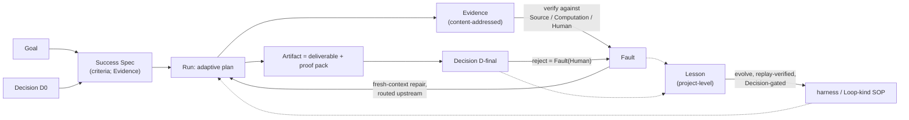

# Product Design

> **Document class: Product (target state).** This document derives the product
> and its form from the story in [`CONTEXT.md`](../CONTEXT.md). It describes
> what Research Harness *is*, independent of any implementation. The current
> code is described separately in
> [`IMPLEMENTATION_SNAPSHOT_2026-09-12.md`](IMPLEMENTATION_SNAPSHOT_2026-09-12.md)
> and is scheduled for a destructive refactor against this design
> ([ADR 0026](adr/0026-redesign-the-product-from-the-story-and-freeze-the-implementation.md),
> [ADR 0027](adr/0027-enrich-the-story-with-grounds-faults-lessons-and-the-outer-loop.md)).
> How the rebuild is shaped — kernel, protocol, storage, Loop kind format, build
> order — is in [`REBUILD_DESIGN.md`](REBUILD_DESIGN.md) ([ADR 0028](adr/0028-rebuild-design-for-horizon-0.md)).

## 1. The story, restated

Research Harness turns a research **Goal** into a self-correcting **Run** whose
every step leaves checkable **Evidence** and whose result is an **Artifact** —
a reader-facing deliverable plus the proof pack that shows how it was produced.
Trust comes from the **Loop** (`verify → Fault → repair → re-run`), performed
by the **harness** as an external referee against a named ground, with the
human's **Decision** as a turn inside the Loop. What a Run learns by failing
settles into **Lessons**, and Lessons are the only ground on which the harness
and its Loop kinds **evolve**.

```text
inner, one Run:      Goal -> criteria -> Run -> Evidence -> verify -> Fault -> repair -> re-run ... -> Artifact -> Decision
outer, the project:  Run -> Faults + Decisions -> Lesson -> evolve(harness, SOP) -> next Run
```



The story is accepted as sound. Everything below is derived from it; nothing
below adds a new concept the story does not already require.

## 2. Design commitments

Each commitment names the clause of the story it follows from, what it
requires, and what it forbids. Together they are the conformance yardstick for
any implementation.

### C1. The Goal enters verify through a Success Spec

*From:* "Goal — its constraints and the criteria by which a Run will be judged
to have answered it — its Success Spec." *Implied by:* `CONTEXT.md` § What the
language implies, items 1 and 4.

At Start, the harness derives a **Success Spec** from the Goal: the questions
the Artifact must answer, the scope boundary, what counts as drift, the
delivery constraints, and the budget. Each criterion names the ground on which
it can be checked — Source, Computation, or Human. A criterion no ground can
check is recorded in the Success Spec as third-layer (research quality, the
human's to judge) and is never bound to a gate. The Success Spec is Evidence
(content-addressed) and is the object of the first Decision. Every quality gate
downstream references it.

Forbids: acceptance criteria fixed per Loop kind and identical for every Goal
as the *only* criteria. Those remain valid as form checks, but a Run whose
gates never read the Success Spec is not converging toward its Goal. Forbids a
gate that reports PASS on a criterion with no ground.

### C2. verify is two things with two names, and every result names its ground

*From:* "verify — checking against a ground the model cannot smooth away: Source,
Computation, Human"; "PASS is a contract signal, never a claim that the
research is true."

- **Integrity verify** is performed by the harness kernel on the Computation
  ground. It is deterministic and the model cannot influence it: content
  hashes, Evidence-to-manifest agreement, state consistency, Decision
  freshness. Its PASS means "this Run's record is internally consistent."
- **Quality gates** are performed by prover Skills. Each gate is a declared
  proxy and carries a **gate kind**, the **ground** it checks against, and a
  **calibration status**:

  | Gate kind | Ground | Checks | Gameable by the model? |
  |---|---|---|---|
  | `structural` | Computation | form: counts, headings, pointer resolution, template residue | yes |
  | `grounded` | Source (or the Success Spec as Evidence) | content against Evidence: a pointer resolves *and* the source supports the statement; a section answers the spec clause it is bound to | partially |
  | `calibrated` | any of the above, measured against Human | the same check, with measured agreement against D-final outcomes or expert review on held-out Runs | reported, not assumed |

  A gate's result is always rendered with its kind, ground, and calibration
  status, and the result is itself Evidence.

Forbids: a gate that reads a verdict written by the producer it checks (a
`Status: PASS` line, a self-scored rubric). Such a check is not verify and may
not be counted as one.

### C3. Two Decisions are mandatory; each binds all it reviewed; none is a dead end

*From:* "Decision — the human's turn to verify inside the Loop"; "two are always
present"; "an exhausted Loop ends in a Decision, never in silence." *Implied
by:* `CONTEXT.md` § What the language implies, items 3 and 6.

Every Loop kind has at least:

- **D0 — Success Spec.** Before retrieval or generation, the human confirms
  what "answered" will mean for this Goal, and the budget. D0 reviews the
  criteria, not the plan; the Run may change its plan without staling D0.
- **D-final — Artifact acceptance.** With the deliverable and its proof pack in
  front of them, the human accepts, rejects with a reason, or requests bounded
  repair. This is the only point in the Loop where third-layer judgment can be
  made, so the product places a human there.

A rejection at any Decision is recorded as a Fault whose ground is Human and
re-enters the Loop through repair routing. An exhausted Loop raises a Decision
with three options: extend the budget, revise the Success Spec (which stales
D0 and re-derives it), or abandon with the proof pack as it stands.

A Loop kind may add intermediate Decisions (scope, structure, protocol). Every
Decision records the hashes of *all* Evidence and Artifacts it reviewed. If any
of them changes, the Decision is stale and its authorization is withdrawn.

Forbids: a Loop kind with no human turn on the Artifact; a Decision whose
review basis omits something the human was shown; a Run that ends `BLOCKED`
without a pending Decision.

### C4. One state authority per Run

*From:* "Run — one recoverable execution."

A Run has exactly one mutable state record. Everything else — readable files,
reports, manifests, the Artifact itself — is a projection of, or Evidence
referenced by, that record. Recovery reads the record, not the projections.

Forbids: parallel writable state; a status a human or Skill can set by editing a
file.

### C5. Completion is agreement, not a status

*From:* "harness — admits a step out of the Loop only when its Evidence, gate
results, and Artifacts agree."

A step leaves the Loop only when the harness observes agreement between the
step's declared outputs, their recorded hashes, the integrity verify result, and
the results of the quality gates bound to that step. Failure leaves the step in
the Loop with a Fault; nothing can mark it complete by assertion.

### C6. Repair is Fault-directed, fresh-context, upstream-routed, and harness-bounded

*From:* "Loop — repair is Fault-directed and runs in fresh context"; "Fault —
the earliest step whose Evidence it implicates"; "stopping is a judgment about
marginal gain, not a fixed number of passes." *Implied by:* `CONTEXT.md` § What
the language implies, item 5.

- **Fault-directed:** the only input to repair is a Fault — failing check,
  ground, earliest implicated step — plus the Evidence that step consumed.
- **Fresh context:** the repairer does not receive the transcript of the
  failed attempt. Failed drafts in context bias the next attempt toward the
  same structure; the product excludes them by construction.
- **Upstream-routed:** when a `grounded` gate fails against the Success Spec,
  the Fault names the *earliest* step whose Evidence conflicts with the spec,
  not merely the step being checked. Consistency between adjacent steps is
  never mistaken for correctness against the Goal.
- **Bounded by the harness:** the budget comes from the Goal's constraints,
  with Loop-kind defaults. After each pass the harness chooses advance, repair,
  or escalate, and stops repair as `converged`, `exhausted`, or `escalated`,
  recording the reason. Bounded stopping is enforced by the referee, not left
  to the producer's discretion.

Forbids: unbounded selfloops; repairs that only re-phrase the final step when
the Fault is upstream; a repair prompt that includes the failed attempt.

### C7. The Artifact is a deliverable plus a proof pack, with statement-level provenance

*From:* "Artifact — every statement points to the Evidence that supports it and
names the relation; the proof pack answers four questions."

Every statement in the deliverable carries a pointer to supporting Evidence and
a relation — `quotes`, `condenses`, or `infers from` — written at generation
time, not attached afterwards. `grounded` gates check these pointers.

The proof pack is the reader's evidence that the Artifact was produced
correctly. It contains, at minimum:

| Proof pack entry | Answers |
|---|---|
| Success Spec (hash), with each criterion's ground | what this Run was trying to answer, and how each part could be checked |
| Decisions, each with its bound hashes | what a human confirmed, over exactly which state |
| Integrity verify result | whether the Run's record is internally consistent |
| Every quality gate result, with gate kind, ground, and calibration status | which proxies passed, and how much they mean |
| Statement provenance index | which Evidence supports each statement, and how |
| Loop trace: passes, Faults, repairs, stop reason | how the Run converged, and why it stopped |
| Evidence index (hash list) | what intermediates exist and can be replayed |
| Skill and kernel identities | what produced and what verified |

Both deliverable and proof pack are replayable from retained Evidence. The
proof pack is also the input from which a Lesson is distilled (C10).

Forbids: a proof pack that is a single score or badge; a deliverable shipped
without its proof pack; a statement with no provenance pointer.

### C8. Three quality layers, never merged

*From:* "PASS is a contract signal, never a claim that the research is true."

| Layer | Question | Who can answer it |
|---|---|---|
| Execution integrity | Is the record consistent? | integrity verify |
| Contract acceptance | Did the Artifact pass its declared gates? | quality gates |
| Research quality | Is the result useful and correct for this reader? | D-final, held-out evaluation, expert review |

The proof pack renders the three layers separately. The product claims the first
two. The third is the human's, and the product's job is to put the human in a
position to make it — with the Success Spec, the Evidence, and the gate results
at hand. Criteria that only the third layer can judge are listed in the Success
Spec as such (C1).

### C9. Adaptivity lives below the Success Spec

*From:* "Run — the Run may change its plan; it may never change its criteria";
`CONTEXT.md` § Where adaptivity lives.

- The Run's plan starts from the Loop kind's SOP and may add, skip, or reorder
  steps. Every step's output still enters verify; every criterion must
  eventually be covered by Evidence before D-final can be raised.
- Gates are bound to criteria, not to step templates. The harness selects the
  gates a step faces from what the step declares it produces and which
  criterion it serves.
- Plan changes are Evidence and do not stale D0. A change to the criteria is a
  Decision: the Run escalates rather than rewriting the Success Spec.

Forbids: a Run that quietly narrows or redefines a criterion it cannot meet; a
gate whose applicability is fixed by step position rather than by the criterion
it serves.

### C10. Lessons are distilled from every Run; evolve is verified against them

*From:* "Lesson — belongs to the project, not to the Run"; "evolve — cites the
Lessons it answers, is verified before it is adopted, and is accepted by a
Decision." *Implied by:* `CONTEXT.md` § What the language implies, item 7.

- After a Run ends (accepted, abandoned, or exhausted), the harness distills a
  **Lesson** from its proof pack: the Faults, the grounds, the owning steps,
  which repairs worked, and the stop reason. Lessons are content-addressed and
  cite the proof pack.
- An **evolve** is a proposed change to the harness (a gate, a budget, a
  routing rule) or to a Loop kind's SOP (steps, Skills, defaults). It must cite
  at least one Lesson. Before adoption it is replayed: the changed harness must
  catch the Fault each cited Lesson records, and must still catch every Lesson
  it caught before. It is then accepted or rejected by a Decision and retains
  the prior baseline.
- The maintainer proposes evolves; an agent may draft them. Neither the harness
  nor the agent adopts one.

Forbids: a harness or SOP change with no cited Lesson; adoption without replay;
automatic promotion.

## 3. Product form

### 3.1 Who uses it

- A **researcher** with a Goal, or an **agent** acting on their behalf. They
  state a Goal, make two Decisions (and any intermediate ones the Loop kind
  adds), and receive an Artifact.
- A **maintainer** who authors Skills and Loop kinds, reads proof packs and
  Lessons, and proposes evolves.

### 3.2 One surface

The product exposes one interface, available as a Python API and as a CLI with
the same verbs:

```text
start(goal, kind, format?)   create a Run; derive the Success Spec; stop at D0
continue()                   advance to the next meaningful stop
decide(decision)             record the pending Decision over its review basis
inspect()                    read the Run: state, Evidence, gates, Decisions, Faults
lessons()                    read the project's Lessons and pending evolves (maintainer)
```

Every Run call returns one of four outcomes:

| Outcome | Meaning |
|---|---|
| `NEEDS_DECISION` | the human's turn; the request names what is reviewed and what changes if accepted |
| `BLOCKED` | the Loop is exhausted; the Fault names the gate, the Success Spec clause, the earliest owning step, and the spent budget; the next legal call is `decide` (extend, revise, or abandon) |
| `COMPLETED` | D-final accepted; the Artifact and proof pack are final; a Lesson is distilled |
| `PROGRESSED` | steps advanced; no stop reached yet |

Nothing else is public: no workflow names, step identifiers, checkpoint codes,
attempt choreography, schema versions, or engine generations.

### 3.3 Loop kinds

A user picks a requested outcome. The outcome selects a Loop kind; the Loop kind
provides the **starting SOP** — default Skills, intermediate Decisions, gates,
and budgets — from which the Run adapts its plan (C9).

| Requested outcome | Loop kind | Required input | Artifact |
|---|---|---|---|
| Orient to a topic and decide what to read | `brief` | topic | one-page brief |
| Review one manuscript | `review` | manuscript | referee-style review |
| Synthesize under a protocol | `evidence-synthesis` | review question | protocol + synthesis |
| Survey a literature | `survey` | topic + delivery constraints | survey draft |
| Develop grounded research directions | `ideas` | topic + scope | direction memo |
| Teach from fixed sources | `tutorial` | source pack + audience | tutorial |

`format` (markdown, PDF, slides) selects an export of the same Artifact. It is
never a separate Loop kind. A Loop kind's SOP changes only by evolve (C10).

### 3.4 What the user sees in a Workspace

A Run lives in one directory. The user-facing surface is small; names below are
logical, not prescribed paths.

| Surface | Contents |
|---|---|
| Goal + Success Spec | the request, and what "answered" means for it, criterion by criterion with its ground |
| Decisions | every Decision, its prompt, its outcome, and its bound hashes |
| Artifact | the deliverable in the requested format, beside its proof pack |
| Evidence | content-addressed intermediates, browsable and replayable |
| Faults | every Fault with its ground, owning step, repair routing, and — when the Loop stopped — the stop reason |

Lessons live at the project level, not in a Workspace. Everything else — state
record, step logs, attempt history — is private execution and may be inspected
but is never something the user must operate.

### 3.5 Skills

Skills are the vocabulary; the harness is the grammar.

- **Producer Skills** create Evidence or Artifacts. They read the Success Spec.
  Any scaffold or template text they emit is marked as such, so that a gate can
  distinguish "not yet written" from "written." Statements they write carry
  provenance pointers (C7).
- **Prover Skills** are quality gates. Each declares its gate kind, its ground,
  its calibration status, the Success Spec clauses it can evaluate, and the
  repair routing it emits on failure.
- **Repair** is a producer Skill invoked with a Fault and Evidence only (C6).

A Skill is authored reference-first: its judgment lives in prose the model
reads, and its scripts perform only deterministic transforms or checks.

### 3.6 What the product does not claim

- that any Artifact is scientifically true, novel, or complete;
- that retrieval was exhaustive;
- that a `structural` or `grounded` gate predicts research quality until it is
  `calibrated`;
- that the harness improves itself. Self-correction is per-Run and bounded;
  evolve is cross-Run, cites Lessons, is replay-verified, and is adopted only
  by a human Decision. There is no autonomous promotion, and this is not
  recursive self-improvement: the evolve procedure itself is fixed and is not
  editable by the agent.

### 3.7 Where this sits

Three words locate the product; none of them is a term in the story.

- **Category — a harness for long-horizon research agents.** In the 2026 sense
  of "agent harness": everything around the model that makes a long-running
  task reliable — state, Evidence, verify, Decisions, budget, Lessons —
  specialized to research work, at the level where completion is an
  evidentiary object rather than an assertion. The model is external; the
  repository makes no model calls of its own.
- **Role — the verification and trust component of an auto-research system.**
  Autonomous research systems produce competitive manuscripts whose claims
  cannot be checked; the field's audits name this the verification gap. Any
  such system can run its literature, ideation, writing, and review stages as
  Loop kinds inside this harness and inherit Evidence, grounds, statement
  provenance, and the proof pack. Composition happens at the application
  layer — an `experiment` Loop kind, or a Skill pack that drives an external
  experiment runner — and does not change the harness. This is not an
  autonomous scientist; it is what an autonomous scientist needs in order to
  be believed.
- **Stance — self-correct per Run, evolve across Runs by Lessons under a
  Decision.** It is neither recursive self-improvement nor a self-evolving
  agent. Those systems also keep an evaluation scaffold the agent may not
  rewrite; this harness is that scaffold, made into the product.

## 4. Conformance checklist

An implementation conforms to this design when each row can be demonstrated on
a real Run, not asserted.

| # | Check | Demonstration |
|---|---|---|
| C1a | Success Spec exists, is Evidence, and is read by at least one gate | change the Goal's question; a gate outcome changes on the same Artifact |
| C1b | A criterion with no ground is rendered third-layer, not gated | add an unverifiable criterion; the proof pack lists it under research quality with no gate result |
| C2a | Integrity verify is kernel-only and deterministic | tamper with an Evidence file; the Run fails closed |
| C2b | No gate reads a producer-written verdict | inject `Status: PASS` into a failing report; the gate still fails |
| C2c | Every gate result carries kind, ground, and calibration status, and is Evidence | inspect the proof pack; alter a gate result file; integrity verify fails |
| C3a | D0 and D-final exist for every Loop kind | run each kind; both stops occur |
| C3b | A Decision binds all reviewed hashes | alter one reviewed file after D0; D0 becomes stale |
| C3c | A rejection re-enters the Loop as a Fault | reject at D-final with a reason; a Fault with ground Human appears and routes to a step |
| C3d | An exhausted Loop yields a Decision | set a budget of one pass on a failing gate; the outcome is `BLOCKED` with a pending Decision offering extend / revise / abandon |
| C4 | One state authority | edit a projection; the Run's state is unchanged and the edit is detected |
| C5 | Completion requires agreement | remove a declared output after the step reports done; the step is not complete |
| C6a | Faults route upstream | seed a wrong retrieval; the Fault names retrieval, not the writer |
| C6b | Repair is harness-bounded | a gate that never improves stops at the declared budget with a recorded reason |
| C6c | Repair runs in fresh context | inspect the repair invocation; it contains the Fault and Evidence, not the failed attempt |
| C7a | Proof pack has every required entry | inspect the proof pack of a completed Run |
| C7b | Every statement has a provenance pointer | delete one pointer; a `grounded` gate fails on that statement |
| C8 | Layers are rendered separately | the proof pack shows three sections, no aggregate score |
| C9a | Plan changes do not stale D0; criteria changes do | skip a step; D0 stands. Edit a criterion; D0 is stale |
| C9b | Gates bind to criteria, not step position | move a step; the same gates apply to it |
| C10a | A Lesson is distilled from every ended Run | complete, abandon, and exhaust one Run each; three Lessons exist, each citing its proof pack |
| C10b | evolve is replay-verified and Decision-gated | propose a gate change citing a Lesson whose Fault it does not catch; adoption is refused. Propose one that does; it waits for a Decision |

## 5. What this document supersedes

This design replaces the product-facing sections of earlier architecture
documents. The story (`CONTEXT.md`), ADR 0001 (Skills vs harness), ADR 0025
(the self-correcting Run as product object), and ADR 0027 (grounds, Faults,
Lessons, the outer loop) carry forward. The engine-level ADRs 0002–0024
describe the snapshot implementation; ADR 0026 records which of them the
refactor must re-decide. The earlier positioning "self-correct, never
self-evolve" is narrowed by ADR 0027 to "self-correct per Run; evolve across
Runs only by Lessons, replay, and a Decision."
