# SKILL_DEPENDENCIES

- Regenerate: `python scripts/generate_skill_graph.py`

## Global skill ⇄ artifact graph (from SKILL.md Inputs/Outputs)

```mermaid
flowchart LR
  classDef skill fill:#e3f2fd,stroke:#1e88e5,color:#0d47a1;
  classDef file fill:#f1f8e9,stroke:#7cb342,color:#1b5e20;

  S_arxiv_search["`arxiv-search`"]:::skill
  F_queries_md["`queries.md`"]:::file
  F_queries_md --> S_arxiv_search
  F_papers_papers_raw_csv["`papers/papers_raw.csv`"]:::file
  S_arxiv_search --> F_papers_papers_raw_csv
  F_papers_papers_raw_jsonl["`papers/papers_raw.jsonl`"]:::file
  S_arxiv_search --> F_papers_papers_raw_jsonl
  S_bias_assessor["`bias-assessor`"]:::skill
  F_papers_extraction_table_csv["`papers/extraction_table.csv`"]:::file
  F_papers_extraction_table_csv --> S_bias_assessor
  S_bias_assessor --> F_papers_extraction_table_csv
  S_citation_verifier["`citation-verifier`"]:::skill
  F_papers_paper_notes_jsonl["`papers/paper_notes.jsonl`"]:::file
  F_papers_paper_notes_jsonl --> S_citation_verifier
  F_citations_ref_bib["`citations/ref.bib`"]:::file
  S_citation_verifier --> F_citations_ref_bib
  F_citations_verified_jsonl["`citations/verified.jsonl`"]:::file
  S_citation_verifier --> F_citations_verified_jsonl
  S_claim_evidence_matrix["`claim-evidence-matrix`"]:::skill
  F_outline_mapping_tsv["`outline/mapping.tsv`"]:::file
  F_outline_mapping_tsv --> S_claim_evidence_matrix
  F_outline_outline_yml["`outline/outline.yml`"]:::file
  F_outline_outline_yml --> S_claim_evidence_matrix
  F_papers_paper_notes_jsonl --> S_claim_evidence_matrix
  F_outline_claim_evidence_matrix_md["`outline/claim_evidence_matrix.md`"]:::file
  S_claim_evidence_matrix --> F_outline_claim_evidence_matrix_md
  S_claims_extractor["`claims-extractor`"]:::skill
  F_output_PAPER_md["`output/PAPER.md`"]:::file
  F_output_PAPER_md --> S_claims_extractor
  F_output_CLAIMS_md["`output/CLAIMS.md`"]:::file
  S_claims_extractor --> F_output_CLAIMS_md
  S_concept_graph["`concept-graph`"]:::skill
  F_output_TUTORIAL_SPEC_md["`output/TUTORIAL_SPEC.md`"]:::file
  F_output_TUTORIAL_SPEC_md --> S_concept_graph
  F_outline_concept_graph_yml["`outline/concept_graph.yml`"]:::file
  S_concept_graph --> F_outline_concept_graph_yml
  S_dedupe_rank["`dedupe-rank`"]:::skill
  F_papers_papers_raw_jsonl --> S_dedupe_rank
  F_papers_core_set_csv["`papers/core_set.csv`"]:::file
  S_dedupe_rank --> F_papers_core_set_csv
  F_papers_papers_dedup_jsonl["`papers/papers_dedup.jsonl`"]:::file
  S_dedupe_rank --> F_papers_papers_dedup_jsonl
  S_evidence_auditor["`evidence-auditor`"]:::skill
  F_output_CLAIMS_md --> S_evidence_auditor
  F_output_MISSING_EVIDENCE_md["`output/MISSING_EVIDENCE.md`"]:::file
  S_evidence_auditor --> F_output_MISSING_EVIDENCE_md
  S_exercise_builder["`exercise-builder`"]:::skill
  F_outline_module_plan_yml["`outline/module_plan.yml`"]:::file
  F_outline_module_plan_yml --> S_exercise_builder
  S_exercise_builder --> F_outline_module_plan_yml
  S_extraction_form["`extraction-form`"]:::skill
  F_output_PROTOCOL_md["`output/PROTOCOL.md`"]:::file
  F_output_PROTOCOL_md --> S_extraction_form
  F_papers_screening_log_csv["`papers/screening_log.csv`"]:::file
  F_papers_screening_log_csv --> S_extraction_form
  S_extraction_form --> F_papers_extraction_table_csv
  S_keyword_expansion["`keyword-expansion`"]:::skill
  F_DECISIONS_md["`DECISIONS.md`"]:::file
  F_DECISIONS_md --> S_keyword_expansion
  F_queries_md --> S_keyword_expansion
  S_keyword_expansion --> F_queries_md
  S_latex_compile_qa["`latex-compile-qa`"]:::skill
  F_citations_ref_bib --> S_latex_compile_qa
  F_latex_main_tex["`latex/main.tex`"]:::file
  F_latex_main_tex --> S_latex_compile_qa
  F_latex_main_pdf["`latex/main.pdf`"]:::file
  S_latex_compile_qa --> F_latex_main_pdf
  F_output_LATEX_BUILD_REPORT_md["`output/LATEX_BUILD_REPORT.md`"]:::file
  S_latex_compile_qa --> F_output_LATEX_BUILD_REPORT_md
  S_latex_scaffold["`latex-scaffold`"]:::skill
  F_citations_ref_bib --> S_latex_scaffold
  F_output_DRAFT_md["`output/DRAFT.md`"]:::file
  F_output_DRAFT_md --> S_latex_scaffold
  S_latex_scaffold --> F_latex_main_tex
  S_literature_engineer["`literature-engineer`"]:::skill
  F_papers_arxiv_export_csv_json_jsonl_bib["`papers/arxiv_export.(csv|json|jsonl|bib)`"]:::file
  F_papers_arxiv_export_csv_json_jsonl_bib --> S_literature_engineer
  F_papers_import_csv_json_jsonl_bib["`papers/import.(csv|json|jsonl|bib)`"]:::file
  F_papers_import_csv_json_jsonl_bib --> S_literature_engineer
  F_papers_imports_csv_json_jsonl_bib["`papers/imports/*.(csv|json|jsonl|bib)`"]:::file
  F_papers_imports_csv_json_jsonl_bib --> S_literature_engineer
  F_papers_snowball_csv_json_jsonl_bib["`papers/snowball/*.(csv|json|jsonl|bib)`"]:::file
  F_papers_snowball_csv_json_jsonl_bib --> S_literature_engineer
  F_queries_md --> S_literature_engineer
  S_literature_engineer --> F_papers_papers_raw_csv
  S_literature_engineer --> F_papers_papers_raw_jsonl
  F_papers_retrieval_report_md["`papers/retrieval_report.md`"]:::file
  S_literature_engineer --> F_papers_retrieval_report_md
  S_module_planner["`module-planner`"]:::skill
  F_outline_concept_graph_yml --> S_module_planner
  S_module_planner --> F_outline_module_plan_yml
  S_novelty_matrix["`novelty-matrix`"]:::skill
  F_output_CLAIMS_md --> S_novelty_matrix
  F_output_NOVELTY_MATRIX_md["`output/NOVELTY_MATRIX.md`"]:::file
  S_novelty_matrix --> F_output_NOVELTY_MATRIX_md
  S_outline_builder["`outline-builder`"]:::skill
  F_outline_taxonomy_yml["`outline/taxonomy.yml`"]:::file
  F_outline_taxonomy_yml --> S_outline_builder
  S_outline_builder --> F_outline_outline_yml
  S_paper_notes["`paper-notes`"]:::skill
  F_outline_mapping_tsv --> S_paper_notes
  F_papers_core_set_csv --> S_paper_notes
  F_papers_fulltext_txt["`papers/fulltext/*.txt`"]:::file
  F_papers_fulltext_txt --> S_paper_notes
  F_papers_fulltext_index_jsonl["`papers/fulltext_index.jsonl`"]:::file
  F_papers_fulltext_index_jsonl --> S_paper_notes
  S_paper_notes --> F_papers_paper_notes_jsonl
  S_pdf_text_extractor["`pdf-text-extractor`"]:::skill
  F_outline_mapping_tsv --> S_pdf_text_extractor
  F_papers_core_set_csv --> S_pdf_text_extractor
  F_papers_fulltext_paper_id_txt["`papers/fulltext/<paper_id>.txt`"]:::file
  S_pdf_text_extractor --> F_papers_fulltext_paper_id_txt
  S_pdf_text_extractor --> F_papers_fulltext_index_jsonl
  F_papers_pdfs_paper_id_pdf["`papers/pdfs/<paper_id>.pdf`"]:::file
  S_pdf_text_extractor --> F_papers_pdfs_paper_id_pdf
  S_pipeline_router["`pipeline-router`"]:::skill
  F_DECISIONS_md --> S_pipeline_router
  F_STATUS_md["`STATUS.md`"]:::file
  F_STATUS_md --> S_pipeline_router
  F_assets_pipeline_selection_form_md["`assets/pipeline-selection-form.md`"]:::file
  F_assets_pipeline_selection_form_md --> S_pipeline_router
  S_pipeline_router --> F_DECISIONS_md
  F_PIPELINE_lock_md["`PIPELINE.lock.md`"]:::file
  S_pipeline_router --> F_PIPELINE_lock_md
  S_pipeline_router --> F_STATUS_md
  S_prose_writer["`prose-writer`"]:::skill
  F_DECISIONS_md --> S_prose_writer
  F_citations_ref_bib --> S_prose_writer
  F_outline_claim_evidence_matrix_md --> S_prose_writer
  F_outline_figures_md["`outline/figures.md`"]:::file
  F_outline_figures_md --> S_prose_writer
  F_outline_outline_yml --> S_prose_writer
  F_outline_tables_md["`outline/tables.md`"]:::file
  F_outline_tables_md --> S_prose_writer
  F_outline_timeline_md["`outline/timeline.md`"]:::file
  F_outline_timeline_md --> S_prose_writer
  F_papers_core_set_csv --> S_prose_writer
  S_prose_writer --> F_output_DRAFT_md
  F_output_SNAPSHOT_md["`output/SNAPSHOT.md`"]:::file
  S_prose_writer --> F_output_SNAPSHOT_md
  S_protocol_writer["`protocol-writer`"]:::skill
  F_STATUS_md --> S_protocol_writer
  S_protocol_writer --> F_output_PROTOCOL_md
  S_research_pipeline_runner["`research-pipeline-runner`"]:::skill
  S_rubric_writer["`rubric-writer`"]:::skill
  F_output_CLAIMS_md --> S_rubric_writer
  F_output_MISSING_EVIDENCE_md --> S_rubric_writer
  F_output_NOVELTY_MATRIX_md --> S_rubric_writer
  F_output_REVIEW_md["`output/REVIEW.md`"]:::file
  S_rubric_writer --> F_output_REVIEW_md
  S_screening_manager["`screening-manager`"]:::skill
  F_output_PROTOCOL_md --> S_screening_manager
  S_screening_manager --> F_papers_screening_log_csv
  S_section_mapper["`section-mapper`"]:::skill
  F_outline_outline_yml --> S_section_mapper
  F_papers_core_set_csv --> S_section_mapper
  S_section_mapper --> F_outline_mapping_tsv
  F_outline_mapping_report_md["`outline/mapping_report.md`"]:::file
  S_section_mapper --> F_outline_mapping_report_md
  S_survey_seed_harvest["`survey-seed-harvest`"]:::skill
  F_papers_papers_dedup_jsonl --> S_survey_seed_harvest
  S_survey_seed_harvest --> F_outline_taxonomy_yml
  S_survey_visuals["`survey-visuals`"]:::skill
  F_citations_ref_bib --> S_survey_visuals
  F_outline_claim_evidence_matrix_md --> S_survey_visuals
  F_outline_outline_yml --> S_survey_visuals
  F_papers_paper_notes_jsonl --> S_survey_visuals
  S_survey_visuals --> F_outline_figures_md
  S_survey_visuals --> F_outline_tables_md
  S_survey_visuals --> F_outline_timeline_md
  S_synthesis_writer["`synthesis-writer`"]:::skill
  F_DECISIONS_md --> S_synthesis_writer
  F_papers_extraction_table_csv --> S_synthesis_writer
  F_output_SYNTHESIS_md["`output/SYNTHESIS.md`"]:::file
  S_synthesis_writer --> F_output_SYNTHESIS_md
  S_taxonomy_builder["`taxonomy-builder`"]:::skill
  F_DECISIONS_md --> S_taxonomy_builder
  F_papers_core_set_csv --> S_taxonomy_builder
  F_papers_papers_dedup_jsonl --> S_taxonomy_builder
  S_taxonomy_builder --> F_outline_taxonomy_yml
  S_tutorial_module_writer["`tutorial-module-writer`"]:::skill
  F_DECISIONS_md --> S_tutorial_module_writer
  F_outline_module_plan_yml --> S_tutorial_module_writer
  F_output_TUTORIAL_md["`output/TUTORIAL.md`"]:::file
  S_tutorial_module_writer --> F_output_TUTORIAL_md
  S_tutorial_spec["`tutorial-spec`"]:::skill
  F_STATUS_md --> S_tutorial_spec
  S_tutorial_spec --> F_output_TUTORIAL_SPEC_md
  S_unit_executor["`unit-executor`"]:::skill
  F_UNITS_csv["`UNITS.csv`"]:::file
  F_UNITS_csv --> S_unit_executor
  S_unit_executor --> F_STATUS_md
  S_unit_executor --> F_UNITS_csv
  S_unit_planner["`unit-planner`"]:::skill
  F_PIPELINE_lock_md --> S_unit_planner
  F_pipelines_pipeline_md["`pipelines/*.pipeline.md`"]:::file
  F_pipelines_pipeline_md --> S_unit_planner
  F_templates_UNITS_csv["`templates/UNITS.*.csv`"]:::file
  F_templates_UNITS_csv --> S_unit_planner
  S_unit_planner --> F_STATUS_md
  S_unit_planner --> F_UNITS_csv
  S_workspace_init["`workspace-init`"]:::skill
  F_CHECKPOINTS_md["`CHECKPOINTS.md`"]:::file
  S_workspace_init --> F_CHECKPOINTS_md
  S_workspace_init --> F_DECISIONS_md
  F_GOAL_md["`GOAL.md`"]:::file
  S_workspace_init --> F_GOAL_md
  S_workspace_init --> F_STATUS_md
  S_workspace_init --> F_UNITS_csv
  F_citations["`citations/`"]:::file
  S_workspace_init --> F_citations
  F_outline["`outline/`"]:::file
  S_workspace_init --> F_outline
  F_output["`output/`"]:::file
  S_workspace_init --> F_output
  F_papers["`papers/`"]:::file
  S_workspace_init --> F_papers
  S_workspace_init --> F_queries_md
```



## Pipeline execution graphs (from templates/UNITS.*.csv)

### arxiv-survey-latex

```mermaid
flowchart LR
  classDef unit fill:#fff3e0,stroke:#fb8c00,color:#e65100;
  classDef human fill:#ffebee,stroke:#e53935,color:#b71c1c,stroke-width:2px;

  subgraph "C0 - Init"
    U_U001["`U001`\n`workspace-init`"]:::unit
    U_U002["`U002`\n`pipeline-router`"]:::unit
  end

  subgraph "C1 - Retrieval & core set"
    U_U010["`U010`\n`literature-engineer`"]:::unit
    U_U020["`U020`\n`dedupe-rank`"]:::unit
  end

  subgraph "C2 - Structure"
    U_U030["`U030`\n`taxonomy-builder`"]:::unit
    U_U040["`U040`\n`outline-builder`"]:::unit
    U_U050["`U050`\n`section-mapper`"]:::unit
    U_U052["`U052`\n`pipeline-router`"]:::unit
    U_U055["`U055`\n`pipeline-router`"]:::unit
    class U_U055 human
  end

  subgraph "C3 - Evidence pack"
    U_U058["`U058`\n`pdf-text-extractor`"]:::unit
    U_U060["`U060`\n`paper-notes`"]:::unit
    U_U070["`U070`\n`claim-evidence-matrix`"]:::unit
  end

  subgraph "C4 - Citations + visuals"
    U_U090["`U090`\n`citation-verifier`"]:::unit
    U_U095["`U095`\n`survey-visuals`"]:::unit
  end

  subgraph "C5 - Writing + PDF"
    U_U100["`U100`\n`prose-writer`"]:::unit
    U_U110["`U110`\n`latex-scaffold`"]:::unit
    U_U120["`U120`\n`latex-compile-qa`"]:::unit
  end

  U_U001 --> U_U002
  U_U002 --> U_U010
  U_U010 --> U_U020
  U_U020 --> U_U030
  U_U030 --> U_U040
  U_U040 --> U_U050
  U_U050 --> U_U052
  U_U052 --> U_U055
  U_U055 --> U_U058
  U_U058 --> U_U060
  U_U060 --> U_U070
  U_U070 --> U_U090
  U_U090 --> U_U095
  U_U095 --> U_U100
  U_U100 --> U_U110
  U_U110 --> U_U120
```

### arxiv-survey

```mermaid
flowchart LR
  classDef unit fill:#fff3e0,stroke:#fb8c00,color:#e65100;
  classDef human fill:#ffebee,stroke:#e53935,color:#b71c1c,stroke-width:2px;

  subgraph "C0 - Init"
    U_U001["`U001`\n`workspace-init`"]:::unit
    U_U002["`U002`\n`pipeline-router`"]:::unit
  end

  subgraph "C1 - Retrieval & core set"
    U_U010["`U010`\n`literature-engineer`"]:::unit
    U_U020["`U020`\n`dedupe-rank`"]:::unit
  end

  subgraph "C2 - Structure"
    U_U030["`U030`\n`taxonomy-builder`"]:::unit
    U_U040["`U040`\n`outline-builder`"]:::unit
    U_U050["`U050`\n`section-mapper`"]:::unit
    U_U052["`U052`\n`pipeline-router`"]:::unit
    U_U055["`U055`\n`pipeline-router`"]:::unit
    class U_U055 human
  end

  subgraph "C3 - Evidence"
    U_U058["`U058`\n`pdf-text-extractor`"]:::unit
    U_U060["`U060`\n`paper-notes`"]:::unit
    U_U070["`U070`\n`claim-evidence-matrix`"]:::unit
  end

  subgraph "C4 - Citations + visuals"
    U_U090["`U090`\n`citation-verifier`"]:::unit
    U_U095["`U095`\n`survey-visuals`"]:::unit
  end

  subgraph "C5 - Writing"
    U_U100["`U100`\n`prose-writer`"]:::unit
  end

  U_U001 --> U_U002
  U_U002 --> U_U010
  U_U010 --> U_U020
  U_U020 --> U_U030
  U_U030 --> U_U040
  U_U040 --> U_U050
  U_U050 --> U_U052
  U_U052 --> U_U055
  U_U055 --> U_U058
  U_U058 --> U_U060
  U_U060 --> U_U070
  U_U070 --> U_U090
  U_U090 --> U_U095
  U_U095 --> U_U100
```

### lit-snapshot

```mermaid
flowchart LR
  classDef unit fill:#fff3e0,stroke:#fb8c00,color:#e65100;
  classDef human fill:#ffebee,stroke:#e53935,color:#b71c1c,stroke-width:2px;

  subgraph "C0 - Init"
    U_U001["`U001`\n`workspace-init`"]:::unit
    U_U002["`U002`\n`pipeline-router`"]:::unit
  end

  subgraph "C1 - Retrieval"
    U_U010["`U010`\n`arxiv-search`"]:::unit
    U_U020["`U020`\n`dedupe-rank`"]:::unit
  end

  subgraph "C2 - Structure + snapshot"
    U_U030["`U030`\n`taxonomy-builder`"]:::unit
    U_U040["`U040`\n`outline-builder`"]:::unit
    U_U050["`U050`\n`prose-writer`"]:::unit
  end

  U_U001 --> U_U002
  U_U002 --> U_U010
  U_U010 --> U_U020
  U_U020 --> U_U030
  U_U030 --> U_U040
  U_U040 --> U_U050
```

### peer-review

```mermaid
flowchart LR
  classDef unit fill:#fff3e0,stroke:#fb8c00,color:#e65100;
  classDef human fill:#ffebee,stroke:#e53935,color:#b71c1c,stroke-width:2px;

  subgraph "C0 - Init"
    U_U001["`U001`\n`workspace-init`"]:::unit
    U_U002["`U002`\n`pipeline-router`"]:::unit
  end

  subgraph "C1 - Claims"
    U_U010["`U010`\n`claims-extractor`"]:::unit
  end

  subgraph "C2 - Evidence audit"
    U_U020["`U020`\n`evidence-auditor`"]:::unit
    U_U025["`U025`\n`novelty-matrix`"]:::unit
  end

  subgraph "C3 - Rubric write-up"
    U_U030["`U030`\n`rubric-writer`"]:::unit
  end

  U_U001 --> U_U002
  U_U002 --> U_U010
  U_U010 --> U_U020
  U_U010 --> U_U025
  U_U020 --> U_U030
  U_U025 --> U_U030
```

### systematic-review

```mermaid
flowchart LR
  classDef unit fill:#fff3e0,stroke:#fb8c00,color:#e65100;
  classDef human fill:#ffebee,stroke:#e53935,color:#b71c1c,stroke-width:2px;

  subgraph "C0 - Init"
    U_U001["`U001`\n`workspace-init`"]:::unit
    U_U002["`U002`\n`pipeline-router`"]:::unit
  end

  subgraph "C1 - Protocol"
    U_U010["`U010`\n`protocol-writer`"]:::unit
    U_U020["`U020`\n`pipeline-router`"]:::unit
    class U_U020 human
  end

  subgraph "C2 - Screening"
    U_U030["`U030`\n`screening-manager`"]:::unit
  end

  subgraph "C3 - Extraction"
    U_U040["`U040`\n`extraction-form`"]:::unit
    U_U045["`U045`\n`bias-assessor`"]:::unit
  end

  subgraph "C4 - Synthesis"
    U_U050["`U050`\n`synthesis-writer`"]:::unit
  end

  U_U001 --> U_U002
  U_U002 --> U_U010
  U_U010 --> U_U020
  U_U020 --> U_U030
  U_U030 --> U_U040
  U_U040 --> U_U045
  U_U045 --> U_U050
```

### tutorial

```mermaid
flowchart LR
  classDef unit fill:#fff3e0,stroke:#fb8c00,color:#e65100;
  classDef human fill:#ffebee,stroke:#e53935,color:#b71c1c,stroke-width:2px;

  subgraph "C0 - Init"
    U_U001["`U001`\n`workspace-init`"]:::unit
    U_U002["`U002`\n`pipeline-router`"]:::unit
  end

  subgraph "C1 - Spec"
    U_U010["`U010`\n`tutorial-spec`"]:::unit
  end

  subgraph "C2 - Structure"
    U_U020["`U020`\n`concept-graph`"]:::unit
    U_U030["`U030`\n`module-planner`"]:::unit
    U_U035["`U035`\n`exercise-builder`"]:::unit
    U_U040["`U040`\n`pipeline-router`"]:::unit
    class U_U040 human
  end

  subgraph "C3 - Writing"
    U_U050["`U050`\n`tutorial-module-writer`"]:::unit
  end

  U_U001 --> U_U002
  U_U002 --> U_U010
  U_U010 --> U_U020
  U_U020 --> U_U030
  U_U030 --> U_U035
  U_U035 --> U_U040
  U_U040 --> U_U050
```
